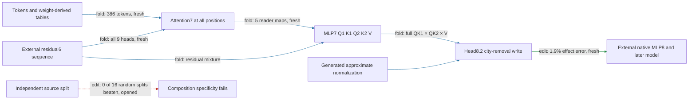

# The residual6 city-removal formula transfers to new documents

The regional path generates attention7, five MLP7 readers and head8.2's complete city-removal write from one supplied residual6 sequence. **The frozen formula now passes prediction and selective-removal gates on twenty new Pile documents**, with weight-derived token tables extended without fitting. Standalone execution also passes on the fresh fixtures. This remains a conditional extraction: native blocks0–6 and MLP8 plus the later model are external, mixed8 RMS is approximate, independent composition remains failed, and no matched-effect simplicity advantage is established.

**Metrics and evaluation.** Effect error is relative L2 difference between generated and exact native removal effects on spelling margins. Control ratio is unrelated-reader RMS movement divided by target RMS movement. Attenuation is the fractional reduction in the UK-minus-US contrast among native contrasts at least0.1logit. These twenty fresh documents provide forty natural/city-substituted sequences and240fixed spelling probes. They test new documents from the same Pile source and city/endpoint vocabulary, not new domains or natural next-token prediction. Corpus pretraining overlap is unknown.

| Claim | Evidence tag | Evaluation | Key numbers | Status |
|---|---|---|---|---|
| Predict native complete-removal effect | edit | fresh20documents | 1.9%error;35%gate | passes |
| Predict untouched and substituted arms | edit | fresh | 1.2% and2.0%error | passes under aggregate gate |
| Beat frozen mean/zero-effect predictions | edit | fresh | mean baseline1.0relative error; zero1.0 | observed, no extra gate |
| Preserve unrelated readers | edit | fresh | four ratios9.3–18%;50%gate | passes |
| Consistent attenuation | edit | fresh | 95%positive,27%mean | passes |
| Beat same-site equal-norm edits | edit | fresh | 16/16;36×median target effect | passes |
| Run outside repository with declared inputs | fold/replay | fresh40fixtures | exact generator replay | passes |
| Independently compose source groups | edit | earlier opened split test | interaction.35 versus random median.24;0/16beaten | fails |

One document increases the UK-minus-US contrast at all six endpoints when the city write is removed. The exact native intervention and the generated intervention agree on those six reversals. The aggregate95%positive result must not be read as an unconditional city-to-spelling direction. No reversed document was removed or replaced.

The four-property status is now **extraction at a declared residual6 boundary, fresh within-corpus prediction, fresh selective manipulation, and failed independent composition**. The executor outputs an attention8 edit; the native suffix still measures its final effect. The fresh token table contains386tokens, including90from the opened table. Shared token entries are identical and all non-table weights are unchanged. The package's original396-token table is not silently claimed to support every new token: fresh execution uses the separately frozen table supplied below.

Price remains about**23million FP32values** and**37thousand native input scalars** at32tokens. The panel-specific fresh table is slightly smaller than the opened table, which is not a general compression result. The next registered simplification tests attention7 omissions by their installed causal effect, retaining failures and deferring fresh promotion of any selected subset.

## Reproducibility appendix

- [Fresh protocol](../../CITY_RESIDUAL6_SINGLE_INPUT_FRESH_V1_PREREGISTRATION.md), [binding](../../CITY_RESIDUAL6_SINGLE_INPUT_FRESH_V1_BINDING.json), [result](../../CITY_RESIDUAL6_SINGLE_INPUT_FRESH_V1_RESULT.json), [row audit](../../CITY_RESIDUAL6_SINGLE_INPUT_FRESH_V1_ROW_AUDIT.json), [table receipt](../../CITY_RESIDUAL6_SINGLE_INPUT_FRESH_V1_TABLES_RESULT.json).
- [Standalone package](../../extracted_circuits/city_residual6_single_input_v1/README.md); for this fresh panel replace its attention7 program with [fresh attention7 weights/table](../../CITY_RESIDUAL6_SINGLE_INPUT_FRESH_V1_ATTENTION7.pt), keeping readers/head8/executor unchanged. [Fresh isolated certificate](../../CITY_RESIDUAL6_SINGLE_INPUT_FRESH_V1_ISOLATED_RESULT.json):40fixtures, exact generator agreement, unsupported-token rejection,0.6096997119020671seconds. This certifies the generated approximation, not exact equality with the native city write.
- Native capture plus nineteen installed batches:800sequence-equivalent forwards,360block calls,50.068062734091654secondsCPU. a–e pass. Reference write captured from actual attention8 Q1/K1/Q2/K2/V factors and native output map. Native recapture score replay exact. Maximum generated query error5.851489329127665e-07; maximum local write error0.04021846383882234.
- Target error0.019047305270533114; untouched0.01189457689696242; substituted0.019852613050126484. Global mean baseline1.0466565319022494; zero-effect1.0.120/120native capable contrasts;114/120positive; mean attenuation0.27386460472269264. Max control ratio0.18113270677489185; target/null median36.039585645902555. Context10 has six native and generated reversals; per-document arrays retained in the result.
- Fresh literal price23,303,302FP32values,93,213,208bytes,36,864native input floats atT32. The fixed executor formula is unchanged; only two checkpoint-derived token tables and their token IDs differ. No fit and no outcome-based row selection.
- Queued older-boundary GPU certificates completed after the atlas released the lane: [three-reader certificate](../../CITY_MLP7_READERS_V1_RESULT.json),40forwards/1.1424097849521786seconds; [installed three-reader replay](../../CITY_MLP7_INTEGRATED_V1_RESULT.json),80forwards/1.5494866941589862seconds; [generated-city-normalizer screen](../../CITY_MLP7_GENERATED_NORM_EDIT_V1_RESULT.json),800forwards/9.324458179064095seconds. All registered gates pass. They retain supplied query/upstream inputs and are not GPU certificates for the fresh residual6 boundary. Their previously pending status is now resolved.
- [Next omission protocol](../../CITY_ATTENTION7_OMISSION_V1_PREREGISTRATION.md), [local preflight](../../CITY_ATTENTION7_OMISSION_V1_CPU_RESULT.json): full-head replay exact; no/leave-one-head candidate writes generated. No causal subset selected yet; fresh promotion will require another panel.
- [Previous report](research_update_2026-09-18_0143_single_residual6.md) records the opened implementation check and increased interface cost. CPU timing differs across runs and contention conditions; do not infer a hardware speedup from201seconds versus50seconds.
