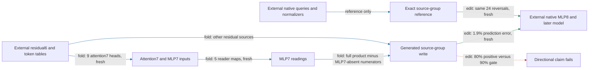

# The MLP7-present group predicts its effect, but fails the direction test

The residual6 executor generates the city-write terms containing MLP7 in a key or current-value slot and predicts their removal effect on twenty new documents with **1.9% error**. However, **positive attenuation is 80%, below the registered 90% gate**. Exact native group removal has the same reversals. This grouping is not promoted as a consistently attenuating regional component. Extraction still requires native residual6 and the native suffix; independent composition remains failed.

**Metrics and scope.** Effect error is relative L2 difference between generated and native edited-minus-unedited spelling margins. Attenuation is fractional reduction of the UK-minus-US contrast among native contrasts at least 0.1 logit. Control ratio divides unrelated-reader RMS movement by target RMS movement. The fresh panel has twenty distinct Pile documents, forty original/city-substituted sequences and 240 fixed spelling probes. It has no overlap with previous frozen documents or inputs, but uses the same city/endpoint vocabulary. These are not natural next-token labels or proven pretraining-disjoint documents.

The group contains every city-side ordered K1×K2×V term with weighted MLP7 output in at least one slot. Its native reference holds full queries and normalization denominators fixed. Removing it at attention8 is **not native MLP7 ablation**. Prediction uses all nine attention7 heads and the existing approximate mixed8 RMS.

| Claim | Evidence | Evaluation | Key numbers | Status |
|---|---|---|---|---|
| Predict source-group effect | edit | fresh 20 documents | 1.9% error; 35% gate | passes |
| Execute isolated generator | fold/replay | fresh 40 fixtures | exact generated-write replay | passes |
| Preserve unrelated readers | edit | fresh | four ratios ≤20%; 50% gate | passes |
| Beat equal-norm same-site edits | edit | fresh | 16/16; 35× median | passes |
| Consistently attenuate contrast | edit | fresh | 80% positive; 90% gate | fails |
| Full native city removal and complement attenuate | edit | fresh reference arms | both 120/120 positive | observed |
| Mixed products reproduce reversals | edit | opened diagnostic | all 24 signs; 56–91% of group effect norm | passes |
| Self terms restore consistent direction | edit | opened diagnostic | 65% positive; 90% gate | fails |
| Independent source composition | edit | previous opened random-split test | 0/16 splits beaten | fails |

Four documents reverse at all six probes under both exact and generated group removal. Full city removal and the complement attenuate all 120 capable contrasts on this panel. The source-group failure therefore is not a sign error introduced by approximate normalization. Its effect RMS is 31% of full removal; that unsigned ratio is not an additive share.

The follow-up separates city-side **self terms**—both keys supplied by MLP7, with MLP7 current value or inherited value—from products mixing MLP7 and other residual sources. All internal MLP7 input products remain. Mixed removal reproduces the reversals, but self removal also reverses there and is positive on only 65% of all probes. This split does not recover a stable directional component. A small measured self/mixed interaction does not establish independent composition without the missing specificity tests.

The four-property assessment is **fresh conditional prediction passes; declared-input extraction passes; control/null preservation passes but directional manipulation fails; independent composition remains failed**. Price remains about 23 million FP32 values and 37 thousand native input floats. No simpler identified component follows from this split.

The folding handoff is limited: dropping attention7 head 3 inside the full-write generator gives 1.3% effect error on the original opened panel and could save 0.88 million weights once packed. Dropping all attention7 heads gives 40% error and fails the 5% gate. The selected eight-head version is not packed or freshly confirmed and does not replace the full generator.

## Reproducibility appendix

- Fresh source: [protocol](../../CITY_SOURCE7_FRESH_V1_PREREGISTRATION.md), [binding](../../CITY_SOURCE7_FRESH_V1_BINDING.json), [result](../../CITY_SOURCE7_FRESH_V1_RESULT.json), [row audit](../../CITY_SOURCE7_FRESH_V1_ROW_AUDIT.json), [table receipt](../../CITY_SOURCE7_FRESH_V1_TABLES_RESULT.json), [isolated certificate](../../CITY_SOURCE7_FRESH_V1_ISOLATED_RESULT.json). Gates a/b/c/e pass; d fails. 880 CPU sequence-equivalent forwards, 396 block calls, 36.375007044989616 seconds. Error 0.018531536901761486; untouched 0.01505102351355066; substituted 0.018956055461386692. Positive 96/120; mean attenuation 0.03557474365362494; max control 0.19522784547233824; target/null median 34.567215341906696. Reversing contexts 4,8,11,19. Isolated generated-write replay exact, 0.4831955060362816 seconds.
- Native source/complement interaction relative to smaller effect: 0.24613913985145183. This does not supersede previous failed random-split specificity. Fresh table 381 tokens; 23,291,782 FP32 values and 36,864 native input floats at T32. [Generator](../../city_source7_present_generator_v1.py) and [opened semantics check](../../CITY_SOURCE7_PRESENT_GENERATOR_V1_CPU_RESULT.json).
- Self/mixed: [protocol](../../CITY_SOURCE7_SELF_CROSS_V1_PREREGISTRATION.md), [preflight](../../CITY_SOURCE7_SELF_CROSS_V1_CPU_RESULT.json), [installed result](../../CITY_SOURCE7_SELF_CROSS_V1_RESULT.json). a/b pass, c fails. One native block7 preflight call, 0.3243252739775926 seconds; 200 installed sequence-equivalents/90 block calls, 8.61091176001355 seconds. Algebraic closures pass; full precision is in receipts. Self RMS 0.007868360807296753, mixed 0.08549787537060738, present 0.09294653507886631. Self positive 0.65; mean attenuation −0.0004926796818334637. Interaction/smaller: all 0.13510176081949934, reversing 0.04312273382575864, other 0.14495114062510614. No new null or independent-composition promotion.
- Omission: [protocol](../../CITY_ATTENTION7_OMISSION_V1_PREREGISTRATION.md), [screen](../../CITY_ATTENTION7_OMISSION_V1_RESULT.json). a/b/c pass; 520 sequence-equivalents/234 block calls, 44.59848739509471 seconds. Selected drop-head3 error 0.013345741597745044; potential packed count 22,441,606 versus 23,326,342. All omitted configurations, including failures, remain in the receipt. FP32 stored writes exactly preserve the edits installed by native attention8; double construction is reproducible from the builder.
- Next [finite-strength protocol](../../CITY_SOURCE7_STRENGTH_V1_PREREGISTRATION.md) and [implemented runner](../../check_city_source7_strength_v1.py): test reversal persistence at strengths 0.1 and 0.5. This is opened evidence and not an exact derivative.
- [Hourly review](../../HOURLY_STRATEGIC_REVIEW_2026-09-18_0155.md) switched to CIRCUIT and records measured runtimes, queue delays and process improvements. The [previous full-write report](research_update_2026-09-18_0152_fresh_residual6.md) retains its successful, separate scope.
