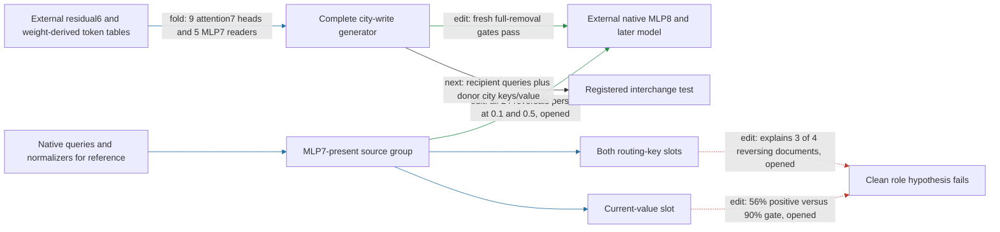

# Smaller edits and key/value roles do not rescue the MLP7 source group

The regional path still generates head8.2's complete city-removal write from native residual6, with fresh conditional prediction and selective-removal evidence. **The MLP7-present subgroup's direction failure persists at smaller strengths, and splitting routing keys from written value does not recover a clean directional component.** We retain the complete coupled interface and stop this sequence of source partitions. Native prefix/suffix dependencies, failed independent composition and unproved simplicity remain.

**Metrics and scope.** Attenuation is fractional reduction of the UK-minus-US contrast among native contrasts at least 0.1 logit. Scaled-effect error compares effect(a)/a with effect(1) in relative L2. Control ratio divides an unrelated-reader RMS movement by target RMS movement. The diagnostics reuse the now-opened twenty-document source-group panel, with forty original/city-substituted sequences and 240 fixed spelling probes; they provide no new fresh/OOD claim.

| Claim | Evidence | Evaluation | Key numbers | Status |
|---|---|---|---|---|
| Reversals occur only at full edit strength | edit | opened | all 24 persist at 0.1 and 0.5 | falsified |
| Approximate amplitude linearity | edit | opened | scaled error ≤6.6% overall, ≤3.5% reversing documents; 10% gate | passes |
| Routing-key main effect explains every reversing document | edit | opened | 3/4 documents, not 4/4 | fails |
| Value main effect gives consistent attenuation | edit | opened | 56% positive; 90% gate; mean 0.14%, 2% gate | fails |
| Interchange field factorization preserves the existing generator | fold/replay | opened CPU | exact generator replay | passes |
| Selective complete-city interchange | edit | new panel frozen | no installed result yet | not yet tested |

The routing-key intervention changes both key factors together. Its main effect keeps the MLP7 value contribution absent; the value main effect keeps the MLP7 key contributions absent. Their key/value product term is retained separately. Routing accounts for three reversing documents, while in the fourth its removal attenuates and the value term counteracts it. The routing main effect is positive on 85% of probes and the value main effect on 56%. Neither supports the proposed simple directional role.

Retaining the key/value cross term changes the group effect by about 4.4% in L2 on this panel. This cross term differs from the earlier **mixed-source** group, which also includes products between MLP7 and other sources inside the two key slots. The two quantities must not be conflated. Small measured interactions and exact write identities still do not establish independent causal composition.

The next test moves a supported interface instead of searching for another partition: use recipient query fields with the paired donor's city keys and complete current/inherited value, then subtract the recipient's original city write. It tests interchange, not whole-head donation or full token replacement. Prediction needs **two logical residual6 contexts**, about 74 thousand supplied floats at 32 tokens, with shared weights. This larger input requirement is explicit. A new twenty-document panel and weight-derived token tables are frozen without model outcomes; no interchange promotion has occurred.

The four-property status remains: full-write conditional extraction, fresh within-corpus prediction and selective removal pass in their prior scope; source-group directional claims fail; interchange is pending; independent composition remains failed. Literal simplicity is not established. The eight-head omission candidate remains a separate opened screen awaiting packing and fresh confirmation.

## Reproducibility appendix

- Strength [protocol](../../CITY_SOURCE7_STRENGTH_V1_PREREGISTRATION.md), [result](../../CITY_SOURCE7_STRENGTH_V1_RESULT.json): a/b/c pass. 160 sequence-equivalent forwards, 72 block calls, 6.094419448869303 seconds CPU. Scaled errors at 0.1/0.5: all 0.06598762621596042/0.036762359073021895; reversing stratum 0.03494420571092399/0.019545862875912604. These finite strengths do not constitute an exact derivative.
- Slot [protocol](../../CITY_SOURCE7_SLOT_FACTORIAL_V1_PREREGISTRATION.md), [preflight](../../CITY_SOURCE7_SLOT_FACTORIAL_V1_CPU_RESULT.json), [result](../../CITY_SOURCE7_SLOT_FACTORIAL_V1_RESULT.json): a passes, b/c fail. 280 sequence-equivalent forwards, 126 block calls, 10.42902940697968 seconds CPU. Key positive 0.85, mean 0.031380710895599746; value positive 0.5583333333333333, mean 0.0013543713814360705, max control 0.28313391368342405. Context11 is the routing-sign exception. Cross-retention change/group norm 0.04402072375448258; suffix main interaction/smaller main effect 0.11269636574317275. No specificity or fresh component test.
- Interchange [protocol](../../CITY_FULL_INTERCHANGE_V1_PREREGISTRATION.md), [field helper](../../city_residual6_fields_v1.py), [CPU preflight](../../CITY_FULL_INTERCHANGE_V1_CPU_RESULT.json): a/b/c pass, 40 fixtures in 0.5870854281820357 seconds. Generator replay exact; native-removal replay error 7.886720172921566e-07; local swap approximation errors 0.006666251893638464–0.028836121695637887. No installed behavioral certificate. Two native contexts, 73,728 native state scalars at T32 per edit.
- Fresh interchange [rows](../../CITY_FULL_INTERCHANGE_V1_ROWS.json), [overlap audit](../../CITY_FULL_INTERCHANGE_V1_ROW_AUDIT.json), [table receipt](../../CITY_FULL_INTERCHANGE_V1_TABLES_RESULT.json): first twenty eligible unseen documents by stream index3754; zero selection model calls and zero frozen document/input overlap. 385 tokens, 87 overlapping table entries exactly equal; non-table weights unchanged. [Shared overlap helper](../../regional_panel_overlap_v1.py) now replaces repeated authoring for future panels and matches the prior frozen source-panel audit without rewriting it.
- [Previous source-failure report](research_update_2026-09-18_0208_source_direction_failure.md) preserves fresh direction and self/mixed failures. [Full-write confirmation](research_update_2026-09-18_0152_fresh_residual6.md) retains its successful, separate counterfactual scope.
