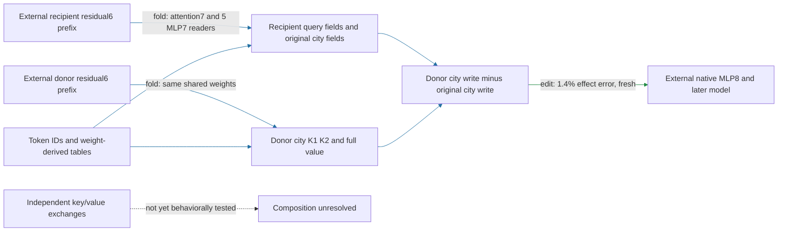

# The complete city interface supports selective interchange

The regional executor now swaps head8.2's complete city-key/value interface between paired UK/US contexts while keeping recipient queries and the native background. **On twenty fresh documents, generated swaps predict the exact native swap effect with 1.4% error and pass all registered control/null gates.** A standalone executor preserves those effects using shorter recipient and donor residual6 prefixes. This remains conditional extraction with two native contexts and a native suffix; independent composition and matched-effect simplicity are unresolved.

**Metrics and evaluation.** Effect error is relative L2 difference between generated and exact native edited-minus-unedited spelling margins. Attenuation is fractional reduction of the paired UK-minus-US contrast among native contrasts at least 0.1 logit. Control ratio divides unrelated-reader RMS movement by target RMS movement. The fresh panel has twenty distinct Pile documents, forty original/city-substituted sequences and 240 fixed spelling probes, with no previous frozen document/input overlap. It retains the prior city/endpoint vocabulary and does not establish new-domain or pretraining-disjoint generalization.

Both normalized key factors and the entire current/inherited value move together. Recipient queries, other source positions and the native residual background remain unchanged. This is a local interface swap, not whole-head donation or full token replacement. Mixed8 RMS inside the generator remains approximate.

| Claim | Evidence | Evaluation | Key numbers | Status |
|---|---|---|---|---|
| Predict native interchange effect | edit | fresh 20 documents | 1.4% error; 35% gate | passes |
| Predict untouched/substituted arms | edit | fresh | 1.9% / 1.1% error | passes under aggregate gate |
| Attenuate capable paired contrasts | edit | fresh | 117/117 positive; 68% mean | passes |
| Preserve unrelated readers | edit | fresh | four ratios ≤7.5%; 50% gate | passes |
| Beat matched random edits | edit | fresh | 16/16; 44× median | passes |
| Trim native input prefixes without changing effects | fold plus edit/replay | opened implementation check | all registered replay gates pass | passes |
| Execute outside repository | fold/replay | isolated 40 fixtures | replay and unsupported-token checks pass | passes |
| Independently compose key and value swaps | edit | registered next test | local algebra only | not yet tested |

Individual recipient movements also mostly point toward the donor: 98% of British-recipient probes move toward American spelling and all American-recipient probes toward British spelling. This is a different denominator from the 117 capable paired contrasts above. No document has a nonpositive capable paired attenuation on this panel.

The extracted executor uses the recipient prefix through the last edited destination and the donor prefix through the city. At this panel's lengths, that is 31 plus 13 tokens: **51 thousand native floats**, down from 74 thousand for two full sequences. There are still two logical native contexts. Shared weight storage stays **23 million FP32 values**. This is a measured state reduction, not a matched-effect simplicity victory or a runtime-speedup claim.

The four-property status is: **fresh conditional prediction and selective interchange pass; standalone declared-input extraction passes; independent composition remains unestablished**. Earlier independent source-partition failures remain failed. The successful coupled swap does not rehabilitate MLP7-present or key/value source-role claims. The next composition screen compares the concrete key-pair and complete-value exchanges, retaining their head product term and separating its effect from suffix interaction.

## Reproducibility appendix

- Interchange [protocol](../../CITY_FULL_INTERCHANGE_V1_PREREGISTRATION.md), [binding](../../CITY_FULL_INTERCHANGE_V1_BINDING.json), [result](../../CITY_FULL_INTERCHANGE_V1_RESULT.json): a–e pass. Native capture plus installed arms: 800 CPU sequence-equivalent forwards, 360 block calls, 30.96610568393953 seconds. Error 0.013842486441109306; untouched 0.01949087991360672, substituted 0.010738606632496437. Capable contrasts 117/120; positive 117/117; mean attenuation 0.6804361688912819. Largest control ratio 0.07498105372249035; target/null median 43.732763297277536, 16/16 beaten. British/American recipient fractions toward donor: 0.975/1.0. Full per-document and direction arrays remain in the receipt.
- [Standalone package](../../extracted_circuits/city_interchange_prefix_v1/README.md), [manifest](../../extracted_circuits/city_interchange_prefix_v1/manifest.json), [prefix protocol](../../CITY_INTERCHANGE_PREFIX_V1_PREREGISTRATION.md), [local receipt](../../CITY_INTERCHANGE_PREFIX_V1_CPU_RESULT.json), [installed receipt](../../CITY_INTERCHANGE_PREFIX_INSTALLED_V1_RESULT.json), [isolated receipt](../../CITY_INTERCHANGE_PREFIX_V1_ISOLATED_RESULT.json). Local and isolated maximum relative write difference 1.1201183984178087e-15; all replay gates pass. Installed certificate: 80 sequence-equivalent forwards/36 block calls, 3.9032665898557752 seconds; all five readout effect differences zero at installed precision. Isolated 40 fixtures: 0.7820534589700401 seconds. These fixtures are opened for the prefix follow-up.
- The installed result's copied `scope` sentence wrongly mentions supplied queries/RMS. Its [explicit scope correction](../../CITY_INTERCHANGE_PREFIX_INSTALLED_V1_SCOPE_CORRECTION.json) binds the original receipt hash and states the actual interface without changing any measurement or gate. Native inputs are two residual6 prefixes; queries and normalization are generated internally.
- Literal price: 23,300,998 FP32 values / 93,203,992 bytes; 385 supported tokens. Native state 50,688 floats versus 73,728 previously (31.25% reduction); token IDs/city/mask additional. Batch1 CPU float32 inputs, float64 edit output. Native blocks0–6 and MLP8/later model remain external.
- Next composition [protocol](../../CITY_INTERCHANGE_COMPOSITION_V1_PREREGISTRATION.md), [local preflight](../../CITY_INTERCHANGE_COMPOSITION_V1_CPU_RESULT.json): native self/swap replay and head algebra pass. Native block7 reconstruction: one batched block call, 0.27824290306307375 seconds, no full-model forward. Local cross/joint write-norm ratios range 0.11375749431540767–1.220052849494241; this is not a behavioral interaction result and motivates retaining the cross. Installed five-arm screen pending; no independent-composition promotion.
- [Previous source-role report](research_update_2026-09-18_0220_conditional_source_roles.md) preserves the failed source decompositions. The eight-head omission remains an unpromoted opened simplification candidate.
