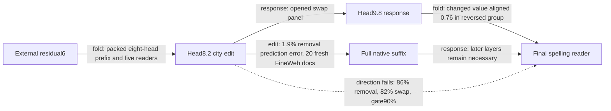

# FineWeb exposes context-dependent reversal of the city path

The packed residual6→attention7/MLP7→head8.2 generator predicts native city effects on FineWeb, but both removal and complete-city interchange fail the frozen direction gate. Native edits reverse with the generated edits, so better approximation alone cannot repair the intended regional interpretation. The subsequent response fold implicates head9.8's changed value and later attention, while leaving native context and the full suffix external.

Metrics: prediction error compares edited-minus-native spelling-margin effects by relative L2 norm. Positive attenuation means the edit reduces the paired UK/US contrast, among pairs with native margin≥0.1. Controls are unrelated-reader RMS movement / target RMS movement. A response term's **aligned fraction** is its signed dot product with the total effect divided by total squared norm; **norm ratio** is its norm divided by total norm. Cancellation can make a fraction exceed one.

| Claim | Evidence | Evaluation | Key numbers | Status |
|---|---|---|---|---|
| Packed removal predicts native effect | edit | fresh FineWeb,20documents | 1.9%error; gate5% | passes |
| Removal has intended direction | edit | fresh | 88/102positive=86%; gate90% | fails |
| Removal preserves controls/beats nulls | edit | fresh | controls≤12%;16/16nulls,30×median | passes these gates only |
| Coupled swap predicts native effect | edit | opened same documents | 1.7%error; gate5% | passes |
| Swap has intended direction | edit | opened | 84/102positive=82%; gate90% | fails |
| Swap preserves controls/beats nulls | edit | opened | controls≤11%;16/16nulls | passes these gates only |
| Attention9 alone accounts for final effect | response | opened | 40%error reversed group;77%elsewhere; gate35% | fails |
| Attention9+MLP9+normalization accounts for effect | response | opened | 49%/75%error; gate35% | fails |
| Routing-change terms explain head9.8 | fold of response | opened | 81%/110%error; gate35% | fails |
| Triple-change term is small | fold of response | opened | 0.96%/3.1%head-response norm; gate10% | passes local gate only |

Removal's fourteen negative capable probes occur in documents14,15,16. Native and generated signs agree on all102capable probes. Their source windows mention Houston entertainment, London Stansted flights and a Houston university. These are observed contexts, not a new semantic classifier or justification for discarding rows. Swap adds document18 to the reversed group; its individual recipient directions move toward the donor in70% of British and75% of American probes. Those denominators include all120probes per recipient side and differ from the capability-conditioned paired metric.

The response calculation retains every downstream module, final normalization and softcap. At the final query token, the attention8 edit and block8 residual change are zero; information must arrive through later contextual attention. Head9.8 has aligned fraction0.68/norm ratio0.73 in the reversed-document group, versus0.24/0.25 elsewhere. Attention17 has aligned fraction0.43/norm ratio0.44 in the other group. These are **responses to the upstream edit**, not evidence that ablating those heads would reproduce its effect.

The native-to-edited head9.8 product expands into all seven nonempty combinations of changes in its two routing scores and complete value. The final query is unchanged. The value-only change has aligned fraction0.76/norm ratio0.81 in reversed documents and1.1/1.1 elsewhere; ordered routing/value crosses are retained. Neither an exact expansion nor a small triple term establishes independent behavioral composition.

Next, fold the head9.8 value reader through MLP8's output matrix. The implemented six-piece formula preserves the direct attention edit, both ordered bilinear cross terms, the quadratic term, MLP8 normalization and block9 normalization. An actual-weight algebra control passes; native MLP8 capture and integrated validation remain pending. Its normalization contexts are explicitly supplied, so this does not yet close native ports.

The four-property status is therefore: cross-corpus **effect prediction passes**; **extraction passes at the declared native boundary**; **selective directional manipulation fails on this corpus**; **independent composition remains unresolved/failed for tested related splits**. Stored-weight savings remain measured, with the matched-effect simplicity null untested. Earlier Pile passes remain valid for their panels; they do not override these misses.

## Appendix: receipts and execution

- [FineWeb removal](../../CITY_ATTENTION7_DROP3_FINEWEB_V1_RESULT.json), [signed diagnosis](../../CITY_ATTENTION7_DROP3_FINEWEB_V1_SIGN_DIAGNOSIS.json), [isolated execution](../../CITY_ATTENTION7_DROP3_FINEWEB_V1_ISOLATED_RESULT.json).
- [Opened swap registration](../../CITY_DROP3_FINEWEB_INTERCHANGE_V1_PREREGISTRATION.md), [swap result](../../CITY_DROP3_FINEWEB_INTERCHANGE_V1_RESULT.json).
- [Response registration](../../CITY_FINEWEB_RESPONSE_V1_PREREGISTRATION.md), [response result](../../CITY_FINEWEB_RESPONSE_V1_RESULT.json), [per-term/control arrays](../../CITY_FINEWEB_RESPONSE_V1_ARTIFACT.pt).
- [Seven-term registration](../../CITY_FINEWEB_HEAD9_FOLD_V1_PREREGISTRATION.md), [fold result](../../CITY_FINEWEB_HEAD9_FOLD_V1_RESULT.json), [source-position/control arrays](../../CITY_FINEWEB_HEAD9_FOLD_V1_ARTIFACT.pt).
- [Next MLP8 value fold](../../CITY_FINEWEB_MLP8_VALUE_FOLD_V1_PREREGISTRATION.md), [helper](../../mlp8_current_value_response_v1.py), [actual-weight algebra control](../../CITY_FINEWEB_MLP8_VALUE_FOLD_V1_ALGEBRA_CONTROL.json). Control uses arbitrary tensors as MLP8 input; it is not native behavioral validation.
- FineWeb sample-10BT streaming:20first eligible unused documents reached after359scans;40sequences/240fixed probes; zero document/input overlap. Lexical location filter, original/substituted city arms and fixed spelling endpoints retained. No pretraining-disjointness or actual next-token-label claim.
- Builder completed files before a Python shutdown crash; [exit receipt](../../CITY_ATTENTION7_DROP3_FINEWEB_V1_BUILDER_EXIT_RECEIPT.json) preserves this. Independent schema/hash/overlap checks passed; no reselected rows.
- FineWeb variant392token table:22,432,390FP32 values. Non-table weights unchanged. Load its packed attention7 file as the table variant of the Pile package; isolated40fixture replay passes. Full native residual6 and suffix remain external.
- Removal:800equivalent forwards/360block calls,29.299301503924653s. Swap:800/360,31.18467815197073s. Response:80/36,2.9988353080116212s. Seven-term fold:80/36,3.0109355919994414s. All CPU,two threads. Algebraic/replay closures pass; full precision and failures remain in JSON.
- Exact response identity and softcap-secant accounting reuse the earlier typed-face census; no claim that this identity is new. The new evidence is the corpus-specific reversal and its receiving-head/value decomposition.
