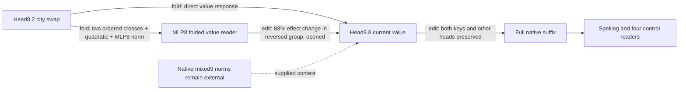

# MLP8's value response matters causally, but is not yet a selective component

The regional path now has a native-weight fold from the head8.2 city edit through MLP8 into head9.8's current value. Its six explicit terms reproduce native value changes, and factor-specific interventions show that the MLP8 and quadratic terms materially affect final spelling margins. This is opened-panel causal evidence at a declared value boundary; native normalization context, the remaining suffix, fresh confirmation and independent composition are still unresolved.

Metrics: folded-value error compares predicted and captured128-dimensional value differences by relative L2 norm. Intervention-change ratio compares the target effect of subtracting a specified value term with the full upstream swap effect, in L2 norm. Aligned fractions are signed projections onto the total response; norm ratios are unsigned. Large norms can coexist with cancellation.

| Claim | Evidence | Evaluation | Key numbers | Status |
|---|---|---|---|---|
| Six-piece value formula reproduces native response | fold | opened,40sequences | all replay gates pass | exact identity with measured FP32 tolerance |
| MLP8 response can be omitted | fold of response | opened | 200%error reversed;42%other; gate35% | fails |
| Quadratic response is negligible | fold of response | opened | 37%/35%of value-response norm; gate10% | fails |
| MLP8-mediated value term matters causally | edit | opened | subtracting it changes reversed target by88%; gate20% | passes basic screen |
| Quadratic value term matters causally | edit | opened | subtracting it changes target by26%in both groups; gate10% | passes basic screen |
| Direct value term matters causally | edit | opened | 96%reversed/57%other effect change; gate20% | passes basic screen |
| Matched-value-boundary specificity | edit | not yet evaluated |16registered random corrections | pending |

The MLP8 intervention subtracts only its induced head9.8 value response. It preserves the upstream city swap, both head9 routing factors, all other heads, and full downstream recomputation. It is not a native MLP8 ablation. Removing this value response makes10of18previously reversed capable probes positive, bringing the opened panel from84/102to94/102positive. That observation is not fresh evidence of a repaired regional circuit: the correction was nominated on these same documents, and controls are uneven. In the reversed group, the largest unrelated-reader change is71%of the intervention's target change, above a50%preservation bar if applied to that subgroup. All-group controls alone hide this limitation.

The folded reader stores L8,R8 and C=Wv9.8·Down8 rather than requiring the full MLP8 output for this read. Direct, left-cross, right-cross, quadratic, MLP8-normalizer and block9-normalizer pieces remain distinct. L/R labels follow the native parameterization and are not semantic identities invariant to hidden-channel gauges. The helper still takes z8, the edit and two native mixed9 normalization contexts. Its11,354,114FP32 values cost45,416,452bytes; this local price does not include native context generation or the full suffix.

Four properties remain separate: the packed city generator predicts fresh/OOD native effects and runs at a declared boundary; FineWeb direction gates still fail for its original removal/swap; the new value mediation is only an opened causal screen; independent composition is unestablished. Matched-effect simplicity remains untested. The next specificity screen uses equal-norm random corrections at the **same head9.8 value boundary**, not the earlier attention8-write null.

## Appendix

- [Fold registration](../../CITY_FINEWEB_MLP8_VALUE_FOLD_V1_PREREGISTRATION.md), [native fold result](../../CITY_FINEWEB_MLP8_VALUE_FOLD_V1_RESULT.json), [six-piece helper](../../mlp8_current_value_response_v1.py).
- [Mediation registration](../../CITY_FINEWEB_VALUE_MEDIATION_V1_PREREGISTRATION.md), [five-arm result and document signs](../../CITY_FINEWEB_VALUE_MEDIATION_V1_RESULT.json).
- [Next specificity registration](../../CITY_FINEWEB_VALUE_NULL_V1_PREREGISTRATION.md).
- [Due mathematical review](../../THREE_HOURLY_MATHEMATICAL_REVIEW_2026-09-18_0314.md) maps the conditional fold to soft-intervention/causal-abstraction requirements and records the scheduling repair.
- Same20opened FineWeb documents,40city-paired sequences,240fixed probes;102capable paired probes. Reversed-group membership frozen by prior exact-native swap signs. No failed documents removed or thresholds changed.
- Native fold:80sequence-equivalent forwards/36block calls,3.1834307711105794sCPU; max value error2.638863522368544e-5; transported contribution error5.587877438445748e-7. All closure checks pass.
- Five-arm mediation:200/90,7.1893901959992945sCPU; all four registered gates pass. MLP8 subtraction ratio0.8815267921599867reversed; quadratic0.2585515767343773reversed/0.2656319242083831other. Unselected head values unchanged exactly; subtraction replay and support gates pass.
- The three-hour timer had fired at173minutes and skipped under its175-minute prompt rule. The wrapper now waits for the actual interval before taking its shared lock. Boundary tests and Bash syntax check pass; cron schedules and GPU queues are unchanged.
