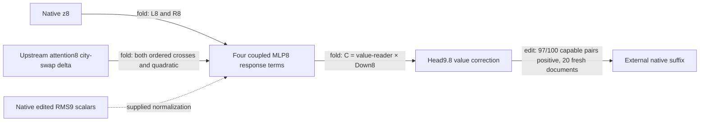

# Fresh-confirmed value mediator with a smaller exact interface

The MLP8→head9.8 value correction passes fresh prediction, directional manipulation, preservation and matched-random gates. Its standalone implementation now needs one native MLP8 input array, the upstream edit, and one edited-RMS scalar per position; full mixed9 arrays are eliminated exactly. This is a conditional value mediator, with native normalization and the remaining model still external. Independent composition and matched-effect simplicity remain unproved.

Metrics: correction prediction error compares its target-margin change from the full-swap background against the independently captured native MLP8 reference. Preservation is unrelated-reader RMS movement / target RMS movement, reported for both correction and total corrected swap. Positive attenuation means reduction of paired UK/US margin among native-capable pairs (margin≥0.1). Norm-matched controls act at the same128-dimensional value boundary, with the same upstream swap and destination support.

| Claim | Evidence | Evaluation | Key numbers | Status |
|---|---|---|---|---|
| Correction predicts independent native reference | edit | fresh20FineWeb documents | all prediction gates pass | passes at declared native interface |
| Corrected swap has intended direction | edit | fresh | 97/100capable pairs positive; mean attenuation43% | passes90%/2%gates |
| Correction preserves unrelated readers | edit | fresh | controls≤14%of correction target effect | passes50%gate |
| Total corrected intervention preserves readers | edit | fresh | controls≤14%of total target effect | passes50%gate |
| Correction beats matched random directions | edit | fresh |16/16;22×median target effect | passes |
| Exact reduced-input extraction | fold/replay + installed edit | opened fresh fixtures |40isolated fixtures; all five installed readout effects unchanged | established at boundary |
| Independent composition | edit | not tested for these two paths | direct-path/MLP8-path joint test registered | not yet established |
| Matched-effect simplicity | pricing | not evaluated | literal cost below; no matched-effect null | not yet tested |

The native parent swap already passes on this fresh panel:91/100positive, with53%mean attenuation. The correction increases the positive fraction to97%while reducing mean attenuation to43%. This is not uniformly stronger behavior. It also does not erase the earlier FineWeb failures or the opened reversed-subgroup control ratio of71%. On the new panel, reversed-document correction controls are≤13%; no document was excluded to obtain this result.

The formula retains both ordered MLP8 cross terms, the quadratic term and MLP8 normalization change. Because this intervention excludes the direct path and block9-normalizer term, it needs neither the native mixed9 vector nor the edited mixed9 vector once the latter's RMS is supplied. This is dependency elimination, not a frozen-normalizer approximation.

The [standalone package](../../extracted_circuits/city_mlp8_value_mediator_v1/README.md) stores11,206,658FP32 values (44,826,632bytes),147,456fewer than the six-piece helper. At32positions it takes36,896 native scalars instead of110,592, plus36,864 intervention scalars counted separately. The edited RMS still requires native counterfactual context; it is not predicted from tokens. Full prefix generation, the upstream swap and downstream model are not included in that price.

The next composition test uses two concrete computational paths into the same value port: the direct attention edit and its MLP8 response. Their insertion is linear with fixed keys, but the suffix can interact. A passing screen will still require same-full-write random-split specificity and fresh joint confirmation. Earlier failed head8 key/value composition remains in the record.

## Appendix

- [Fresh registration](../../CITY_VALUE_MEDIATION_FRESH_V1_PREREGISTRATION.md), [fresh result](../../CITY_VALUE_MEDIATION_FRESH_V1_RESULT.json), [row audit](../../CITY_VALUE_MEDIATION_FRESH_V1_ROW_AUDIT.json), [opened same-boundary null](../../CITY_FINEWEB_VALUE_NULL_V1_RESULT.json).
- [Reduced-interface registration](../../CITY_MLP8_VALUE_EXTRACTED_V1_PREREGISTRATION.md), [local result](../../CITY_MLP8_VALUE_EXTRACTED_V1_CPU_RESULT.json), [installed result](../../CITY_MLP8_VALUE_EXTRACTED_INSTALLED_V1_RESULT.json), [isolated execution](../../CITY_MLP8_VALUE_EXTRACTED_V1_ISOLATED_RESULT.json), [manifest](../../extracted_circuits/city_mlp8_value_mediator_v1/manifest.json).
- [Next composition registration](../../CITY_VALUE_PATH_COMPOSITION_V1_PREREGISTRATION.md).
-20new FineWeb documents after725streamed documents;40original/substituted city sequences,240fixed probes,100capable pairs. No prior document/exact-input overlap; no native capability filtering. This is fresh within the mediator's discovery corpus, not another corpus shift, actual next-token labeling or pretraining-disjointness guarantee.
- Fresh prediction error7.14468258448438e-6; maximum native value-fold error2.0424312248426618e-5; nullmedian ratio21.54696630381768; correctioncontrolmaximum0.13891838657954897. Complete document signs and subgroup/control results retained.
- Fresh execution800equivalent forwards/360block calls,30.03478026902303sCPU. Exact interface construction1.53655s/zero full forwards. Installed replay80/36,3.05004s. Isolated replay1.56984s. All closures pass; detailed precision is in JSON.
- Selector repeated the Python-finalization crash only after completed artifacts. Independent hash/schema/overlap validation passed; [exit receipt](../../CITY_VALUE_MEDIATION_FRESH_V1_BUILDER_EXIT_RECEIPT.json) retained. No reselection or silent success exit.
- Four-property accounting: conditional fresh prediction supported; extraction at native z8/edited-RMS boundary supported; fresh selective **manipulation of this mediated response** supported; independent composition unresolved. This is not evidence for whole-MLP8 removal or for the original packed-prefix intervention, which was not used as the parent in this test.
