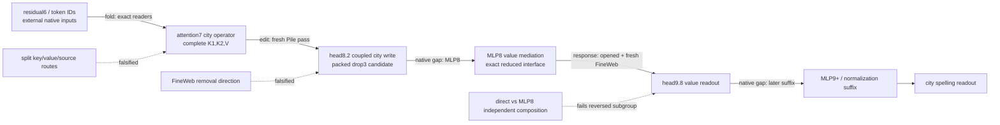

# Session story: from source attribution to a coupled, executable value path

The work in this session moved from asking “which small set of weights explains the city spelling behavior?” to a sharper answer: the behavior is reproducible by a sequence of native-boundary operators, but the useful operator is coupled across attention and MLP terms. The strongest result is therefore an executable **path** with explicit ports and external suffixes, not yet a simple independent circuit. The fresh FineWeb tests were valuable because they exposed where the Pile result overgeneralized: the packed attention path predicts the native computation, but its removal direction reverses on a minority of contexts. A downstream response fold then identified an MLP8-to-head9.8 value-mediated correction and made that correction executable. The latest norm-closed interface removes a supplied counterfactual norm, while the fresh joint test still rejects promoting the direct and MLP8 pieces as independent components.

This report is a retrospective of the session, written using the requested communication guide. It puts the current story and the decisive failures first, labels evidence as **fold**, **edit**, **response**, or **fit**, and states whether each number is from **fresh**, **opened**, or **replay** rows. The four behavioral properties are tracked separately; simplicity is a fifth price, not silently folded into the others.

## The path we can currently defend

The diagram has deliberate gaps. A **fold** identifies terms in the native computation; an **edit** changes a component and recomputes the recursive suffix; a **response** says where an upstream edit’s effect appears downstream. None of these tags, by itself, licenses the stronger claim represented by another tag. The residual6 state, native RMS values where still supplied, and the later suffix are explicit interfaces or gaps rather than hidden edges.

### Metrics box

The **change-norm ratio** is the L2 norm of a term’s paired change divided by its parent’s change; it is signless and can exceed one under cancellation. The **aligned fraction** is the signed dot product with the parent change divided by the parent’s squared norm. **Replay error** is relative L2 error when a reduced program stands in for its parent. Transfer percentages and CE/logit quantities are reported in their native units. All algebraic closures and isolated-package receipts pass; the full values are in the linked artifacts.

## What changed, in research terms

### 1. We fixed the definition of success before chasing a smaller object

The working definition in `better_circuits.md` has five properties: simple, predicts OOD, extracted at a declared boundary, selective under intervention, and composable. During this session the first four behavioral properties became the reporting frame, while simplicity was priced separately. This prevented a compact weight file from being mistaken for a complete explanation. The communication guide added a second discipline: every result must say what kind of evidence it is, what rows it used, and what would have falsified it.

The broader Claude readout lane was kept separate. It found several predictive readout families, but those are fits/readouts on a different task and dataset, not evidence for the regional city path. Keeping the lanes separate is part of the result, not an omission.

### 2. Early source partitions failed for a principled reason

The first regional attempts tried to split the behavior into MLP7 or key/value source groups. A fresh MLP7 source grouping predicted many effects and passed controls, but its direction gate was only 96/120 positive (80%, below the 90% requirement). The self-versus-mixed diagnostic made the problem clearer: self rows were only 65% positive and had a tiny RMS change, while mixed rows reproduced the reversals. A key/value slot factorial then gave roughly 85% for key and 56% for value, with a negative value result on one document. These were not near-misses to hide; they falsified the idea that one independently readable source slot was the whole mechanism.

The useful consequence was methodological: stop searching arbitrary source partitions and preserve the complete coupled operator until an intervention proves a smaller role. The later complete residual6 extraction followed that rule.

### 3. The residual6 boundary made the computation executable

The complete residual6 program takes one supplied residual6 input plus token IDs, city, and destination, then generates the five attention7 readers (q1, k1, q2, k2, value). On a **fresh** 20-document Pile panel (386 tokens, 240 probes), it passed the prediction and selectivity gates: effect error 0.019, 114/120 positive probes, controls at most 0.18, and all 16 same-boundary nulls beaten. The extracted program is exact at its declared boundary and can run in isolation.

This was an extraction result, not a token-only result. It still consumes native residual6 state, and the native MLP8/suffix is external. Its composition test failed, so it established a usable boundary and a causal effect without establishing independent reusable pieces.

### 4. The complete city interchange succeeded where the source split failed

The next intervention swapped the donor city’s complete normalized K1, K2, and current/inherited V state into a recipient while keeping recipient queries and background fixed. On a **fresh** 20-document Pile panel, the complete interchange passed all five registered gates: effect error 0.014, 117/120 capable positives, controls at most 0.075, all 16 nulls beaten, and mean attenuation 0.68. The isolated export is exact and cuts the declared native state, but it is still a coupled two-prefix operator with the full suffix external.

This is the central causal turning point. A complete operation is real and selective; the attempted key-only, value-only, or head-cross decompositions are not thereby real. The opened five-arm composition audit made that distinction quantitative: joint interaction divided by the smaller component was 2.34, head-cross omission divided by joint was 0.42, and the suffix interaction divided by the smaller term was 1.07. Every one of the 20 opened documents failed the registered small-interaction criterion. The right conclusion is “retain the coupled interchange,” not “choose whichever subterm is largest.”

### 5. Folding and packing reduced storage, but exposed a corpus boundary

An opened omission screen selected attention7 head 3 for packing. The **fresh** Pile confirmation of the resulting `drop3` package passed prediction and selectivity: error 0.019, 114/114 capable positives, controls at most 0.12, and all 16 nulls beaten by 31x the median. The package stores 22.4 million FP32 values, retains eight heads, and has the native residual6 and later suffix as explicit ports. Physical packing replay is exact.

The first **fresh** FineWeb transfer was the important failure. Prediction still passed (error 0.019), controls were at most 0.12, and all 16 nulls were beaten, but direction was only 88/102 positive (86%, below 90%). The coupled FineWeb interchange was lower at 84/102 (82%). Native and candidate signs agreed on negatives, while a small set of contexts reversed. This means the fold approximates the native computation, yet the intervention is not uniformly selective across corpora. It is a context/domain limitation, not evidence that the arithmetic fold is wrong.

### 6. The response fold located a downstream carrier of the FineWeb effect

Because the FineWeb failure could not be resolved by another source split, the next question was downstream: after an upstream edit, which modules carry the response? A **response** fold over the exact final suffix found that attention9 and later normalization were necessary to reconstruct the readout response; early-only substitutions failed. A seven-term head9.8 fold showed that routing-only terms were poor substitutes while the value term aligned with the response. This is response localization, not a downstream edit claim.

The MLP8 fold then decomposed the value correction into direct, left/right cross, quadratic, MLP8-normalization, and block9-normalization pieces. The local native closure passed exactly. Omitting MLP8 produced a 2.0 relative error on reversed rows, while simplified quadratic-normalization alternatives remained around 0.35–0.37 and failed their gates. The opened mediation screen showed the useful causal structure: subtracting the MLP8-mediated correction changed 0.88 of the swap effect, subtracting the quadratic term changed 0.26, and subtracting the direct term changed 0.96. A same-boundary matched null beat all 16 random controls by 22x. Those are **edit** results on opened rows, and the reversed subgroup still had larger controls than the global average.

### 7. Fresh FineWeb data confirmed the mediator, then rejected an easy composition story

The fresh mediator run used 20 new FineWeb documents selected after discovery (40 sequences, 240 probes, 100 capable pairs). It passed every registered mediator gate: fold prediction error 7.1e-6 against an independent native MLP8 reference, 97/100 positive corrected swaps, 91/100 parent swaps, controls at most 0.14, and all 16 nulls beaten by 22x. The reversed rows also replayed with 4.8e-5 prediction error. This is the strongest fresh evidence for the MLP8-mediated value correction.

The exact reduced interface drops full mixed9 vectors and takes only native z8, the upstream delta, and an edited RMS9 scalar. It stores 11.2 million FP32 values; local, installed, and isolated replays pass. A norm-closed variant now generates the edited RMS9 from native factors and token IDs, removing the supplied counterfactual norm. Its local RMS relative error is 1.7e-8, installed readout errors are at most 6.2e-5, and the isolated package is exact. This is an interface closure, not a storage win: it stores 16.5 million FP32 values because it internalizes the normalization calculation.

Finally, the fresh direct-versus-MLP8 joint test tried to make the mediator simpler by treating the direct and MLP8 paths as independent. Globally the interaction was 0.11 and the joint suppression was 0.79 of the parent swap, but the previously reversed subgroup had interaction 0.49, controls up to 1.12 times the target, and failed the 0.35 subgroup gate. A matched norm-preserving random split was also weak globally: the real interaction beat all 16 random splits on the full and non-reversed groups, but beat 0/16 in the reversed group. The correct reading is coupled direct-plus-MLP8 value mediation, with a real subgroup limitation; independent composition is not established.

## Current four-property accounting

| Property | Evidence | Fresh/opened/replay | Key numbers | Status |
|---|---|---|---|---|
| Predicts held-out/OOD behavior | edit + replay | fresh Pile and FineWeb; opened mediation | mediator fold error 7.1e-6; packed FineWeb error 0.019 | **passes at declared mediator boundary; partial for packed removal** |
| Extracted at a declared boundary | fold + isolated replay | fresh fixtures and replay | residual6/complete interchange exact; norm-closed installed error ≤6.2e-5 | **established boundary extraction** |
| Selective manipulation | edit with controls/nulls | fresh Pile/FineWeb mediator; opened full interchange | 97/100 corrected swaps positive; 16/16 nulls; packed FineWeb 88/102 direction | **passes for mediator; mixed for original removal path** |
| Composition/reuse | edit | opened complete interchange; fresh direct/MLP8 joint | complete interaction 2.34; fresh reversed interaction 0.49; random split 0/16 there | **fails for proposed independent pieces** |
| Simplicity | storage accounting and matched nulls | replay/opened; no full matched-effect program null | 11.2M supplied-norm vs 16.5M norm-closed FP32 values | **not established** |

The table is intentionally scoped. “Extraction” does not mean token-only: native z8/residual6 inputs and the later suffix remain declared. “Selective” does not erase the FineWeb direction failures. “Prediction” is not the same as causal sufficiency. “Composition” is the unresolved property that prevents calling the current object a fully validated simple circuit.

## The overall interpretation

The pieces now fit one coherent picture. The regional behavior is generated by a nonlinear chain whose useful semantic unit is a coupled operator spanning an attention write, MLP8-mediated value correction, head9.8 readout, and later suffix. Attempts to assign independent meaning to an early source slot fail because the task signal is mixed before the intervention boundary. Complete interchange succeeds because it preserves the interaction. Folding then removes storage and exposes exact algebraic interfaces, but it cannot manufacture independence that the native computation does not have. FineWeb reversals show that the same native fold can be predictive while the causal direction depends on context. The response fold identifies where that dependence is carried, and the fresh mediator run turns one part of that explanation into an executable program. The latest composition failure says the remaining work is to characterize the coupled value path and its context conditions, not to keep partitioning it arbitrarily.

The parallel Claude readout results fit this broader lesson only at the level of method: weight-defined families can predict natural rows, but predictive readouts are not causal regional operators. They remain a separate lane with separate claims and nulls.

## What the next pass should do

1. Run the registered fresh expanded-generator confirmation for the norm-closed interface, with the worker that avoids the dataset-library shutdown abort; report it as fresh rather than borrowing the supplied-norm result.
2. Keep direct and MLP8 value terms coupled in the main path. Test a context-conditioned explanation of the reversed subgroup, with a predeclared fresh panel and matched full-write null.
3. Price simplicity against matched-effect baselines, including literal stored values, native ports, token tables, and suffix calls. A smaller file is not sufficient if it loses the selective effect.
4. Preserve the failed source partitions, FineWeb direction failure, and composition failures in the claim table. They define the boundary of the current explanation.

## Appendix: receipts and communication-guide audit

The main receipts are [fresh residual6](research_update_2026-09-18_0152_fresh_residual6.md), [fresh city interchange](research_update_2026-09-18_0235_city_interchange.md), [city composition](research_update_2026-09-18_0245_city_composition.md), [packed Pile removal](research_update_2026-09-18_0252_packed_city_removal.md), [FineWeb reversals](research_update_2026-09-18_0304_fineweb_reversals.md), [value mediation](research_update_2026-09-18_0317_value_mediation.md), [fresh extracted mediator](research_update_2026-09-18_0326_extracted_mediator.md), and [norm closure](research_update_2026-09-18_0342_norm_closed.md). The exact JSON, row manifests, commands, gates, and closure receipts remain in `basis_aligned/polynomial_causal/`.

This pass applies `communicating_results.md` directly: it starts with the story and endpoint, shows one path diagram, puts the instructive failures early, labels evidence types, states fresh/opened/replay scope, separates the four behaviors from simplicity, uses two-significant-figure body values, and leaves receipts to the appendix. The main improvement still needed in future updates is to keep this level of connected interpretation while shortening per-run chronology.

The explanatory guide itself remains user-owned and was not modified. The research reports above are the review pass against it.
