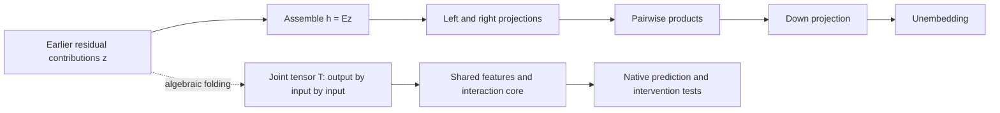
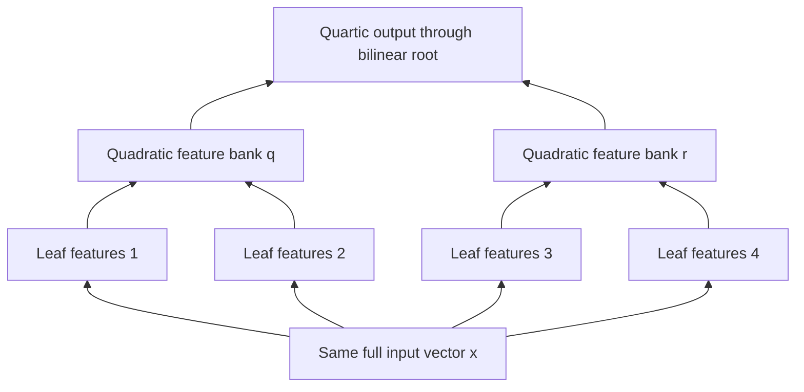
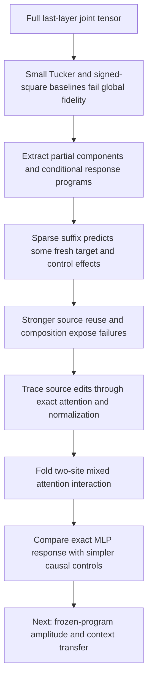

# Folding the joint tensor: what worked, what failed, and where the circuit search stands

**20 September 2026, 14:48 UTC.** This report follows the path from the full last-layer third-order tensor to the current conditional interaction programs. It includes the latest native carry-only control.

**We did construct and analyze the full joint third-order tensor implicitly. Small shared Tucker spaces do not approximate that object well in the tested weight metric.** We then found useful partial components and smaller conditional response programs, but these have not yet delivered the full goal: a simple, independently extracted circuit that predicts OOD, supports selective removal, and composes or reuses reliably.

The shift toward conditional programs was motivated by those measured failures and by native causal tests. It changes the object being approximated. It must not be reported as having solved the original global tensor decomposition.

## 1. Terms and the original object

| Term | Meaning here |
| --- | --- |
| **Folding** | Algebraically substituting or contracting adjacent computations while preserving the declared function. It can expose cancellations; it does not itself reduce cost. |
| **Third-order tensor** | An array with three indices: one output index and two input-feature indices. “Order three” does **not** mean a cubic polynomial: this tensor computes a quadratic function. |
| **Joint decomposition** | Factor the function defined by all three matrices together, so output projections, input projections and cancellations are considered jointly. |
| **Tucker decomposition** | Shared input/output feature spaces connected by an interaction core. Its ranks are feature-space dimensions. |
| **Interaction sparsity** | Few retained feature-pair interactions. This differs from sparse feature definitions or a small number of features. |
| **Conditional program** | An executable computation given a declared background and input ports. Preparing those ports may still require the original model. |
| **Reader / writer** | A reader maps a state into an observable; a writer maps features back into a state. A contextual derivative reader is not automatically a reusable predictor. |
| **Opened / fresh** | Opened data have already influenced analysis or redesign. Fresh evaluation is frozen before observing its outcomes. Neither automatically establishes broad distributional OOD. |

For a bilinear MLP,

\[
B(h)=D[(Lh)\odot(Rh)],
\]

write its input as contributions from earlier computations, \(h=Ez\). With unembedding \(U\), the MLP's unnormalized projected contribution is

\[
f(z)=C[(Az)\odot(Bz)],\qquad C=UD,\quad A=LE,\quad B=RE.
\]

Here the symbol \(B\) on the right denotes the contracted right-factor matrix, rather than the whole MLP. Equivalently,

\[
T_{vij}=\tfrac12\sum_k C_{vk}(A_{ki}B_{kj}+A_{kj}B_{ki}),
\qquad f_v(z)=\sum_{ij}T_{vij}z_i z_j.
\]

The native last-layer experiment used **6,912 source coordinates**, 50,304 vocabulary outputs and 4,608 bilinear channels. The source assembly was \(E=[I,\lambda_{17,0}D_{16},O_{17}]\). An earlier prose dimension of 7,872 was corrected.

We evaluated this joint tensor through contractions, mode Gram matrices and streamed blocks rather than storing the enormous dense array. Exact QR-based changes of coordinates reduced the effective input and output ambient dimensions to 1,152. That is an exact algebraic reduction, not evidence that a much smaller semantic feature space exists; expanded feature adapters still cost storage and computation.

**Scope matters:** this tensor describes a polynomial contribution. MLP RMS normalization, output bias, residual readout, final RMS normalization and logit softcap remain explicit in the real model. Two-QK-product attention has its own normalization and cached-value dependencies. The complete normalized network is not one fixed polynomial tensor.

## 2. What happened to the full third-order decomposition

We tested the symmetric shared-input Tucker family

\[
T_{vij}\approx\sum_{\alpha,p,q}W_{v\alpha}G_{\alpha pq}P_{ip}P_{jq}.
\]

The same input features \(P^\top z\) feed both input slots; \(W\) supplies shared output directions; \(G\) specifies their pair interactions.

| Experiment | Result | What it establishes |
| --- | --- | --- |
| Joint HOSVD/Tucker initialization, rank 64 | **97.27% relative tensor error**, versus 98.41% for independent matrix SVD | Joint contraction helps slightly, but this small-rank representation is very inaccurate. |
| Mode-spectrum bounds for the same shared-input Tucker family | Achieving ≤10% tensor error requires output rank **at least 1,088** and input rank **at least 1,089** | Better optimization alone cannot make tiny ranks solve this particular ambient weight objective. These are necessary, not sufficient, ranks. |
| Output-sharing signed-square decomposition | At 4,608 square products, **91.29% full tensor error** | This alternative also fails as an economical global replacement at the native product budget. |
| One leading output component | A 256-square version gives **4.27% component prediction error** on fresh validation documents | A useful partial component exists; it is not a replacement for the full tensor. |

The last component was selected from weights, then checked with native input/output adapters. Removal increased loss more than a single equal-norm random-direction control. That is evidence of behavioral relevance, but not semantic selectivity, broad OOD, or reuse. The random control was one direction, not a null distribution.

The bounds are specific to the **declared source coordinates, coefficient-Frobenius metric and Tucker family**. They do not rule out wide sparse dictionaries, different arithmetic circuits, cheaper repeated-input polynomial representatives, or accurate behavior on the model's actual normalized inputs.

We also corrected real instruments rather than treating every negative as scientific evidence. An earlier activation-fit experiment normalized its targets but not its predictor, so its failure does not test the intended family. A later native CUDA SVD failed full-basis orthogonality/replay; CPU float64 restored the instrument, while the tested rank-512 failure remained. These are separate bugs and surviving negative results.

Sources: [joint tensor and sparsity audit](../../JOINT_FOLDED_SPARSITY_2026-09-20.md), [output-sharing results](../../OUTPUT_SHARED_COMPONENT_2026-09-20.md), [SVD instrument audit](../../JOINT_INPUT_BASELINE_AUDIT_2026-09-20.md).

## 3. What “sparse” now means

We no longer treat “many small core coefficients” as sufficient evidence of simplicity. Rescaling features can make coefficients small without removing a computation.

We distinguish:

- **Few features:** a small intermediate dictionary.
- **Few interactions:** few retained unordered pairs, or few output-specific core edges.
- **Sparse feature definitions:** each feature reads few original source coordinates.
- **Shared computation:** a product or intermediate feature is evaluated once and used by multiple outputs.

A shared product needs one multiplication, but each outgoing coefficient still costs storage. Dense input projections, output adapters, normalization forms, support indices, backgrounds and source generators count too. Fixing scales helps define penalties, but does not remove all rotational freedom: a sparse basis is not automatically a uniquely identified circuit.

This distinction yielded a real conditional result. In an eight-coordinate, six-MLP response program, retaining **18 of 36 unordered numerator pairs per stage** passed the tested target/control gates. Nine pairs and zero quadratic numerator failed. The MLP consumer fell from 2,582 to 1,718 floating values plus 216 integer indices, and from 216 to 108 numerator pair products per token. Exact normalization and substantial native context preparation remained. One matched random half-support also passed, so the selected support was not uniquely identified.

That earlier suffix program predicted fresh regular-noun structural tests, but stronger source-component reuse tests failed. Its success did not transfer automatically from one intervention direction to independently varied upstream contributions.

Sources: [sparse interaction definition and controls](../../JOINT_READER_SPARSE_RESPONSE_2026-09-20.md), [preceding report](research_update_2026-09-20_0726_sparse_subject_response.md).

## 4. Where Hierarchical Tucker fits—and what we actually ran

**Hierarchical Tucker (HT) represents a large tensor as a tree of smaller bilinear computations.** Folding two pure bilinear layers produces a degree-four polynomial with one output and four input indices: an order-five tensor. HT can represent linear features, combine them into quadratic features, and combine those into quartic outputs without storing the full expansion.

The tree groups **tensor slots, not necessarily disjoint input coordinates**. Every leaf can read the same full vector. Ordinary HT targets compression; sparse cores, useful feature bases and explicit sharing between branches are additional objectives. A shared computation DAG allows one quadratic feature to feed several parents instead of being recomputed in separate branches.

We ran a restricted native-weight benchmark: a two-MLP homogeneous numerator branch with five source-amplitude inputs and four output readers. The exact fold replayed at about \(6.6\times10^{-15}\) relative error.

| Representation | Stored values per context | Worst polynomial coefficient error |
| --- | ---: | ---: |
| Canonical quartic monomials | 280 | Exact |
| Rank-8 symmetric pair-tree HT | 656 | 9.35% |
| Rank-2 symmetric pair-tree HT | 116 | 36.26% |

**HT did not win this benchmark's accuracy–storage comparison.** Rank 8 met the 10% error bar but cost more than the exact canonical polynomial. Rank 2 saved storage but missed fidelity. This benchmark excluded RMS denominators, background/bias terms and the intervening attention path; it was not a full normalized-model or causal test.

We retained your symmetry refinement: two coefficient tensors can compute the same polynomial when every input slot receives the same \(x\). For \((x^\top x)^2\), a compact representative has pair rank one, while the fully symmetric representative has pair rank \(d(d+1)/2\). Thus symmetry identifies the function but can obscure a cheap representation. On the measured native benchmark, however, symmetrization improved the rank-8 approximation. We should compare representatives rather than assume one always wins.

Sources: [native quartic/HT benchmark](../../NATIVE_TWO_MLP_QUARTIC_HT_2026-09-20.md), [HT and shared-DAG direction](../../HIERARCHICAL_TUCKER_SHARED_DAG_DIRECTION_2026-09-20.md). Adaptive trees, learned sparse hierarchical cores and automatic reusable-feature discovery remain unfinished.

## 5. Why the trajectory moved toward causal response programs

The global weight metric asks for fidelity across all combinations of source coordinates. The circuit goal asks which computations predict and selectively control a behavior on meaningful inputs. We therefore kept the global failures as constraints and used native intervention tests to choose smaller objects to fold.

The current task concerns subject-number and attractor-number edits. An **attractor** is a nearby noun whose number can interfere with agreement. We split the earlier residual state into 23 named source contributions and evaluate number effects alongside eight other logit contrasts.

A recipient-specific selector can achieve selective edits in all 16 opened role/cell tests, but it uses native derivatives and finite reference effects. It is an **oracle baseline**, not an extracted source-selection circuit. Frozen shared reader banks performed worse, so we cannot silently replace that oracle with a reusable selector.

Combining subject and attractor edits exposed another distinction: successful individual edits need not compose additively. Joint native selectivity passed all eight composition cells, but simply adding singleton effects predicted only one of eight within the registered error bars. Exact final-readout treatment did not fix that; interactions arise upstream too.

The composition error is divided by the **weaker singleton number effect**. That prevents a large effect from hiding failure to predict a smaller one. The gates are 10% for number and 5% for each control contrast. These percentages are not comparable to tensor coefficient errors in the earlier tables.

## 6. Latest fold and the control that changed its interpretation

For two token edits at fixed background, we compiled the mixed attention correction: the later query reading the earlier edited source. This preserves both QK products, normalization, rotary factors and cached values. The exported correction uses **27 writer columns**—three value-related branches across nine heads—with scalar nonlinear amplitude functions. Those are computational coordinates, not 27 identified semantic features.

Adding this correction to the additive singleton attention states, then executing native MLP11 and the remaining suffix, passes all eight opened composition cells. We next folded the MLP11 response jointly over those 27 coordinates, retaining its exact RMS denominator.

For background \(h\), correction \(Wz\), homogeneous MLP numerator \(P\), and \(s(h)=\operatorname{mean}(h^2)+\epsilon\), the exact residual response is

\[
Wz+\frac{P(h+Wz)-P(h)-[P(h)/s(h)]\,[s(h+Wz)-s(h)]}{s(h+Wz)}.
\]

The numerator has linear and quadratic terms in \(z\); the background correction ensures zero intervention gives exactly zero response. Independent CPU replay agreed to about \(1.3\times10^{-12}\) relative error.

But exactness is not simplicity. The canonical response stores **498,070 values per context**. Across 48 contexts it costs 23.91 million values, versus 19.26 million for conditioned native factors plus their shared Down matrix. Expanding the joint tensor loses that storage comparison.

The latest native controls ask whether that detailed MLP response is needed at all:

| Composition construction | Cells passing | Worst number-effect error |
| --- | ---: | ---: |
| Add singleton post-attention states, no mixed edge; native MLP afterward | 6/8 | 15.06% |
| Mixed edge plus exact folded MLP response | 8/8 | 0.0241% |
| Keep only linear MLP response numerator | 8/8 | 0.0322% |
| Keep only quadratic MLP response numerator | 8/8 | 2.91% |
| **Carry-only: add mixed edge after background MLP, omit its MLP response** | **8/8** | **2.91%** |

Values above come from the same latest carry-control run; all passing rows also meet every control gate. Carry-only's largest control error is 1.51%.

This overturns the tentative necessity story suggested by local state norms. The precise MLP response improves accuracy, but **is not required under these output tolerances on these opened cells**. Carry-only needs no new MLP-response coefficients; it still requires the compiled attention edge, native singleton backgrounds and the native suffix. It does not delete MLP11 or prove that MLP interactions are unimportant elsewhere. The older six-MLP quadratic-omission failure concerns a different interface and remains valid.

Sources: [exact response fold and accounting](../../V4_MLP_RESPONSE_FOLD_2026-09-20.md), [degree-split preregistration](../../V4_MLP_DEGREE_SPLIT_V1_PREREGISTRATION.md), [carry-only preregistration](../../V4_MLP_CARRY_CONTROL_V1_PREREGISTRATION.md), [latest native result](../../../bilinear_quotient/circuits/followups/v4_mlp_carry_control_v1_result.json).

## 7. What is established, and what is still missing

| Requirement | Evidence now | Remaining gap |
| --- | --- | --- |
| **Simple** | Some conditional consumers shrink; a carry-only interaction control passes. | Global Tucker/HT wins are absent; full context/source-generation costs remain substantial. |
| **Predicts OOD** | Earlier conditional suffixes passed particular prospective syntax tests. | Latest carry-only route is opened-data evidence; robust transfer remains untested. |
| **Extracted** | Several prepared programs execute independently on CPU. | Preparing their backgrounds and source edits still uses the model; no complete token-input closure. |
| **Selective removal/editing** | Native contextual oracle edits preserve registered controls. | A small reusable extracted selector is missing; local approximation alone does not identify a selective semantic unit. |
| **Composes and reuses** | Latest two-site correction passes eight specified composition cells. | Broader amplitude/context/task reuse is missing; earlier stronger reuse failures remain. |

The next discriminating test is to freeze the simpler carry-only program and vary the two edit amplitudes independently, then test new contexts without choosing supports from their outcomes. Signed and mixed amplitudes matter: repeating the same direction at a different strength does not identify a full interaction tensor. The linear-response program is a useful tighter-accuracy baseline; HT and sparse shared-DAG discovery remain candidates rather than demonstrated solutions.

The three-hour review loop checks the mathematical object, searches related primary literature, compares matched-interface baselines, and redteams positive and negative results. The research goal remains active. We have better-defined folded objects and stronger falsifiers, but not yet the complete simple circuit the project is seeking.
