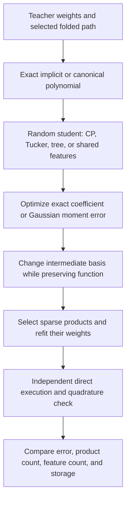

# Decomposition research update — 2026-09-20 15:48 UTC

The strongest new result is that finding a low-dimensional feature space and finding a sparse computation inside that space are different problems. A second optimization over feature bases recovered the planted three-product quartic structure and made one native quartic approximation substantially sparser. The full-width quadratic remains difficult: its apparent Gaussian-metric improvement largely tracks a simple radial baseline.

This is the current checkpoint in the two-day decomposition study through September22,15:10UTC. It is not a claim that we have identified causal circuits.

## Terms and mathematical object

A **bilinear channel** multiplies two linear features. A **shared quadratic feature** is a polynomial computed once and reused by several products. A **basis change** mixes intermediate features while compensating downstream weights, preserving the represented function. A **sparse root** uses only a few pairs of intermediate features. Sparsity of those pairs does not mean the individual quadratic features are sparse.

For a folded bilinear layer, the joint third-order tensor is implicit in three factors:

$$
f_v(z)=\sum_k C_{vk}(A_kz)(B_kz),\qquad
T_{vij}=\frac12\sum_k C_{vk}(A_{ki}B_{kj}+A_{kj}B_{ki}).
$$

The full native experiment includes the unembedding and preceding output projections. Its exact reduced input and output frames each have dimension1152. The students use128,512, or1024 bilinear channels; these widths are chosen model capacities, not proven minimal ranks.

For two bilinear layers, the degree-four polynomial has an order-five coefficient tensor, with one output index and four input indices:

$$
f_v(x)=\sum_{ijkl}H_{vijkl}x_ix_jx_kx_l
       \approx\sum_{(a,b)\in\mathcal S}W_{v,ab}q_a(x)q_b(x).
$$

Hierarchical Tucker organizes such contractions as a tree. Our shared-feature version permits reuse across branches. Here all input slots receive the same vector; they are not disjoint groups of coordinates. We match the polynomial through canonical monomial coefficients, allowing compact unsymmetrized computations. The representation itself need not be a fully symmetric tensor.

## Sparse shared quartics: measured results

We ran24 basis searches: two targets, Adam/Muon, learning rates0.005/0.05, three restarts. The starting feature spans remain fixed. We normalize each quadratic feature to unit isotropic Gaussian norm and minimize the sum of output-vector norms over shared product pairs. We then impose an actual product budget and solve for its output coefficients.

| Target and fixed product budget | Before basis search | Best after search | Stored scalar values |
|---|---:|---:|---:|
| Planted shared quartic,3 products |13.75%|0.00955%|72 plus support metadata|
| One native quartic,4 products |32.31%|4.81%|76 plus support metadata|
| Same native quartic, all10 products |2.513%|2.513%|100|

Errors are relative function norm under isotropic Gaussian inputs, not squared errors. The native target has five amplitude inputs and four outputs; it is a local homogeneous numerator, not the full model.

Every planted three-product search reached0.00955–0.01334% error. The native four-product searches ranged4.81–8.95%. Basis transformations preserved their starting functions to at most1.35e-15 relative error. The sparse exports were independently executed and checked by exact-degree Gaussian quadrature:15,625 points for the planted target and3,125 for the native target. Those errors agree with the coefficient calculation to numerical precision.

The unchanged all-product error is an important control: the basis search cannot enlarge the feature span. The starting approximation sets a floor. Basis condition numbers reached54 on the native target, so coordinate stability remains a concern despite accurate float64 replay. We have recovered economical computations, not uniquely identified original feature labels.

## Full native quadratic: a less favorable result

The new sweep used24 random-start fits: widths128/512/1024, Gaussian/Frobenius objectives, Muon rates0.005/0.05, two restarts,600steps.

| Width | Best Gaussian error among Gaussian-trained fits | Best Frobenius error among Frobenius-trained fits |
|---|---:|---:|
|128|58.62%|97.62%|
|512|56.67%|96.09%|
|1024|56.47%|95.48%|

A radial quadratic baseline alone has58.95% Gaussian error and99.84% Frobenius error. For a symmetric quadratic matrix $Q_v$, it retains only $\operatorname{tr}(Q_v)I/d$. This explains much of the improvement from the zero function under the Gaussian metric.

The distinction follows from the exact identity for standard Gaussian $x$:

$$
\mathbb E\|f(x)-\widehat f(x)\|_2^2
=\sum_v\left[2\|Q_v-\widehat Q_v\|_F^2+
\operatorname{tr}(Q_v-\widehat Q_v)^2\right].
$$

Gaussian loss rewards matching trace as well as tensor coefficients. It is not interchangeable with Frobenius loss. The larger learning rate also hurt Frobenius-trained fits; a failed fit cannot by itself establish a rank lower bound. Increasing width to1024 gives only modest gains at this optimization budget.

## Covariance-informed matching

We captured2,048 actual normalized MLP17 input rows from each of two fixed document panels. Calibration covariance and evaluation covariance differ by70.39% relative Frobenius norm. Calibration mean squared norm is1.868, versus centered covariance trace4.152. Ignoring the mean is therefore a substantive modeling assumption.

The next16-fit study compares:

- Isotropic zero-mean Gaussian inputs.
- Zero-mean Gaussian inputs with centered covariance.
- Zero-mean Gaussian inputs with the uncentered second moment.
- Gaussian inputs with both the measured mean and centered covariance.

The moment matrix $M$ in the polynomial loss contains fourth moments for quadratic functions. A covariance matrix alone is not that moment matrix; Gaussian assumptions provide a way to construct it. The noncentral calculation was verified independently with quadrature and parameter gradients, both within2.85e-14 absolute discrepancy. Evaluation-panel inputs do not enter optimization or restart selection.

The distinction between weight objectives, distributional moment assumptions, and actual-input diagnostics follows the framework of [When Are Two Networks the Same?](https://arxiv.org/pdf/2605.15183). These fits keep normalization and attention outside the polynomial equality claim.

## What this changes

The planted controls now support a two-stage strategy: recover a useful intermediate space, then search for a simpler basis and shared interaction graph. On the full native tensor, low reconstruction error is still unachieved. The covariance experiment will test whether the difficult coefficient directions matter on actual model inputs, while continuing to report isotropic error so distribution weighting cannot hide it.

Primary receipts and reproducible programs are indexed in [the study README](../../direct_tensor_match/README.md), particularly `QUARTIC_BASIS_SWEEP_V1.json`, `SPARSE_QUARTIC_PROGRAMS_V1.json`, `NATIVE_FULL_QUADRATIC_V2.json`, and `NATIVE_COVARIANCE_V1.json`.
