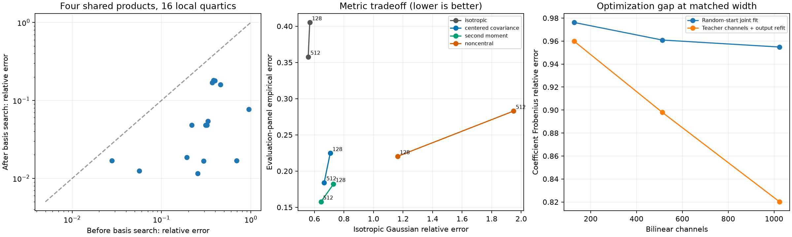
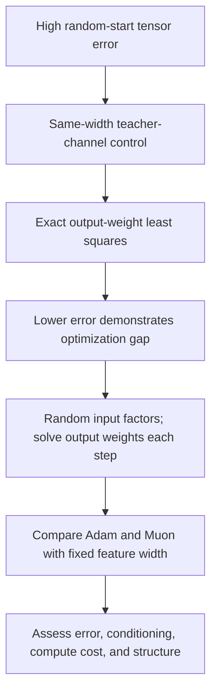

# Decomposition update — 2026-09-20 15:57 UTC

Three new controls distinguish sparse structure, distribution weighting, and optimization failure. Sparse basis improvements replicated across all16 local quartic contexts. Covariance-informed matching improved error on separate actual model inputs, with a clear tradeoff against isotropic error. A width-matched teacher-channel baseline substantially outperformed random-start full-tensor fitting, demonstrating an optimization gap.

## Sparse quartic structure replicated

Each context has its own fitted bank of four quadratic features, followed by shared products. We reconstructed the previously selected starting fit, then ran two basis-search restarts with pilot-selected settings. These are16 independently fitted representations; they are not one circuit transferred across16 contexts.

| Allowed shared products | Median error before basis search | Median after | Worst after |
|---|---:|---:|---:|
|2|67.75%|7.39%|31.36%|
|4|31.98%|4.82%|18.08%|
|6|14.02%|3.33%|15.36%|
|8|4.07%|2.69%|13.00%|
|10|2.62%|2.62%|12.90%|

Errors use isotropic Gaussian function norm. All16 contexts improved at each non-full budget;15/16 improved by at least2× at four products. The full10-product result stays invariant, as it should: changing a basis does not enlarge its span. Starting fits replayed within the1e-8 bar; basis transformations preserved functions to1.52e-14 relative error. One initial script invocation failed because the fitting helper returns a state dictionary rather than a model object; this was corrected before any result was produced.

The useful lesson is structural: a dense root in one intermediate basis can become sparse in another. Rank alone does not select that basis. The negative result is also visible: some contexts retain roughly13% error even with all products. The intermediate span itself then needs improvement. Gauge condition numbers reached190, so stable features remain unproven despite accurate float64 function preservation.

## Covariance helps actual-input matching, but changes what is preserved

Let $q$ denote the exact reduced input coordinates. For quadratic outputs, the loss involves fourth moments:

$$
\mathcal L=\sum_v\operatorname{vec}(Q_v-\widehat Q_v)^\top
M\operatorname{vec}(Q_v-\widehat Q_v),\qquad
M=\mathbb E[(q\otimes q)(q\otimes q)^\top].
$$

A covariance matrix is a compact way to specify a Gaussian approximation to $M$; it is not itself $M$. We compared four assumptions, using calibration statistics only. Restarts were selected by their own training objective before examining the evaluation panel.

At512 bilinear channels:

| Assumption | Its Gaussian training error | Isotropic Gaussian error | Actual evaluation-panel error |
|---|---:|---:|---:|
|Isotropic zero mean|55.81%|55.81%|35.76%|
|Centered covariance, zero mean|28.22%|66.61%|18.42%|
|Uncentered second moment, zero mean|6.94%|64.44%|15.76%|
|Measured mean and centered covariance|10.83%|194.85%|28.29%|

The first error column measures different distributions across rows and is not a common ranking criterion. The last column does use the same actual inputs. All statistics received a small isotropic ridge. The two document panels are distinct cached offsets, not evidence of broad domain OOD performance.

The noncentral Gaussian is more faithful to the first two measured moments, yet performed worse than the second-moment approximation here. Increasing its width from128 to512 lowered its own loss but worsened evaluation error from22.03% to28.29% and isotropic error from116.36% to194.85%. This warns against equating a richer distributional assumption or lower training loss with a better representation.

Why this may happen remains open: Gaussian higher moments differ from native higher moments; optimizer geometry changes under whitening; and weakly weighted directions can become large. These are hypotheses, not established explanations. The noncentral formula passed independent quadrature and gradient checks, and every native whitening replay was below8.84e-7. That rules out those particular implementation errors, not all possible bugs.

## High full-tensor error is partly an optimization problem

For fixed channel features $\phi_k(q)=(a_k^\top q)(b_k^\top q)$, output weights can be solved by linear least squares. Let $K_{jk}=\langle\phi_j,\phi_k\rangle$ in the chosen metric. If the selected teacher channels are indexed by $S$, the optimal output matrix is

$$
D=C K_{:,S}K_{S,S}^{\dagger}.
$$

We evaluated18 width/metric/selection combinations. Largest individual channel energy is a simple baseline; it does not model cancellation. Random subsets supplied controls.

| Width | Earlier random-start Frobenius fit | Selected teacher channels with output refit |
|---|---:|---:|
|128|97.62%|95.98%|
|512|96.09%|89.80%|
|1024|95.48%|82.02%|

These have the same number of bilinear channels and dense output weights. The teacher-channel baseline receives useful initialization information, so this is an existence/control result rather than a fair random-initialization discovery contest. It nevertheless disproves the inference that the earlier error was purely an unavoidable consequence of those widths. Even an arbitrary random1024-channel teacher subset reached about86.8% error after refitting.

Independent Gram and implicit tensor calculations agreed within2.23e-16 relative squared error; normal equation residuals were below4.60e-15. Refitting never worsened the objective. These checks specifically redteam an apparently favorable baseline.

The next experiment is random-start **variable projection**: optimize input features while solving the output weights at each step. It uses a tiny numerical ridge and differentiates through the solve. This directly targets the demonstrated optimization gap. It does not assume the model has a low-rank decomposition, and it does not make the resulting features interpretable by itself.

The overall circuit goal remains open: these are representation and fitting results, with no new claim of semantic identification, selective removal, or native circuit composition. The two-day science focus continues.

Primary receipts: [study index](../../direct_tensor_match/README.md), `QUARTIC_CONTEXT_BASIS_V1.json`, `NATIVE_METRIC_SWEEP_V1.json/.pt`, and `NATIVE_CHANNEL_BASELINE_V1.json`. The [plot PDF](../../direct_tensor_match/REPLICATION_AND_METRICS_V1.pdf) is available for export.
