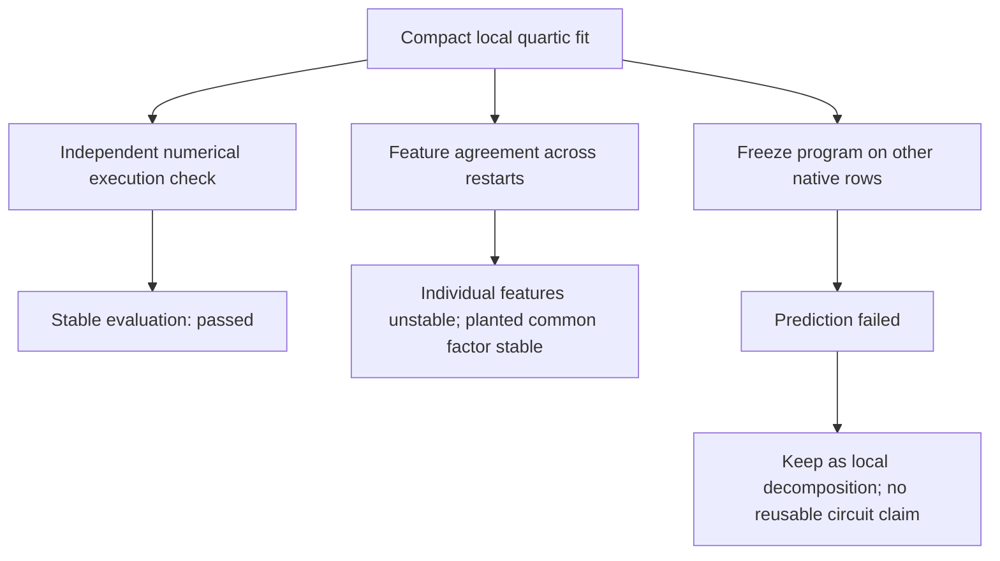

# Decomposition update — 2026-09-20 16:03 UTC

The latest experiments distinguish numerical stability, feature identity, and reuse. Sparse quartic exports are numerically stable, but their individual features are not uniquely recovered. A common-quadratic-factor hypothesis fits native local targets compactly, yet the frozen programs fail across other rows. That failure prevents promoting these decompositions into reusable circuits.

## Stability is not identity

We audited all32 four-product exports from the16-context study.

| Check | Result |
|---|---:|
|Worst float32 direct execution error|2.05e-7|
|Worst function change under1e-4 relative RMS factor noise|1.93e-4|
|Worst matched-feature correlation across two gauge restarts|0.297|
|Native support graphs matching up to permutation|12/16|

The first two predictions passed; the prediction that all features would match above0.99 failed. Both restarts started from the same intermediate span. The mismatch therefore reflects remaining choice of basis as well as optimization variation, not necessarily a different represented function.

For the planted shared-factor toy, the reused quadratic factor was much more stable: all12 basis searches recovered a common factor with pairwise Gaussian correlation at least0.999999997. The remaining features need not be individually unique.

The reason is explicit. If

$$
f_v(x)=q(x)\sum_a W_{va}r_a(x),
$$

an invertible mixing of the $r_a$ can be absorbed into $W$. The common factor $q$ can remain fixed while the names of the other intermediate features change. Seeking stable reusable computations may therefore require identifying a factor or subspace rather than every individual feature.

## A different structural assumption: one common quadratic

We directly fitted

$$
f_v(x)\approx q(x)r_v(x),
$$

where $q$ and each $r_v$ are quadratic polynomials. For five inputs and four outputs, this costs15 common-factor coefficients plus60 output-quotient coefficients:75 scalar values. The earlier four-product bank costs76 values plus support metadata. These are different model families at nearly equal storage.

The common factor is randomly initialized and normalized to unit Gaussian quadratic norm. At each optimization step, the output quotients are solved by linear least squares with a tiny numerical ridge. We swept Adam/Muon, learning rates0.01/0.05, and two restarts:136 fits over one planted target and16 native targets.

Results:

- Planted positive control: best relative Gaussian error9.93e-7.
- Native targets: median4.00%, worst14.55%;12/16 below10%.
- Better than the earlier four-product bank on13/16 native targets, though with a different optimization budget and objective history.
- Better than a74-value rank-one output approximation on all16 targets. That baseline is one dense scalar quartic with an output writer, so the gain is not explained merely by redundant outputs.

All selected native programs and the planted program were independently checked by exact-degree Gaussian quadrature. This validates the reported polynomial approximation error; it does not validate native behavioral effects.

## Frozen row transfer failed

We froze each selected row0 program and evaluated the other11 rows in its group:176 coefficient targets. The five amplitude coordinates retain named source roles, but the underlying native directions and readers vary by row. The test therefore concerns reuse at this particular amplitude interface.

| Heldout-row test | Median relative Gaussian error |
|---|---:|
|Entire program frozen, original row0 scale|100.10%|
|Oracle scalar rescaling of frozen program|97.29%|
|Common factor frozen; output quotients refitted to heldout weights|46.96%|
|Fixed random factor; output quotients refitted|81.78%|

Only the first row is an unchanged-program prediction. The remaining rows use heldout coefficients and measure approximation capacity, not prediction. The learned factor beat the random-factor control on149/176 rows, but the residual error remains large. The frozen-program prediction failed its preregistered50% median bar.

The worst unchanged-program relative error was1404×. Relative errors can be extreme when target magnitudes change greatly; even oracle scalar adjustment leaves97% median error, so scale mismatch alone does not explain the general failure.

This is a useful negative result. Good local tensor compression and stable numerical execution are insufficient for the ultimate goal. The full native joint-tensor experiment now queued uses variable projection to address the separately demonstrated optimization gap; it does not depend on assuming these local amplitude features transfer.

Primary artifacts are indexed in [the study README](../../direct_tensor_match/README.md): `QUARTIC_STABILITY_AUDIT_V1.json`, `SHARED_STRUCTURE_AUDIT_V1.json`, `COMMON_FACTOR_SWEEP_V1.json`, `COMMON_FACTOR_OUTPUT_BASELINES_V1.json`, and `COMMON_FACTOR_TRANSFER_V1.json`. No model checkpoint was modified.
