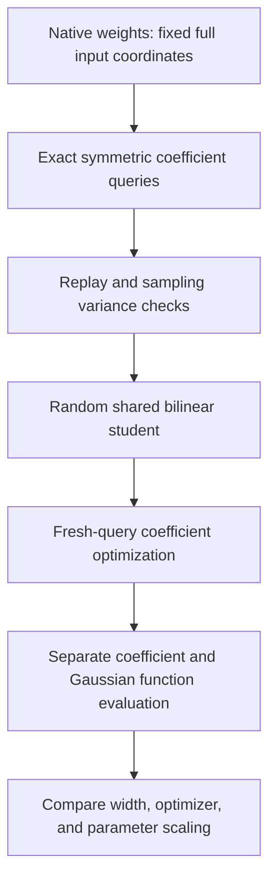

# Decomposition update — 2026-09-20 16:20 UTC

We can now query and validate coefficients of the native two-layer quartic on its full1152-dimensional input space. The estimator pilot passed and supports a bounded stochastic fitting experiment. Separately, eliminating output weights by variable projection did not close the full quadratic optimization gap at the tested settings.

## Full quadratic variable projection: useful negative result

For fixed quadratic input features, output weights can be solved by linear least squares. We differentiated through a tiny-ridge solve and optimized the input features from random initialization. Eight fits covered widths128/512, Adam/Muon, and two restarts, at learning rate0.005 for400steps.

| Width | Best Adam coefficient error | Best Muon coefficient error | Teacher-channel selection/refit baseline |
|---|---:|---:|---:|
|128|97.06%|99.87%|95.98%|
|512|95.21%|99.62%|89.80%|

Every fit improved and passed the independent objective replay. The prediction of beating the teacher-channel baseline failed. The Gram systems were well-conditioned (maximum condition3.68), with normal-equation residuals below1.73e-6. This makes a badly conditioned output solve an unlikely explanation for this specific failure. It does not rule out a bad input-feature learning rate, parameter scaling, insufficient iterations, or poor nonlinear minima. Muon was worse here; earlier toys did not establish a universal optimizer winner.

## Full-input quartic estimator passed

The target is the pure bilinear composition MLP16→MLP17→unembedding, including the intervening carry multiplier. It is a degree-four numerator with an order-five coefficient tensor. Intervening attention, residual additions, and normalization operations are outside this particular polynomial target.

The coefficient oracle computes the fully symmetrized entries from weights. A complete four-coordinate restriction replayed against direct native-factor execution with6.19e-7 relative error; float32 versus float64 entry queries differed by5.12e-7.

Uniform sampling used8,192 ordered input-index tuples. A separate stratified estimator sampled2,048 tuples from each of the five multiplicity patterns and weighted them by their exact counts. Their estimated squared Frobenius energies were3.647e20 and3.631e20, a difference of1.05 combined estimated standard errors. The uniform estimate's relative standard error was0.224%. These are estimated uncertainties, not guarantees against unobserved tails.

All-distinct tuples account for98.74% of the stratified coefficient-energy estimate; two-equal/others-distinct tuples account for most of the remainder. Thus uniform sampling is plausible for this native target even though it can fail badly on sparse counterexamples.

## Sampling assumptions change optimization

At an equal500-query budget on a12-dimensional toy, a single diagonal quartic was missed entirely by uniform sampling in196/200 trials. Equal collision-stratum allocation missed it in0/200. For a single all-distinct monomial, the comparison reversed: uniform missed115/200, versus153/200 under equal-stratum allocation. There is no universally favorable fixed allocation.

We then ran36 paired-initialization optimization controls: exact coefficient loss, uniform sampled loss, and stratified sampled loss; Adam/Muon; two restarts; planted tree/shared-DAG and diagonal quartic targets.

A few discriminating outcomes:

- Both exact-loss tree restarts stayed near13.37% error under either optimizer. One stratified Muon run reached0.088%; noise can help escape a poor solution.
- Exact-loss shared-DAG Muon fits reached about0.076% error. Sampled losses produced one similar good run and one much worse run (11.7% uniform,24.0% stratified).
- The diagonal target's uniform sampler saw no teacher signal in about1,100/1,200 batches, yet Adam still recovered it in both runs. One exact-loss Adam run failed near100%. Missing most batches does not by itself prove eventual recovery failure.

These controls use exact final-checkpoint evaluation and a fixed exact teacher denominator. They isolate optimizer/estimator interaction on representable examples; they do not certify native convergence.

## Next experiment: global shared bilinear computations

The queued student computes

$$
q_a(x)=(A_ax)(B_ax),\qquad
\widehat f_v(x)=\sum_k C_{vk}(L_kq)(R_kq).
$$

This shares quadratic features across root products. We test128 or512 quadratic features,128 root products, Adam/Muon and two restarts: eight fits per parameterization. The first bank covers the full1152-dimensional input, not moving five-dimensional amplitude ports. The cores are dense; width constraints alone are not sparse interaction discovery.

Each fit uses300steps of256 fresh coefficient queries. Final checkpoints are evaluated on8,192 separate coefficient queries and256 Gaussian input vectors. The Gaussian function diagnostic is a different metric, and neither diagnostic is native behavioral OOD.

A companion run represents the same initial output weights through unit-RMS raw parameters times a fixed small scale. This changes optimizer geometry without changing representable functions. It directly tests whether output update size overwhelms the initially small output matrix. Both queued scripts remain immutable.

Primary receipts and runnable code are indexed in [the study README](../../direct_tensor_match/README.md): `VARIABLE_PROJECTION_V1`, `NATIVE_QUARTIC_QUERY_V1`, `STRATIFIED_QUARTIC_CHECK_V1`, and `STOCHASTIC_QUARTIC_TOYS_V1`. The circuit goal remains unachieved; this stage tests global polynomial representation and optimization.
