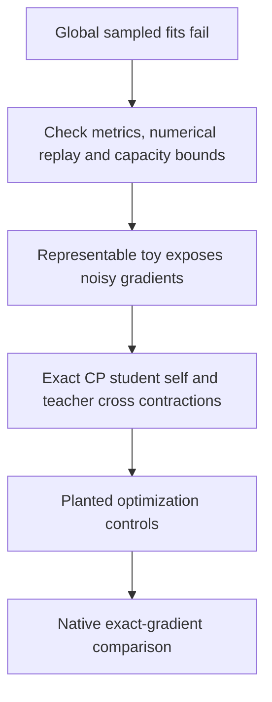

# Global decomposition checkpoint — 2026-09-20 16:43 UTC

The first global quartic fitting sweeps failed to learn a useful approximation. That is a result about these students and this optimization budget, not evidence that the target has no compact structure. The three-hour mathematical review produced a concrete next route: exact gradient contractions instead of sampled coefficient gradients.

| Experiment | Outcome |
|---|---|
|16 global quartic fits; two widths, optimizers, restarts and output scales|About100% coefficient error; both improvement predictions failed|
|Native symmetric quadratic ALS, width512|89.89% Frobenius error, nearly the89.80% teacher-channel baseline; no rejected sweeps|
|Native homogeneous radial quartic baseline|90.04% Gaussian error; narrowly missed90% threshold, within sampling uncertainty|
|Native quartic Gaussian energy decomposition|Estimated19.2% constant,43.4% second Wick degree,37.4% fourth Wick degree|

The native quartic students failed under both coefficient and Gaussian function metrics. Their mean mismatch explains about19% of their Gaussian residual, so it is not the dominant explanation. The coefficient-query output-rank128 lower bound was78.44%, but that is only a relaxation: it does not prove our shared-DAG family can attain that error.

## Why an accurate sampled norm can still be a poor training signal

We constructed an exactly rank-one teacher and student in1152 dimensions. At one fixed random orientation,256uniform coefficient queries gave gradient error over4million times the exact gradient norm. Even4,096queries remained extremely noisy. This demonstrates a failure mode on a representable toy; we have not yet measured native gradient signal-to-noise directly.

The exact loss for a unit-vector power toy contains a term proportional to $(a^\top u)^4$. Random high-dimensional vectors can have tiny overlap, making the true alignment gradient very small while sampled gradients remain noisy. Scalar norm-estimation accuracy alone does not address this problem.

## Exact-gradient continuation

For a quartic CP student,

$$
\widehat f_v(x)=\sum_k C_{vk}(a_k^\top x)(b_k^\top x)(c_k^\top x)(d_k^\top x),
$$

we can compute its self inner product from factor Gram matrices, including all24 permutations. Its cross inner product with the native two-bilinear-layer teacher is a sum of exact directional contractions of that teacher.

Therefore we can optimize

$$
\|\widehat H\|_F^2-2\langle H,\widehat H\rangle
$$

with exact parameter gradients, without expanding H or sampling coefficients. The omitted teacher norm is constant. Estimating that norm still limits claims about exact normalized error, but does not make this unnormalized gradient stochastic.

The implementation passed independent dense value and gradient checks at approximately1e-15. This CP student differs from the shared quadratic DAG, so storage, capacity and reuse must be compared explicitly. Planted optimization controls are the next step before native fitting.

The [three-hour mathematical review](../../THREE_HOURLY_MATHEMATICAL_REVIEW_2026-09-20_1637.md) includes primary literature, explicit assumptions, the Gaussian/Frobenius trace identity, and the revised priorities. [Code and receipts](../../direct_tensor_match/README.md) preserve both failed predictions and successful numerical checks. The circuit goal remains open.
