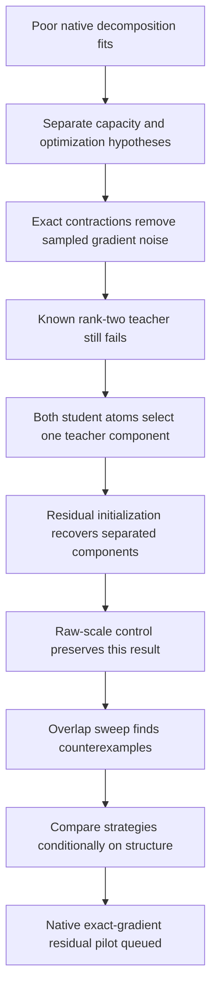

# Exact gradients and competing components — 2026-09-20 17:00 UTC

**Update at17:05:** [Refinement-rate controls](research_update_2026-09-20_1705_refinement_overshoot.md) recover the two amplitude0.5 overlapping failures at the same step budget. Their original endpoints were worse than their initializations; do not interpret those cells as a structural obstruction. The measurements below are retained unchanged.

**Bad decomposition fits can be optimization failures even when the student has exactly enough capacity.** We now have a concrete example and a counterexample to its proposed remedy. Exact-gradient joint fitting repeatedly duplicates one planted component. Residual fitting recovers that example, but loses to joint fitting on some overlapping components. This is evidence about the geometry of optimization, not a proof that native tensors have—or lack—simple circuits.

The two-day decomposition focus remains active through September 22, 15:10 UTC. The native exact-gradient pilot is queued; no native result is claimed here. The last mathematical/literature review was at 16:37, with results added through 16:42. The next is due around 19:37.

## What is being matched?

A **quartic polynomial** has degree four in its input. Its **order-five coefficient tensor** has one output slot and four input slots:

$$
f_v(x)=\sum_{i,j,k,l}H_{vijkl}x_ix_jx_kx_l.
$$

The native target is the pure path through MLP 16, MLP 17 and the unembedding. Attention, other residual terms and normalization denominators are outside this particular target. All four input slots receive the same 1152-dimensional vector. We match the fully input-symmetric coefficient tensor, so antisymmetric representations of the same polynomial do not count as functional differences.

A **CP student** here is a sum of products of four linear features:

$$
\widehat f_v(x)=\sum_{a=1}^{r}C_{va}
\prod_{s=1}^{4}(p_{s,a}^{\top}x).
$$

An **atom** is one such product; $r$ is the number of atoms. This is a different structural hypothesis from a shared bilinear DAG. It permits inexpensive exact contractions but does not automatically reuse intermediate quadratic features. A successful fit would still need circuit identification and reuse tests.

The reported relative coefficient error is

$$
\epsilon_F=\frac{\|H-\widehat H\|_F}{\|H\|_F}.
$$

This is not a Gaussian function error. Gaussian inputs weight quartic trace components differently; covariance-informed Gaussian inputs change that weighting further. Earlier native studies include both isotropic and covariance metrics, plus empirical evaluation on a separate captured panel. The new controls isolate coefficient fitting first.

## Exact training without expanding the tensor

Let $\phi_a$ be the symmetric coefficient tensor of atom $a$. Its feature Gram matrix is

$$
K_{ab}=\langle\phi_a,\phi_b\rangle
=\frac{1}{24}\sum_{\pi\in S_4}
\prod_{s=1}^{4}\langle p_{s,a},p_{\pi(s),b}\rangle.
$$

The teacher–feature cross matrix is $Q_{va}=\langle H_v,\phi_a\rangle$. For the folded two-layer teacher, we compute $Q$ by evaluating its symmetric multilinear contraction on the four factor vectors. The variable part of the exact objective is

$$
\mathcal L(C,P)=\operatorname{tr}(CKC^\top)-2\langle Q,C\rangle.
$$

The omitted $\|H\|_F^2$ is constant. Output weights are solved from the small Gram system; input factors are optimized by Adam or Muon. Independent dense expansion checks agree to about $10^{-15}$ for values and gradients. The coefficient-query evaluator was also checked independently, with maximum absolute error $5.6\times10^{-16}$.

For native tensors, the teacher norm is estimated only for scaling and normalized-error reporting. This does not introduce coefficient-sampling noise into the gradient. Floating-point arithmetic and local optimization remain possible sources of failure.

## A same-capacity failure and recovery

The initial sweep comprised 16 fits of planted rank-two tensors at input dimensions 6, 32, 128 and 1152. Removing sampled gradients did not guarantee recovery. At dimension 1152, the two learned atoms both aligned with the stronger teacher atom and largely ignored the weaker one.

We then compared two schedules with the same final rank two and 1500 total optimizer steps:

- **Joint:** optimize both atoms together for 1500 steps.
- **Residual:** fit one atom for 600 steps, fit another to the remaining tensor for 600 steps, then refine both for 300 steps.

| Optimizer; two starts | Joint error | Residual error |
|---|---:|---:|
| Adam | 33.743–33.744% | $2.3\times10^{-7}$ to $4.0\times10^{-7}$ |
| Muon | 33.740–33.743% | $1.36\times10^{-4}$ to $1.59\times10^{-4}$ |

The residual fits recover both teacher atoms. These are equal step budgets, not equal wall-clock budgets; timings are recorded. This comparison uses one planted teacher, so it is not an optimizer ranking across tensor families.

**Redteam:** residual refinement starts from unit raw vectors, while the original joint run starts from raw vectors of length roughly $\sqrt{1152}$. Even though the forward pass normalizes both, the angular effect of an Adam step changes. Four same-direction joint controls with unit raw initialization still stopped at about 33.743% error. That scale change alone did not explain the recovery.

## Where residual fitting fails

We next changed two properties of a controlled rank-two teacher: the second output writer's amplitude relative to the first, and the overlap of corresponding linear factors. Output writers are orthogonal. Every cell has the same final rank and 1500 steps, Adam at initial learning rate 0.05, and unit raw initialization for the joint baseline.

| Writer amplitude ratio | Linear-factor overlap | Joint relative error | Residual relative error |
|---:|---:|---:|---:|
| 1.0 | 0.00 | 70.815% | $6.3\times10^{-8}$ |
| 1.0 | 0.50 | $1.5\times10^{-8}$ | $8.5\times10^{-6}$ |
| 1.0 | 0.95 | $1.5\times10^{-8}$ | $2.6\times10^{-6}$ |
| 0.5 | 0.00 | 44.827% | $6.7\times10^{-8}$ |
| 0.5 | 0.50 | $1.5\times10^{-8}$ | 44.645% |
| 0.5 | 0.95 | numerical floor | 24.084% |
| 0.1 | 0.00 | 9.979% | $7.6\times10^{-8}$ |
| 0.1 | 0.50 | 9.934% | 9.909% |
| 0.1 | 0.95 | 5.686% | 5.742% |

Tiny values in this table are relative errors, not percentages. “Numerical floor” means the signed squared residual reached floating-point cancellation; it is not an exact equality certificate. The grid has one teacher orientation and one initialization per cell. Quartic atom correlations and signed squared errors are retained in the receipts.

**Interpretation:** separated components favor residual discovery in this experiment. Some overlapping components favor joint optimization instead. With a weak overlapping component, both can stall. Subtracting the best rank-one approximation to a rank-two tensor does not generally leave a rank-one tensor, so greedy progress need not reveal a true teacher component. This is a plausible explanation to test, not yet a demonstrated cause of each failed cell.

## What this says about Tucker and HT

The earlier poor fits cannot be attributed solely to an assumed rank. Capacity limits, the selected hierarchy, gauge choice, optimizer coordinates, sampled gradient noise and component competition are distinct hypotheses. The new experiment demonstrates one of them on a target whose required capacity is known exactly.

HT remains a useful compression baseline: a tree of bilinear computations. Sparse, shared bilinear DAGs remain closer to the desired reusable circuit representation. The CP experiment supplies an exact-gradient comparison and a way to diagnose optimization; it does not replace those objectives.

The native pilot grows up to eight CP atoms, with two starts per stage and joint output-weight refits. It trains entirely from weights and evaluates independent coefficient queries and Gaussian inputs. Its low rank is a deliberately small first test; failure would not rule out a larger CP model or a compact shared DAG.

[Study index and executable receipts](../../direct_tensor_match/README.md) · [Three-hour mathematics and literature review](../../THREE_HOURLY_MATHEMATICAL_REVIEW_2026-09-20_1637.md)
