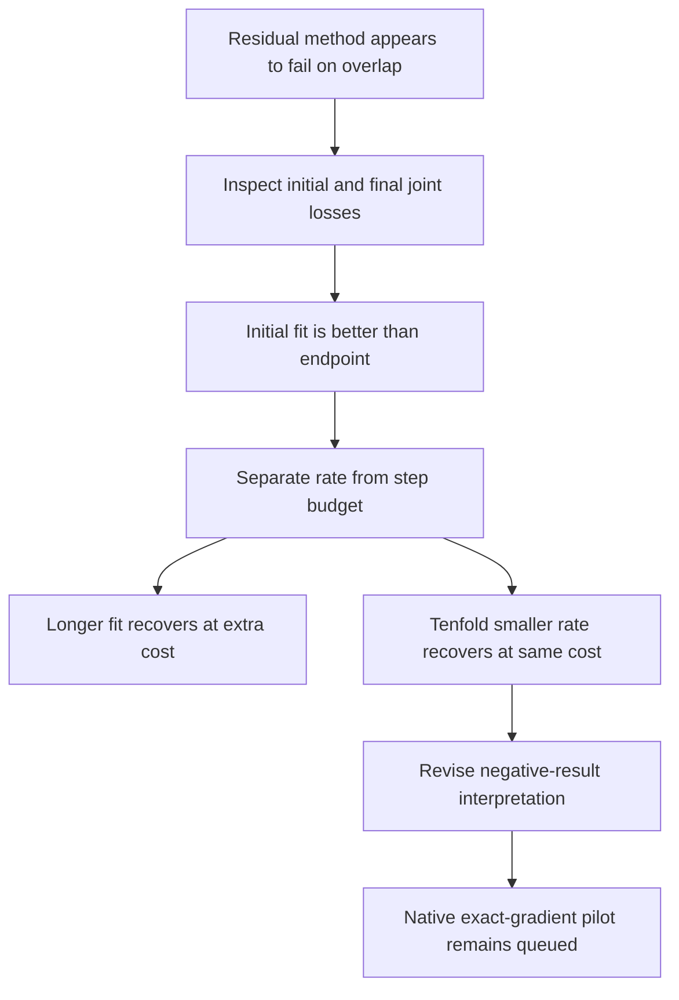

# Refinement overshoot changes the interpretation — 2026-09-20 17:05 UTC

**The two overlapping-component failures in the 17:00 report disappear when the final refinement learning rate is reduced tenfold, with the same step budget.** Their original errors were real, but they did not establish an obstruction to residual construction. The final optimization phase had discarded a better starting solution.

This is precisely why we are redteaming negative results. The historical receipts remain unchanged; this report updates their interpretation.

## Controlled comparison

The teacher is a rank-two quartic polynomial in 1152 input dimensions, with orthogonal output writers and writer amplitude ratio 0.5. The **linear overlap** is the inner product between corresponding unit input factors of the two teacher components. A **residual initialization** fits one atom for 600 steps, fits another to the remaining tensor for 600 steps, and then jointly refines both atoms for 300 steps. Output writers are solved analytically throughout.

All errors below are relative symmetric coefficient Frobenius errors. The loss is calculated by exact contractions, without sampled coefficients.

| Linear overlap | Before final refinement | 300 steps, learning rate 0.05 | 300 steps, learning rate 0.005 | 300 steps, learning rate 0.0005 |
|---:|---:|---:|---:|---:|
| 0.00 | numerical floor | $6.6\times10^{-8}$ | numerical floor | numerical floor |
| 0.50 | 0.6505% | 44.6449% | numerical floor | numerical floor |
| 0.95 | 11.7842% | 24.0843% | $4.2\times10^{-8}$ | $2.2\times10^{-7}$ |

Tiny values are relative errors, not percentages. Numerical floor means cancellation in the signed squared residual; it does not certify exact symbolic equality. Each cell uses one fixed teacher orientation and initialization. Both learning rates use the same cosine decay schedule.

The learning-rate-0.05 runs improve if extended to1500 joint steps, but that spends more computation. Reducing the rate achieves recovery within the original300-step refinement budget. Perturbing the initialization is less reliable: it helps one overlap case but leaves2.72% error in the other after1500 steps. Even a teacher-near oracle initialization can be damaged by the large refinement rate.

## Why this does not prove that every residual stage is easy

Let $R$ denote the residual coefficient tensor after the first fitted atom. Its exact output Gram matrix is

$$
G_{vw}=\langle R_v,R_w\rangle_F.
$$

A single CP atom has only one output direction. Therefore every one-atom approximation to this residual has relative error at least

$$
\epsilon_{\mathrm{output},1}
=\sqrt{1-\frac{\lambda_{\max}(G)}{\operatorname{tr}(G)}}.
$$

This is a lower bound from relaxing the input structure. It is not a claim that a CP atom can attain the bound.

| Linear overlap | Residual output-rank-one lower bound | Actual second-atom residual error |
|---:|---:|---:|
| 0.00 | numerical floor | $5.6\times10^{-7}$ |
| 0.50 | 0.6651% | 6.1446% |
| 0.95 | 13.5498% | 64.2179% |

These residual-relative errors have a different denominator from the full-teacher errors above. A poor intermediate rank-one residual fit can still provide two factors that joint optimization turns into an accurate rank-two representation. Intermediate-stage error is not a lower bound on the final jointly optimized model.

## Updated lesson for the native work

The previous report correctly showed that joint fitting can duplicate one component and that one fixed residual schedule can also fail. It was premature to read the latter as evidence favoring joint fitting on overlapping structure. For these two cells, the failure is controlled by the final learning rate and reporting only the final checkpoint.

Future comparisons should report the initial, best-training-objective and final checkpoints. Keeping the best checkpoint prevents a nominal refinement from replacing a better fit. It does not itself discover the missing structure: here the smaller learning rate provides the recovery. Checkpoint selection must use the training objective, not a heldout metric or teacher feature identity.

The queued native pilot grows CP atoms with exact contractions and refits their output writers. It does not run this same unit-scale joint-input refinement phase, so this result is not a diagnosis of a native failure. No native result from that pilot is yet available. No OOD, manipulation or circuit-reuse claim follows from these toy recoveries.

[Executable evidence and plans](../../direct_tensor_match/README.md) · [Earlier report, retained with correction link](research_update_2026-09-20_1700_exact_gradients_and_component_competition.md)
