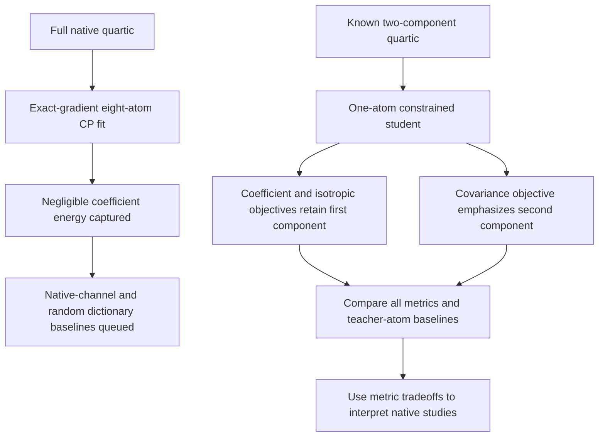

# Native CP null and exact quartic covariance control — 2026-09-20 17:14 UTC

**The native exact-gradient eight-atom pilot did not yield a useful global approximation.** It captured approximately0.086% of coefficient energy, conditional on the estimated teacher norm. Meanwhile, a controlled quartic experiment confirms that covariance weighting can change which structure a constrained student retains. These are separate results: the latter is not a native covariance success.

## Native result

The target is the pure MLP16→MLP17→unembedding quartic path, in the full1152-dimensional input space and an exact1152-dimensional output frame. A CP atom is a product of four linear features with an output writer. We grew eight atoms, using two random starts and300 Adam steps per stage, exact symmetric coefficient contractions, and joint output-weight refits. No input data were used to train this model.

| Atoms | Coefficient energy captured, estimated fraction | Independent coefficient error | Gaussian function error |
|---:|---:|---:|---:|
| 1 | 0.0159% | 99.9863% | 100.0163% |
| 2 | 0.0300% | 99.9727% | 99.9849% |
| 4 | 0.0451% | 99.9630% | 100.0685% |
| 8 | 0.0863% | 99.9356% | 100.1773% |

The coefficient diagnostic uses8192 independent ordered index tuples; the Gaussian diagnostic uses256 input vectors. Neither selects atoms. Training gains use exact self/cross contractions but the teacher norm used to normalize them is estimated. These figures are not exact normalized-error certificates.

The finite-value prediction passed. The predictions of coefficient error below99% and energy capture above2% failed. Runtime was27.7seconds. At eight atoms, standalone reduced factors/writers contain46,080 values plus the output frame; expanding writers directly into vocabulary space costs439,296 values. Neither price includes a normalization or attention replacement.

Post-fit structure inspection found a feature-Gram condition number of3.58. The largest absolute correlation between linear factors from different atoms was0.937; no pair exceeded0.99. Thus this run does not reveal an obvious nearly duplicate factor to share. It also does not establish that no shared representation exists, or that higher-rank CP/HT/DAG models must fail.

## A comparable baseline is queued

The next comparison retains the same widths from two fixed1024-atom dictionaries:

- Native-channel products:512 diagonal and512 off-diagonal pairs of penultimate bilinear channels.
- Random products:1024 products of four random unit linear features.

Each dictionary selects the atom with the largest conditional training gain after refitting output weights. The selector was validated against exhaustive candidate refits on a small tensor. Evaluation queries match the native pilot but do not participate in selection. This is a limited candidate dictionary, not an exhaustive search over all4608² channel pairs. Standalone factor storage is charged; a reference into the original large model is not counted as a free compact program.

## Exact quartic Gaussian matching, including covariance

For linear factors $p_1,\ldots,p_8$ and a zero-mean Gaussian input with covariance $M$,

$$
\mathbb E_{x\sim\mathcal N(0,M)}
\left[\prod_{i=1}^{8}(p_i^\top x)\right]
=
\sum_{\mathcal P}\prod_{(a,b)\in\mathcal P}p_a^\top M p_b,
$$

where $\mathcal P$ ranges over the105 pairings of eight indices. This gives the exact Gram matrix between quartic CP features, and therefore an exact function-space fitting objective. $M$ here denotes input covariance; it determines the required eighth moments only because we assume a zero-mean Gaussian distribution. Actual empirical eighth moments and nonzero means are different objectives.

Independent five-point-per-axis Gaussian quadrature validates the values and gradients for isotropic and dense covariance cases, with relative discrepancies below $3\times10^{-15}$. Whitening gives the same result. The implementation avoids materializing the full eighth-moment tensor.

## Controlled tradeoff: which feature gets retained?

The teacher is

$$
f(x)=\begin{bmatrix}x_0^4\\0.5x_1^4\end{bmatrix},
$$

in16 dimensions. The student has only one CP atom. We compare coefficient Frobenius, isotropic Gaussian and covariance Gaussian training. The covariance is

$$
M=\operatorname{diag}(0.2,2,1,\ldots,1).
$$

These entries are **variances**, not standard deviations. Fourth-power feature energy scales with the fourth power of variance, so the covariance deliberately makes the second teacher component much more important.

Twelve fits cover two Adam rates and two starts per metric,600 steps each. Checkpoints are selected by their own exact training objective, including the initial checkpoint. The table shows the best training result for each metric, evaluated under all three metrics.

| Training metric | Coefficient error | Isotropic Gaussian error | Covariance Gaussian error |
|---|---:|---:|---:|
| Coefficient Frobenius | 44.7280% | 44.7255% | 99.9800% |
| Isotropic Gaussian | 44.8994% | 44.5644% | 99.9732% |
| Covariance Gaussian | 89.4463% | 89.4379% | 2.0700% |

The best fixed teacher-atom baseline for covariance fitting has1.9922% covariance error. Thus the learned covariance fit is close to that concrete baseline but does not beat it. These baselines refit output writers under the relevant metric; simply retaining a teacher coefficient is a different comparison.

The result shows a predictable tradeoff, not one universally superior metric. Data-informed weighting can improve approximation on the specified distribution while degrading global coefficient fidelity. This is why native comparisons must retain isotropic, covariance and independent empirical evaluations separately.

[Study index and receipts](../../direct_tensor_match/README.md) · [Previous refinement-rate correction](research_update_2026-09-20_1705_refinement_overshoot.md)
