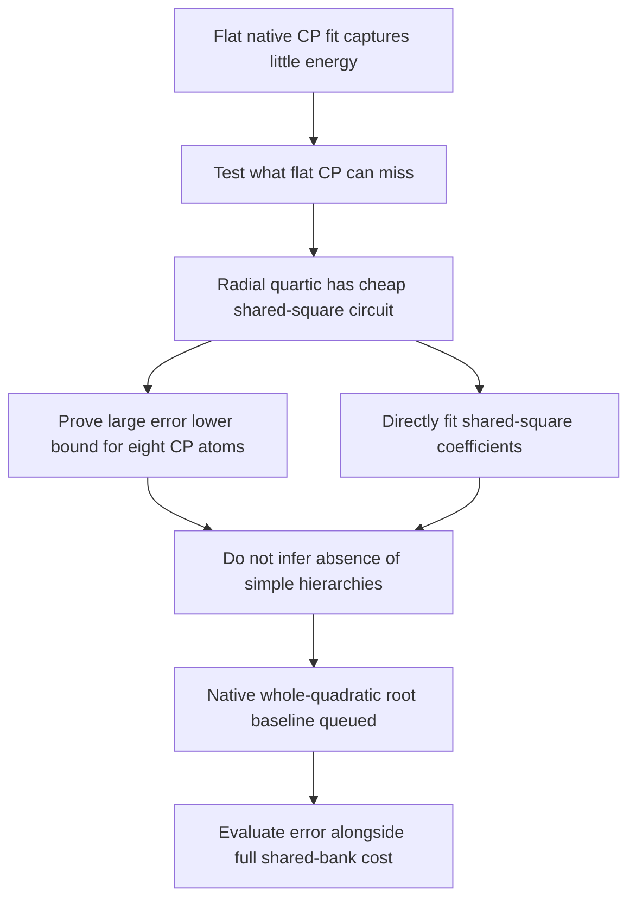

# Hierarchy capacity and a native baseline — 2026-09-20 17:21 UTC

**A poor flat-CP fit can coexist with an exact, inexpensive shared circuit.** We now have a validated capacity control showing this quantitatively at the model's1152-dimensional input width. The native hierarchy baseline is queued to test whether retaining whole quadratic features captures structure that eight products of linear features miss.

## A shared circuit that flat CP cannot cheaply represent

Consider

$$
q(x)=\sum_{i=1}^{d}x_i^2,\qquad f(x)=q(x)^2.
$$

The exact circuit computes $d$ squares, sums them, then squares the sum: $d+1$ scalar multiplications and $d-1$ additions. It reuses one quadratic feature at the root. These counts apply to the exact unit-coefficient expression, not to every dense learned quadratic form.

Its fully symmetric quartic coefficient tensor is

$$
H_{ijkl}=\frac{1}{3}
(\delta_{ij}\delta_{kl}+\delta_{ik}\delta_{jl}+\delta_{il}\delta_{jk}).
$$

An **unfolding** groups the first two tensor slots into a row index and the last two into a column index. The resulting matrix acts on a matrix $X$ as

$$
\mathcal H(X)=\frac{1}{3}
\left(\operatorname{tr}(X)I+X+X^\top\right).
$$

Its eigenvalues are $(d+2)/3$ on the identity direction, $2/3$ on the symmetric traceless subspace, and zero on skew-symmetric matrices. Thus its rank is $m=d(d+1)/2$.

A **flat CP atom** is a product of four arbitrary linear forms. Its symmetric tensor can be grouped into six outer products across this unfolding, so its matrix rank is at most six. An $r$-atom CP student therefore has unfolding rank at most $6r$. The best rank-$6r$ matrix approximation gives a necessary coefficient-error bound:

$$
\frac{\|H-\widehat H\|_F}{\|H\|_F}
\ge
\sqrt{\frac{4\max\{0,m-6r\}}{3d(d+2)}}
\qquad (r\ge1).
$$

This is a relaxation: reaching that matrix rank is not sufficient to attain the bound with CP factors. It bounds this known radial target, not the native model.

| Input dimension | Eight-atom CP coefficient-error lower bound | Exact shared-circuit multiplications |
|---:|---:|---:|
| 16 | 63.83% | 17 |
| 32 | 76.70% | 33 |
| 128 | 81.10% | 129 |
| 1152 | 81.61% | 1153 |

Dense checks at dimensions4,8,16 validate the spectrum, polynomial evaluation and individual CP unfolding ranks to floating-point precision. The result also refines the role of symmetry: the symmetric coefficients identify the function, but storing or factorizing that symmetric tensor need not be the cheapest way to compute it. The circuit can retain the compact expression $q^2$.

## Can direct optimization recover the shared feature?

We fit the structural hypothesis

$$
\widehat f(x)=\left(\sum_i a_i x_i^2\right)^2
$$

from random signed coefficients $a_i$. The diagonal support and reuse pattern are supplied; the coefficients are learned. This is not generic discovery of an unknown hierarchy.

For two coefficient vectors $a,b$, the exact symmetric tensor inner product is

$$
\langle H(a),H(b)\rangle_F
=\frac{(a^\top b)^2+2\sum_i a_i^2b_i^2}{3}.
$$

Dense values and gradients independently validate this objective. Twelve fits vary dimension16/128/1152, Adam rate0.01/0.05 and two initializations, with1000 steps and best-training checkpoint selection.

At rate0.05 all six fits reach the coefficient-loss numerical floor. Recovery of the quadratic coefficients, modulo their irrelevant global sign, ranges from about $2\times10^{-11}$ to $1.5\times10^{-9}$. At1152 dimensions the two coefficient-recovery errors are $1.0\times10^{-9}$ and $5.3\times10^{-10}$.

At rate0.01, five of six fits retain2.77–5.12% coefficient error at this budget; the remaining fit reaches $1.7\times10^{-6}$. The learning rate still matters even with the correct architecture. “Numerical floor” is not a symbolic equality certificate, so the independent quadratic-coefficient recovery is also reported.

## What the next native experiment tests

The native two-layer path already has a hierarchy:

$$
\begin{aligned}
m_i(x)&=(L_{1,i}x)(R_{1,i}x),\\
q_k(x)&=(L_2D_1)_{k,:}m(x),\\
r_k(x)&=(R_2D_1)_{k,:}m(x),\\
f_v(x)&=\sum_k C_{vk}q_k(x)r_k(x).
\end{aligned}
$$

The next baseline keeps whole quadratic products $q_kr_k$ and refits their output writers. It uses256 candidate native root channels:128 with the largest reduced-output writer norms and128 randomly chosen remaining channels. Writer norm is a disclosed candidate proxy, not exact feature energy.

Training uses8192 uniform coefficient tuples. Root features are selected by the conditional gain from refitting output writers. Evaluation uses separate8192 tuples and256 Gaussian vectors, matching the previous CP diagnostic. **The entry queries are exact, but this finite training Gram approximates the full-tensor objective.** This distinction will remain explicit in the results.

We retain widths1,8,32,128 and all256 candidate roots. The full shared4608-channel quadratic bank remains. Absorbing $D_1$ into the retained root projections gives the reduced parameter count

$$
2(4608)(1152)+2r(4608)+1152r,
$$

plus the output frame. At eight roots this is10,699,776 values, versus46,080 for eight flat CP atoms. The comparison tests structural capacity; it is not an equal-price compression contest. The exported baseline will include the shared bank and folded root projections.

The native-channel CP dictionary comparison is also queued. Neither pending experiment establishes predictive, manipulable or reusable semantic circuits; those remain the ultimate criteria after the current decomposition-science focus.

[Code, plans and receipts](../../direct_tensor_match/README.md) · [Native CP and covariance report](research_update_2026-09-20_1714_native_cp_null_and_covariance.md)
