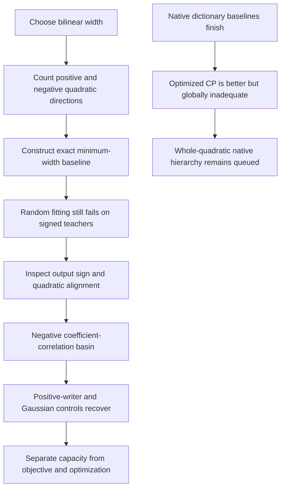

# Signed width, output-weight basins and native baselines — 2026-09-20 17:29 UTC

**The number of bilinear products needed for a real quadratic feature depends on its positive and negative eigenvalue counts, not just its rank.** A new120-fit control also exposed a signed-output optimization trap. Twenty-four paired controls repair the affected examples at unchanged width and step budget. Separately, the native channel dictionary comparison has finished; it supports the small CP pilot's improvement over simple baselines without making the fit useful globally.

## Width inside a quadratic feature

Write a quadratic as

$$
q(x)=x^\top Qx=\sum_{a=1}^{k}(u_a^\top x)(v_a^\top x),
\qquad Q=\tfrac12(UV^\top+VU^\top).
$$

Here $k$ counts products inside **one quadratic feature**. It is distinct from the number of quartic roots or output directions.

Let $n_+(Q)$ and $n_-(Q)$ count positive and negative eigenvalues. Their invariance under invertible changes of coordinates is the classical law of inertia; see [David Bindel's Cornell notes](https://www.cs.cornell.edu/courses/cs6210/2025fa/lec/2025-11-03.html). Applying that framework to this parameterization gives the exact minimum real bilinear width

$$
k_{\min}=\max\{n_+(Q),n_-(Q)\}.
$$

The lower bound follows because $q$ vanishes on $\ker U^\top$, whose codimension is at most $k$. A positive-definite or negative-definite subspace cannot intersect that kernel nontrivially, so each has dimension at most $k$.

For the matching construction, pair one positive and one negative eigen-direction:

$$
\lambda(e^\top x)^2-\mu(f^\top x)^2
=
(\sqrt\lambda e^\top x+\sqrt\mu f^\top x)
(\sqrt\lambda e^\top x-\sqrt\mu f^\top x).
$$

Remaining eigen-directions each use one square. Thus positive rank four requires four products, whereas balanced signed rank four requires only two. Our spectral constructions replay the dense quadratic matrices to about $10^{-15}$.

## Five rotated structural controls

We fit $c\,q(x)^2$ directly against a planted squared quadratic, with dense learned input directions. This removes the previous control's supplied diagonal support while retaining the hypothesis that one quadratic feature is reused twice.

The120 fits cover five spectra, widths2/4/8, Adam/Muon, rates0.01/0.05, two starts,600 steps. The table gives the best coefficient error over those eight optimizer/rate/start combinations for each family and width.

| Quadratic family | Minimum exact width | Width2 | Width4 | Width8 |
|---|---:|---:|---:|---:|
| Rank4 positive semidefinite | 4 | 54.16% | 0.388% | numerical floor |
| Rank4 balanced signs | 2 | 95.26% | numerical floor | $8.2\times10^{-8}$ |
| Rank4, three positive / one negative | 3 | 46.49% | 0.0103% | numerical floor |
| Full rank, four positive / four negative | 4 | 95.79% | 95.79% | numerical floor |
| Full positive, decaying spectrum | 8 | 56.02% | 17.05% | numerical floor |

Tiny values are relative errors, not percentages. Numerical floor is floating-point cancellation, not symbolic equality. Constructive spectral baselines certify that the two highlighted signed failures have enough capacity. Width expansion helps optimization in this sweep, but that alone would misdiagnose the required width.

## Why the signed failures occurred

All the minimum-width balanced fits selected a negative scalar output writer and a quadratic nearly orthogonal to the teacher. This is possible because coefficient Frobenius geometry does not preserve positivity of functions. For example,

$$
p(x,y)=(x^2-y^2)^2,\qquad s(x,y)=(2xy)^2
$$

are nonnegative, yet their fully symmetric coefficient tensors satisfy

$$
\langle H_p,H_s\rangle_F=-\tfrac43.
$$

An analytic scalar writer solves

$$
c^*=\frac{\langle H_{\rm teacher},H_q\rangle_F}{\|H_q\|_F^2}.
$$

Substituting it into the objective rewards a large **absolute** cross inner product. That creates a negative-writer basin, even though the teacher is a positive square. This is a legitimate local fitting outcome under the stated objective, not an arithmetic bug in the tensor contraction.

We tested three alternatives from the same input-factor initializations: fix $c=1$, learn $c=\operatorname{softplus}(s)>0$ starting at one, or use the exact Gaussian function metric with analytic $c$. For the last option, the cross inner product of two nonnegative squared functions cannot be negative.

At learning rate0.05, all three alternatives recover both signed families across both starts to numerical precision at the same600-step budget. Quadratic absolute cosine differs from one by at most $2.3\times10^{-16}$. At rate0.01, some controls remain substantially inaccurate, so this is not a universal recovery guarantee.

The Gaussian squared-quadratic contraction was independently checked against exact quadrature and gradients, with discrepancy $1.4\times10^{-16}$. These controls justify the positive-writer assumption only for this known squared-feature teacher. Native vector readouts are signed; imposing positivity on them would change the problem.

## Native dictionary result

The fixed dictionaries contain1024 candidate atoms each and select at most eight through exact conditional output-refit gains. The native dictionary samples channel pairs; it is not the full channel-pair search. All rows below retain eight quartic CP atoms and46,080 reduced factor/writer values plus the output frame.

| Method | Coefficient-energy fraction captured, normalized by estimated teacher norm | Independent coefficient error |
|---|---:|---:|
| Random fixed dictionary | $2.0\times10^{-10}$ | approximately100% |
| Native channel-pair dictionary | 0.01963% | 99.9814% |
| Optimized residual CP pilot | 0.08630% | 99.9356% |

The native dictionary's finite, monotone-training and better-than-random predictions all passed. It ran in1.64seconds. The optimized pilot captured about4.4times its energy at the same retained width, but took27.7seconds. Both remain poor global approximations. Their Gaussian errors are slightly worse than zero prediction; small coefficient improvements do not ensure distributional improvement.

This is useful calibration: the exact-gradient optimizer found more coefficient structure than these simple baselines. It does not establish that its rank is adequate or its features are reusable circuits.

[Study index and receipts](../../direct_tensor_match/README.md) · [Hierarchy capacity control](research_update_2026-09-20_1721_hierarchy_capacity_and_native_baseline.md)
