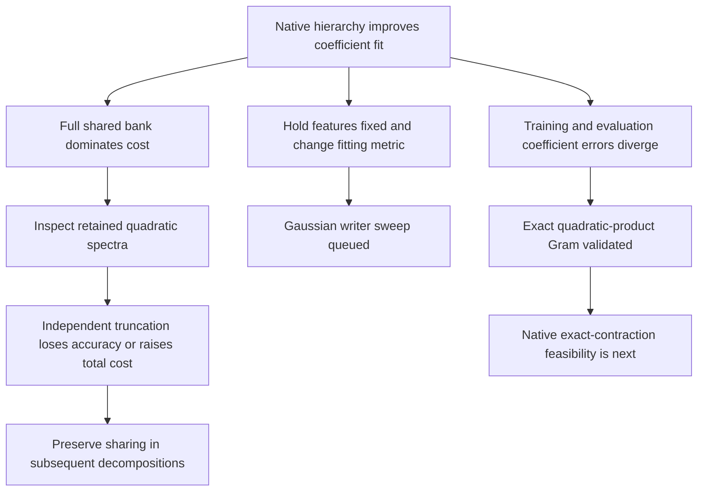

# Native hierarchy and the cost of independent factors — 2026-09-20 17:38 UTC

**Retaining whole native quadratic products improves on eight flat CP atoms, but the approximation remains poor and the shared input bank dominates its cost.** Independently truncating the retained quadratics does not yet give an attractive replacement. A paired metric experiment is queued, and an exact hierarchical coefficient-contraction formula has passed small-scale validation.

## Native hierarchy result

The target remains the pure MLP16→MLP17→unembedding quartic polynomial. We retained products of whole quadratic features from256 candidate root channels, selected using8192 training coefficient queries and analytic output-weight refits. All4608 shared first-layer bilinear channels remain. Evaluation used8192 separate coefficient queries and256 Gaussian inputs.

| Root products | Training coefficient error | Evaluation coefficient error | Gaussian function error | Reduced values, excluding output frame |
|---:|---:|---:|---:|---:|
| 1 | 99.637% | 99.565% | 93.380% | 10,627,200 |
| 8 | 98.879% | 98.816% | 92.836% | 10,699,776 |
| 32 | 97.786% | 98.122% | 94.013% | 10,948,608 |
| 128 | 95.370% | 96.969% | 93.464% | 11,943,936 |
| 256 | 93.256% | 96.294% | 91.622% | 13,271,040 |

The eight-root comparison beats the eight-atom CP coefficient error of99.936%, but uses about232times as many reduced values. The prediction of evaluation error below95% at128 roots failed. Finite checks passed. Runtime was3.36seconds.

Training improvement increasingly exceeds evaluation improvement as width grows. The feature-Gram condition numbers stay below2.60, so poor linear-system conditioning is not an evident explanation for that gap. This is a finite sampled coefficient fit, even though each queried coefficient is exact. The Gaussian error also does not improve monotonically with width under coefficient training.

## Do the retained quadratics admit cheap independent factorizations?

For each of the16 quadratic matrices in the eight-root model, we formed

$$
Q_k=\operatorname{Sym}\!\left(A^\top\operatorname{diag}(\ell_k)B\right),
$$

where $A,B$ are the shared bilinear readers and $\ell_k$ is a folded root projection. Direct evaluation of these matrices agrees with the exported shared-bank program to relative error $1.9\times10^{-15}$.

All16 matrices have1152 numerically nonzero eigenvalues at a $10^{-6}$ relative threshold. The larger positive/negative eigenvalue count ranges from579 to629. These are threshold-dependent numerical counts, not symbolic ranks. Exact independent bilinear representation would therefore require many products per quadratic under this numerical interpretation.

We retained the largest $k$ positive and $k$ negative eigenvalues in each matrix. Opposite-sign directions can be paired into one bilinear product. This constructs an explicit approximation at width $k$, rather than claiming an optimal quartic approximation.

The following errors compare the compressed program against the **exported eight-root approximation**, not against the original teacher:

| Bilinear products per quadratic | Coefficient error vs exported program | Gaussian error vs exported program | Independent-factor values |
|---:|---:|---:|---:|
| 16 | 97.07% | 98.55% | 599,040 |
| 32 | 93.99% | 97.53% | 1,188,864 |
| 64 | 86.78% | 94.24% | 2,368,512 |
| 128 | 70.37% | 83.92% | 4,727,808 |
| 256 | 40.74% | 61.08% | 9,446,400 |
| 512 | 4.23% | 12.61% | 18,883,584 |

The original shared-bank program uses10,699,776 reduced values. Width256 saves only about12% while changing that program substantially. Width512 is more accurate but costs about76% more. The sampled diagnostics use a fresh8192 coefficient tuples and256 Gaussian vectors. They do not certify global quartic error, and this particular spectral truncation is not a lower bound on all possible shared decompositions.

**The lesson is about reuse:** independently factoring each quadratic discards the common bank through which the original quadratics are expressed. Smaller individual matrix ranks do not automatically imply a smaller total program. A joint dictionary or sparse core can still be a better structural hypothesis.

## Separate the metric from the features

The queued Gaussian experiment holds the retained native root sets fixed. It refits only output writers using4096 synthetic standard-Gaussian inputs computed from weights, then evaluates1024 independent Gaussian inputs and the same coefficient panel used above.

The sweep covers widths8/32/128/256 and three ridge strengths. It also reevaluates the coefficient-trained writers on that same new Gaussian panel and fits a homogeneous radial quartic baseline. All cells will be reported; no heldout cell is selected for deployment. The Gaussian objective is sampled, not an exact moment contraction. No actual text activation covariance is used in this test.

## Exact hierarchical coefficient contractions

For symmetric matrices $Q,R,S,T$, let $H(Q,R)$ denote the symmetric coefficient tensor of $(x^\top Qx)(x^\top Rx)$. We derived and validated

$$
\langle H(Q,R),H(S,T)\rangle_F
=\frac{
\langle Q,S\rangle_F\langle R,T\rangle_F
+\langle Q,T\rangle_F\langle R,S\rangle_F
+4\operatorname{tr}(QSRT)
}{6}.
$$

Dense expansion with indefinite, noncommuting matrices independently checks both values and gradients, with relative errors below $3\times10^{-16}$. This supplies exact self/cross Gram entries for quadratic-product features without expanding the order-five tensor.

Applying it to every native teacher root would allow exact output refits for a fixed hierarchical student. That native contraction and its compute cost have not yet been tested. The formula validates a next route, not a completed native result.

[Study index and receipts](../../direct_tensor_match/README.md) · [Signed-width and optimizer controls](research_update_2026-09-20_1729_signed_width_and_writer_basins.md)
