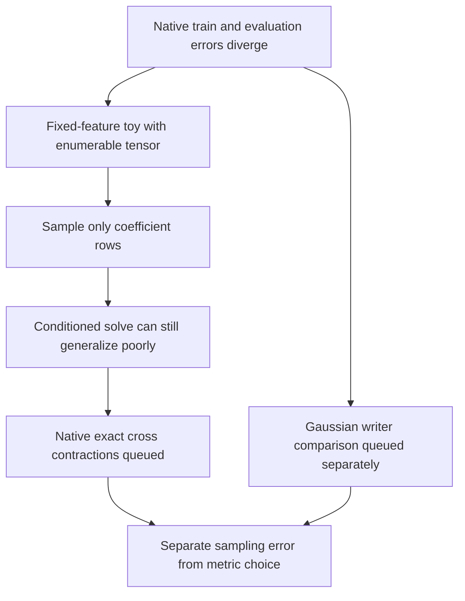

# Exact refit queued; coefficient-sampling control — 2026-09-20 17:46 UTC

**Good Gram conditioning does not establish that a coefficient-query fit approximates the full tensor well.** A540-fit control isolates this issue without learned features, stochastic gradients or a nonlinear optimizer. The native exact-contraction refit is queued to measure the effect on the actual retained hierarchy.

## What stays fixed

A teacher is a sum of12 products of quadratic forms, with three output directions and eight inputs. Students retain the first2,4 or8 root features; only output weights are fitted. Three teacher families use dense independent quadratics, diagonal quadratics, or one quadratic shared across all roots.

At this small dimension, all $8^4=4096$ ordered coefficient tuples can be enumerated. This gives the exact full-tensor optimum for each fixed student feature set. We then fit from16/64/256/1024/4096 uniformly sampled tuples **with replacement**, across12 seeds. Even4096 draws need not cover all4096 tuples. SVD least squares handles rank-deficient designs explicitly; no hidden ridge or discarded runs are used.

If $F$ is the full coefficient feature matrix and $Y$ the teacher coefficients, the exact writer solves

$$
\min_C\|FC^\top-Y\|_F^2.
$$

A sampled writer solves the same expression after selecting rows. The omitted teacher features leave a deterministic residual. Sampling that residual changes the fitted cross moments, even though every observed coefficient is noiseless.

## Results at eight retained roots

| Teacher family | Exact optimum | Median error,16 queries | Median error,256 queries | Median error,4096 queries |
|---|---:|---:|---:|---:|
| Dense quadratics | 46.78% | 64.97% | 47.94% | 46.86% |
| Diagonal quadratics | 58.69% | 100.00% | 117.37% | 62.58% |
| Shared quadratic | 56.26% | 83.28% | 57.88% | 56.37% |

These are full coefficient errors after sampled fitting, not training errors. Diagonal teachers concentrate their coefficients on a small subset of tuples. Every16-query and64-query eight-feature diagonal design is rank deficient in this experiment. The worst256-query error exceeds1400%. This illustrates a failure mode; it is not a diagnosis of the native tensor, whose earlier query audit found most energy in all-distinct indices.

A particularly useful witness occurs for the shared-quadratic family at width2 and16 queries:

- Sampled training error:84.54%.
- Full coefficient error:112.38%.
- Design condition number:1.576; corresponding Gram condition number:approximately2.484.

The solve is well conditioned, yet its full-tensor result is worse than zero prediction. This separates numerical stability from statistical accuracy. The full enumeration also independently agrees with the exact quadratic-product Gram formula.

## Native exact-refit experiment

The queued pilot uses the same eight native root features as the earlier hierarchy baseline. It forms their16 quadratic matrices, streams all4608 teacher root products in blocks, computes exact symmetric feature cross inner products, and solves the resulting8×8 system in float64.

This computes **student self terms and the full teacher–student cross term**. It does not compute the full teacher self norm. The existing teacher-norm estimate only scales normalized-error labels; it does not affect which writer minimizes the exact objective.

The pilot checks a contraction block against float64, records scan runtime, compares exact training gains against the old sampled writer, and then evaluates the same independent coefficient and Gaussian panels. The expected exact-objective improvement need not produce a measurable improvement on a finite evaluation panel.

The separate Gaussian writer sweep also remains queued. Together these experiments isolate two changes:

| Comparison | What changes |
|---|---|
| Sampled coefficient writer vs exact coefficient writer | Accuracy of the coefficient objective |
| Coefficient writer vs Gaussian writer | The fitting metric |

Features and their full shared-bank cost remain explicit in both comparisons. Neither is a new circuit-discovery claim.

[Code and receipts](../../direct_tensor_match/README.md) · [Native hierarchy and spectral-cost results](research_update_2026-09-20_1738_native_hierarchy_and_spectral_cost.md)
