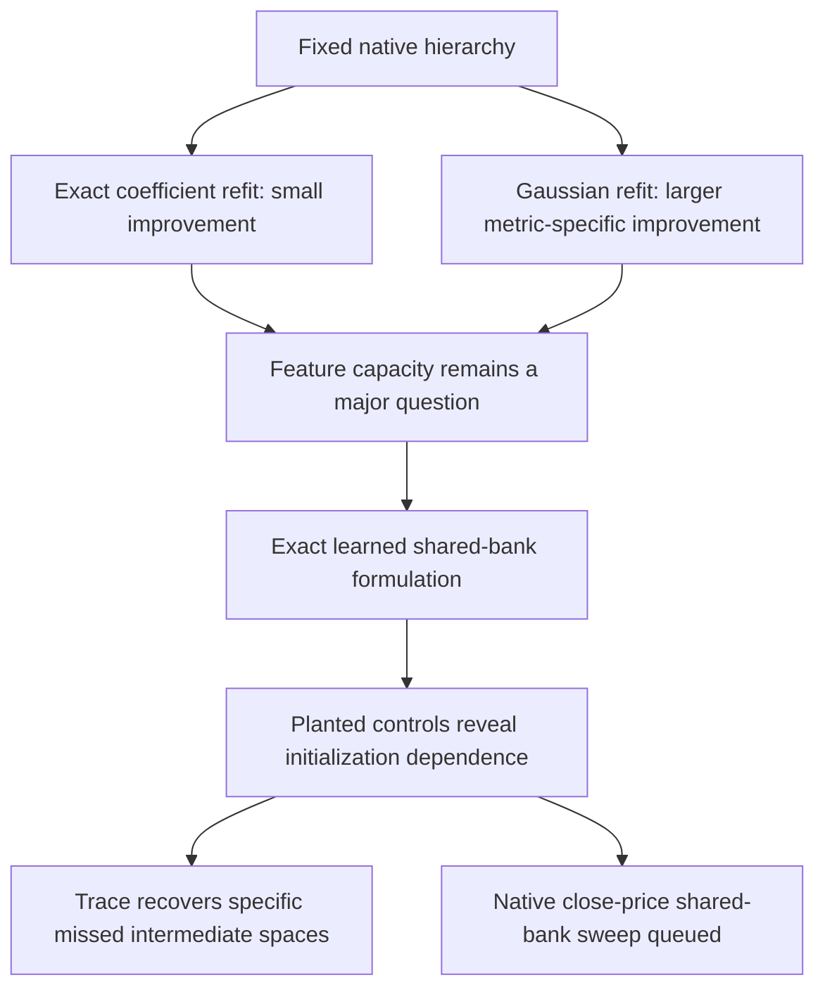

# Exact native metrics and learned sharing — 2026-09-20 18:02 UTC

**For the fixed native hierarchy, changing the metric mattered much more than removing coefficient sampling.** We also now have exact gradients for a learned shared quadratic dictionary, with68 planted controls showing both recoveries and initialization failures. A native comparison at a similar reduced parameter count to eight CP atoms is queued.

## Native results: sampling accuracy versus fitting metric

The exact eight-root coefficient refit contracts all4608 native teacher roots against the retained features. Its scan took23.49seconds. A float32 kernel block agreed with float64 to $2.5\times10^{-7}$, and the output solve residual was $1.5\times10^{-16}$.

| Eight-root writer | Coefficient energy captured, normalized by estimated teacher norm | Heldout coefficient error | Gaussian error on the original panel |
|---|---:|---:|---:|
| Fitted from coefficient queries | 2.076% | 98.816% | 92.836% |
| Fitted by exact coefficient contractions | 2.173% | 98.765% | 92.485% |

All three preregistered predictions passed, but the practical improvement is small. Sampling error is not the main approximation gap at this width.

Here “exact” applies to the **student self term and full teacher–student cross term**. The teacher norm remains estimated. The raw receipt's phrase “Full teacher self/cross” is imprecise and should be read with this correction; no full teacher self norm was computed.

The Gaussian experiment kept the same features and refitted output writers from4096 synthetic Gaussian inputs. On1024 separate Gaussian inputs, the unregularized results were:

| Roots | Original coefficient writer: Gaussian error | Gaussian-trained writer: Gaussian error | Gaussian-trained writer: coefficient error |
|---:|---:|---:|---:|
| 8 | 92.575% | 83.251% | 99.461% |
| 32 | 93.777% | 80.004% | 99.878% |
| 128 | 92.524% | 76.004% | 100.051% |
| 256 | 90.635% | 75.055% | 101.027% |

Ridge0.01 changes the256-root result to74.985% Gaussian error and100.856% coefficient error. The radial quartic baseline on this same panel is89.940%. All Gaussian-sweep predictions passed. These are sampled function-metric fits from weights, not fits to text activations or actual activation covariance. The global coefficient objective worsens, and no circuit adoption follows.

## Learn the shared dictionary instead of retaining the whole native bank

The new student uses quadratic features

$$
q_a(x)=\sum_{t=1}^{k}(u_{at}^\top x)(v_{at}^\top x),
\qquad
\widehat f_v(x)=\sum_{a\le b}C_{v,ab}q_a(x)q_b(x).
$$

The **bank width** counts distinct quadratics $q_a$; the **bilinear width** $k$ counts products inside each quadratic. A root coefficient records which pair of shared quadratics contributes to an output. The current root coefficients are dense: this is not yet sparse-core discovery.

Exact self inner products reduce to traces of small factor matrices. For $Q_a=E_aF_a^\top$, define $K_{ab}=F_a^\top E_b$. Then

$$
\operatorname{tr}(Q_aQ_bQ_cQ_d)
=\operatorname{tr}(K_{ab}K_{bc}K_{cd}K_{da}).
$$

Combined with the quadratic-product Gram identity, this avoids dense input-space quartic tensors and dense quadratic matrix products. Teacher cross terms expand the student root into its $k^2$ bilinear-channel pairs and use exact native directional contractions. Independent dense value, gradient, normalization and entry checks agree below $7\times10^{-16}$.

## What the68 planted controls revealed

Forty random-start fits cover five teacher structures, Adam/Muon, two rates and two starts. Both teacher and student have three shared quadratics, two products per quadratic and three outputs. Eighteen followups test spectral initialization, extra starts and a wider bank; ten more test input-trace initialization. Exact teacher-bank replay confirms sufficient capacity for all five families.

The table compares best coefficient errors from the initialization families. Spectral and trace initializations include16 weights-only basis trials, so they spend more initialization work than an individual random start.

| Planted family | Random starts, bank3 | Leading-unfolding initialization | Input-trace initialization |
|---|---:|---:|---:|
| Coordinate quadratics | 54.03% | 59.14% | numerical floor |
| Rotated signed quadratics | 0.0091% | 63.83% | numerical floor |
| Dense mixed roots | 0.0187% | 0.0442% | 2.61% |
| Common quadratic factor | 0.2303% | 0.0323% | 3.29% |
| Squared quadratics | 1.638% | 0.0199% | 2.93% |

For the coordinate teacher, one four-feature Muon run also reaches0.0163%, while the additional three-feature starts remain poor. Extra width can help optimization even when it is unnecessary for exact representation.

The leading three unfolding directions in the coordinate and rotated-signed cases overlap with only one of the three true quadratic directions: principal cosines are approximately $(1,0,0)$. Thus that spectral initialization misses the desired intermediate space, despite a compact exact circuit.

The input trace

$$
J_{vij}=\sum_k H_{vijkk}
$$

recovers the needed span for these two disjoint-support structures. Their trace-based initial fits already reach the numerical floor before refinement. This is not universal: products of quadratic matrices enter the general trace formula, and disjoint traceless quadratics can make this trace vanish. The other three rows show that trace initialization can be worse.

## Next native comparison

The queued student has four shared quadratics, four bilinear products per quadratic, and ten root products. It has48,384 reduced factor/writer values, compared with46,080 for eight flat CP atoms, plus the same output frame. With direct vocabulary writers instead, those counts are539,904 versus439,296; the close-price comparison applies to the shared reduced frame.

Eight native fits compare Adam/Muon, two rates and two starts,400 steps each, using exact coefficient self/cross gradients and best-training checkpoint selection. This tests learned reuse without carrying the inherited10.7million-value quadratic bank. It does not assume that the toy initializations scale to1152 inputs or that a successful approximation will identify semantic circuits.

[Code and receipts](../../direct_tensor_match/README.md) · [Hourly strategic review](../../HOURLY_STRATEGIC_REVIEW_2026-09-20_1801.md)
