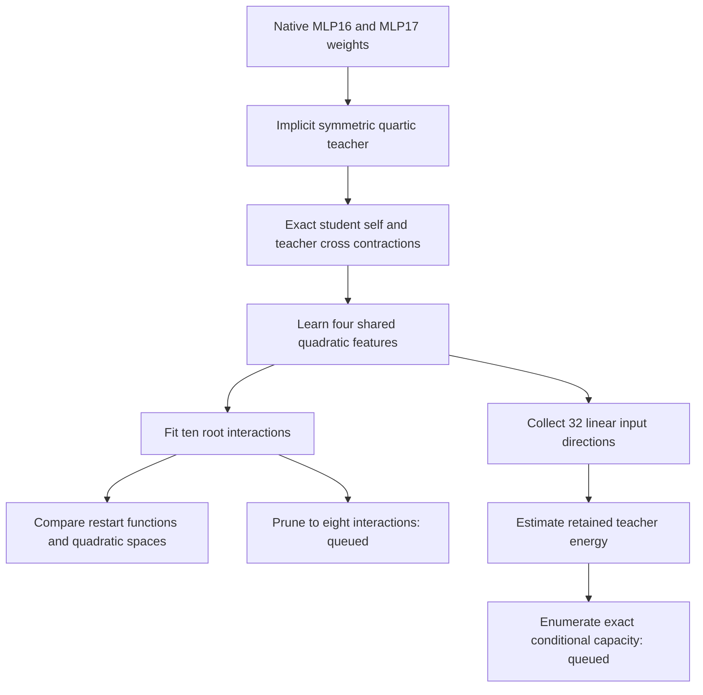

# Shared features, restart stability, and input capacity

**20 September 2026, 18:25 UTC.** The learned shared quadratic dictionary captures about **0.2015% of native quartic coefficient energy**, compared with **0.0863% for eight flat CP terms**. This is a measurable structural improvement, but both remain poor global approximations. Input-space measurements suggest that the selected dictionary itself may be a major restriction. Exact conditional-capacity and matched-price pruning checks are queued; their outcomes are not assumed here.

This continues the [18:02 report](research_update_2026-09-20_1802_exact_native_metrics_and_learned_sharing.md). The two-day weights-first study remains active through 22 September, 15:10 UTC. The next scheduled three-hour math/literature review is around 19:37 UTC.

## Objects and terms

The **teacher** is the pure degree-four contribution formed by composing MLP16 with MLP17 and the unembedding:

$$
f_v(x)=\sum_{i,j,k,l}H_{vijkl}x_i x_j x_k x_l.
$$

An exact orthogonal output frame reduces the output dimension to 1152 while preserving coefficient inner products. The input also has dimension 1152. Attention, the other residual terms, RMSNorm and the final softcap are outside this polynomial target. Results are not full-model replacements.

The **student** now uses a shared dictionary of four quadratic features, each with four products:

$$
q_a(x)=\sum_{t=1}^{4}(u_{at}^{\top}x)(v_{at}^{\top}x),
\qquad
\widehat f_v(x)=\sum_{1\leq a\leq b\leq4}C_{v,ab}q_a(x)q_b(x).
$$

A **root interaction** is one product $q_aq_b$. There are ten possible interactions here. Each quadratic is normalized in coefficient Frobenius norm. The output weights are solved analytically during fitting; Adam or Muon updates the quadratic readers. Self and teacher–student cross contractions are exact algebraic expressions evaluated in floating point. The teacher's total coefficient norm is still estimated.

**Captured energy** means the improvement over the zero student in squared coefficient error, divided by that estimated teacher norm. **Relative error** is the unsquared norm ratio. Capturing 0.2015% energy therefore implies about 99.899% relative error, not 99.7985%. Independent coefficient-query estimates have their own sampling variation.

## Native fit and optimizer sensitivity

Eight fits used two optimizers, two rates, two seeds, and 400 steps. Checkpoints were selected by training gain, not by diagnostic errors. The table gives captured coefficient energy; each cell lists the two seeds.

| Optimizer | Rate 0.0005 | Rate 0.005 |
|---|---:|---:|
| Adam | 0.1653%, 0.1745% | 0.1997%, 0.2015% |
| Muon | 0.00766%, 0.00522% | 0.1912%, 0.1813% |

Adam is better under this small tested budget; this does not establish a universal optimizer ranking. Muon changes sharply with learning rate. The best training-selected student has independent coefficient error 99.857% and synthetic Gaussian function error 99.984%: its gain is not a broad function-space recovery.

The shared bank has **48,384 reduced floating parameters**, versus CP8's **46,080**, excluding the common exact output frame. Its expanded vocabulary writer is larger, so the near-price comparison applies only in the reduced frame. The queued pruning test enumerates all 45 eight-of-ten supports for every frozen bank, refits output weights, and compares at 46,080 floating parameters plus 16 support integers. It matches scalar counts, not serialized bytes: the refitted writer uses FP64.

Positive-result redteam: the high-rate Adam root Gram condition reaches approximately 4,200–5,300, versus about 32–162 for high-rate Muon. These are logged endpoint conditions, not necessarily the selected checkpoint's condition. A good numerical fit could rely on poorly separated features or cancellations. The gain alone does not establish simple individual features.

## Are the same features recovered?

The exact coefficient-function cosine between the two high-rate Adam runs is **0.934**. Across all high-rate optimizer/seed pairs it ranges from **0.830 to 0.934**. Thus the small fitted components resemble each other to some extent.

We separately compare the four-dimensional spaces of quadratic forms. **Principal cosines** measure alignment between spaces and are unaffected by invertible changes of basis inside either space. The smallest principal cosine is 0.643 for Adam versus Adam, but ranges as low as **0.00049** across high-rate fits. Reproducible approximate output functions therefore do not imply recovery of the same whole quadratic dictionary. A low-overlap direction might have little output importance; this does not prove every useful feature is unstable.

## Input coverage is a different structural restriction

Both CP8 and this shared bank depend on at most **32 linear input directions**. Even a completely unrestricted quartic core cannot recover teacher coefficients lying outside their input span.

Two independent 4096-probe estimates of the teacher's first-input unfolding Gram give normalized traces 1.00318 and 1.00287. Their rank-32 tail errors are about 95.74%; pooling gives 96.20%. These are **finite-measurement spectra**, not certified global lower bounds. Agreement between panels does not remove spectral estimation bias.

Independent four-slot probes estimate the coefficient energy retained when *all four* inputs are projected into a fixed span:

| Frozen input span | Retained coefficient energy | Standard error in percentage points |
|---|---:|---:|
| Leading 32 input-Gram modes | 0.03885% | 0.00260 |
| Leading 64 modes | 0.06697% | 0.00287 |
| Leading 128 modes | 0.22926% | 0.00494 |
| CP8's 32 reader directions | 0.17726% | 0.00954 |
| Learned bank's 32 reader directions | 0.23335% | 0.01319 |

Leading single-input modes need not optimize a projection applied to every input slot. The learned bank's gain is roughly 86% of the *sampled* energy in its selected span; CP8 uses roughly 49%. These ratios motivate an exact check rather than a claim of saturation.

For a frozen orthonormal basis $P\in\mathbb R^{1152\times32}$, the projected tensor has only $\binom{35}{4}=52{,}360$ distinct symmetric input entries per output. We can enumerate them and weight each by its permutation multiplicity:

$$
\|H_P\|_F^2
=\sum_{i\leq j\leq k\leq l}
\frac{4!}{\prod_s m_s!}\,\|(H_P)_{:,ijkl}\|_2^2.
$$

Here $m_s$ is the multiplicity of coordinate $s$ in the tuple. This supplies an exact conditional ceiling in floating-point arithmetic without storing the large tensor. The CPU ordered-enumeration check passed; the native audit is queued.

## Known-structure redteam

For the radial polynomial $f(x)=(x^\top x)^2$, restriction to any rank-$r$ input space retains exactly

$$
\frac{\|H_P\|_F^2}{\|H\|_F^2}=\frac{r(r+2)}{d(d+2)}.
$$

Consequently every quartic using at most 32 linear input directions has relative coefficient error at least **99.9591%** when $d=1152$. CP8 is one such class. Yet the radial function has an exact small shared sum-of-squares computation. This strengthens the earlier valid but weaker 81.61% pair-unfolding bound. It demonstrates a structural mismatch for this particular known teacher, not a native-model impossibility result.

The same radial teacher calibrates probe bias. At $d=128$, the exact first-mode rank-four tail error is 98.425%. Median sampled tails are 93.83%, 95.52%, 96.59%, and 97.64% at 256, 512, 1024, and 4096 probes. A nearly correct total norm can coexist with a biased spectrum. The calculation was independently checked against dense projections.

## Interpretation and next decision

These results separate three questions that a high-error Tucker/HT fit otherwise confounds: whether the input dictionary covers the teacher, whether the chosen interaction structure uses that dictionary well, and whether optimization finds the available fit. They do not establish that HT fails, nor that simple circuits cannot exist.

The next native receipts are the matched eight-interaction pruning test and exact frozen-span energy audit. A high utilization ceiling would favor broader or structurally different input features; low utilization would favor changing the root representation. Both isotropic and covariance-informed work remain part of the study; the present receipts concern coefficient geometry, with synthetic isotropic Gaussian diagnostics, not empirical activation covariance.

Primary receipts and code are in [direct_tensor_match](../../direct_tensor_match/README.md): `NATIVE_LEARNED_SHARED_BANK_V1`, `LEARNED_BANK_STABILITY_V1`, `NATIVE_INPUT_MODE_V1`, `INPUT_MODE_CALIBRATION_V1`, and the two queued plans. No feature has yet passed the OOD, extraction, selective intervention, or reuse tests needed for an identified circuit.
