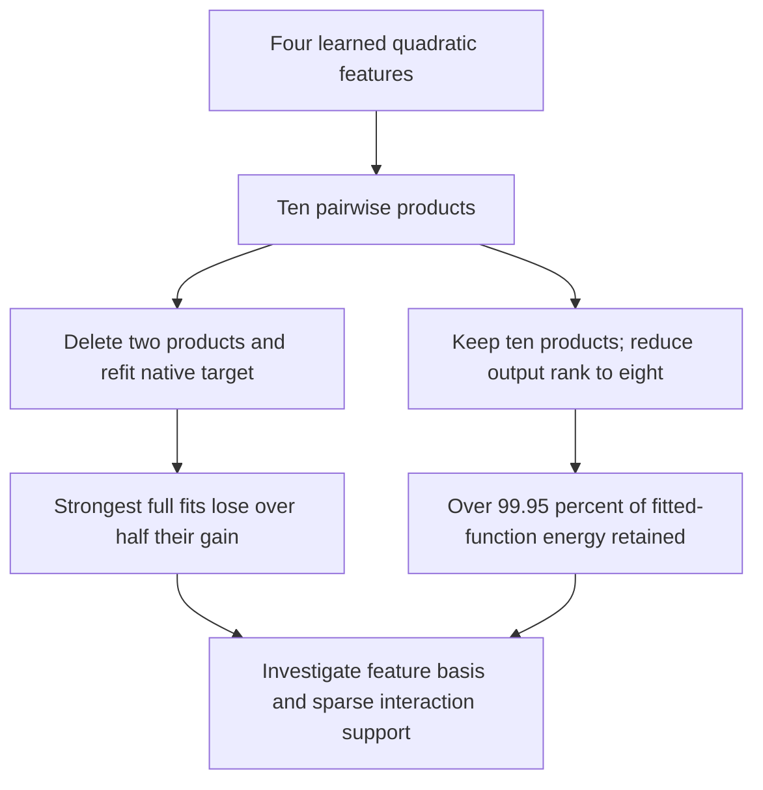

# What sparsity removes, and how structural assumptions change fitting

**20 September 2026, 18:29 UTC.** Matched-parameter pruning still beats CP8, but the best native gain falls from 0.2015% to **0.1436% of coefficient energy**. Separately, five planted controls show that dictionary allocation and square-versus-general-product assumptions change optimization substantially—even when an exact representation is known to exist.

This is a result update to the [18:25 report](research_update_2026-09-20_1825_shared_features_and_input_capacity.md), covering the same pure MLP16→MLP17→unembedding quartic. It is not evidence of identified causal circuits or a full-model replacement.

## Native pruning: the favorable result and its limitation

The full student uses four quadratic features $q_a$, each containing four bilinear products, and all ten unordered interactions $q_aq_b$. We froze each of eight fitted dictionaries, enumerated all $\binom{10}{8}=45$ eight-interaction supports, and solved output weights using exact teacher-cross and student-self contractions. No diagnostic loss chose the support.

| Model / training-selected configuration | Captured coefficient energy | Independent coefficient error |
|---|---:|---:|
| CP8 | 0.08630% | 99.936% |
| Best ten-interaction bank: Adam, 0.005, seed1 | 0.20148% | 99.857% |
| That same bank after eight-interaction pruning | 0.08901% | 99.927% |
| Best pruned bank: Adam, 0.0005, seed0 | 0.14363% | 99.889% |

The pruned bank and CP8 both have 46,080 reduced floating parameters, excluding the common output frame. The bank also needs 16 support integers. Serialized bytes differ because refitted writers are FP64. Its synthetic Gaussian error is 100.010%, so the coefficient gain is not a general function-metric gain.

All three preregistered predictions passed, but one was weak: “some fit retains at least90%” passed on a low-gain Muon fit. The strongest two Adam fits retain only **44.2% and46.3%** of their gain. The best pruned program comes from a lower-rate fit and retains86.9%. Merely reporting three successful predictions would hide the main limitation.

## Deleting interactions differs from reducing output dimension

For a frozen dictionary, define the ten-vector $\phi(x)$ of root products and its coefficient Gram matrix

$$
G_{st}=\langle \operatorname{coeff}(\phi_s),\operatorname{coeff}(\phi_t)\rangle_F,
\qquad \widehat f(x)=C\phi(x).
$$

The best output-rank-eight approximation of this **exported student function** follows from the singular values of $CG^{1/2}$. This exact CPU audit retains at least **99.9586% of student coefficient energy** across all eight fits. For the best full bank it retains99.9625%, whereas deleting two named root interactions sacrifices over half the native objective gain.

These quantities have different targets: the output-rank audit approximates the fitted student; the pruning objective approximates the native teacher. They nevertheless show that output rank alone is not an adequate explanation for the pruning loss. Coordinate support, conditioning, and cancellation deserve attention.

A rank-eight writer implementation retains all ten products and mixes them into eight output channels. It costs46,160 floating parameters:46,080 plus80 mixing coefficients. It is **not** an eight-interaction computation. The selected high-rate Adam snapshots have root Gram conditions around4,150–5,300; low-rate Adam snapshots are around5–25. Both the support and the numerical separation of features matter to a simplicity claim.

## Fixed input-reader budget: five structural baselines

We reused the five known teachers from the earlier shared-bank controls: coordinate sums, rotated signed forms, dense root mixtures, a common quadratic factor, and squared quadratic features. Each has input dimension6 and three outputs. Eight fits per configuration used Adam/Muon, rates0.005/0.05, two seeds,600steps, and best-training checkpoint selection.

Write $b\times k$ for $b$ quadratic features containing $k$ products each. The configurations2×3,3×2,6×1 all use72 input-reader scalars; their output writers use9,18,63 scalars respectively. Thus input coverage and reader count are controlled, but total price is not equal. Eighty new fits join forty prior matched controls.

Best relative coefficient errors across those eight fits, in percent:

| Teacher | 2×3 | 3×2 | 6×1 |
|---|---:|---:|---:|
| Coordinate sums | 68.322 | 54.029 | 31.114 |
| Rotated signed | 68.322 | 0.00910 | 0.01026 |
| Dense mixtures | 30.841 | 0.01870 | 0.01446 |
| Common factor | 24.645 | 0.23026 | 0.05560 |
| Squared quadratics | 41.765 | 1.63811 | 0.03906 |

The six-feature model has a constructive exact representation for every teacher: split each original quadratic into its two products, then expand its parent interactions. Starting from those known readers and refitting writers gives independently enumerated errors below2.5×10⁻⁸. Therefore its31.1% coordinate failure is **not a capacity limitation**. The prediction of below1% random-fit error for all five families failed and remains recorded. Failures of the narrower2×3 architecture have no equivalent capacity certificate here.

## A square-leaf hypothesis rescues one teacher and hurts another

A general product $(u^\top x)(v^\top x)$ usually defines an indefinite quadratic form. A square $(u^\top x)^2$ imposes a different, positive-semidefinite structure. Both coordinate and rotated-signed teachers can be built from six square leaves with signed root writers; known-reader replay verifies this to about2.4×10⁻⁸.

We ran sixteen additional random fits under the square-leaf constraint, with the same optimizer/rate/seed grid and600steps. It uses36 reader scalars plus63 writer scalars.

- **Coordinate teacher:** Adam at0.05, seed0 reaches2.35×10⁻⁸ error; Muon at0.05, seed0 reaches8.97×10⁻⁵. Other restarts still fail substantially.
- **Rotated-signed teacher:** the best square-leaf random fit stalls at31.1%, despite its exact capacity witness. The previous general-product model reaches about0.0103%.

Thus the positive result is not a universally better architecture. A structural constraint can improve one optimization landscape and worsen another. This is precisely why high tensor error should not be summarized as “Tucker/HT cannot represent the structure.” Neither a favorable restart nor a negative result alone answers representation capacity or stable feature recovery.

## Next evidence

The exact32-dimensional input-span energy audit remains queued. A new queued capture measures covariance at the **normalized MLP16 input**, the actual input to this quartic teacher. The prior covariance artifact measured transformed MLP17 inputs and is unsuitable for this purpose.

Subsequent covariance comparisons must distinguish four-slot coefficient weighting by $M^{1/2}$, Gaussian function error involving eighth moments, and empirical function error on actual rows. Centered covariance and uncentered second moment are saved separately. No covariance-weighted quartic result is claimed yet.

Primary receipts: `NATIVE_SHARED_BANK_PRUNE_V1`, `ROOT_OUTPUT_RANK_V1`, `SHARED_BANK_ALLOCATION_V1`, and `SQUARE_LEAF_CONTROL_V1` in [direct_tensor_match](../../direct_tensor_match/README.md). Native input-capacity and covariance jobs provide the next continuation; the three-hour literature review remains due around19:37 UTC.

## 18:36 UTC addendum: sparse interactions after changing the feature basis

A direct follow-up now shows that the fixed feature basis caused much of the pruning loss. Let $q$ contain the four frozen quadratic features. Introduce an invertible matrix $S\in\mathbb R^{4\times4}$ and set $\widetilde q=S q$. Its induced symmetric-square matrix $T(S)\in\mathbb R^{10\times10}$ transforms the root-product vector:

$$
\widetilde\phi=T(S)\phi,
\qquad
\widetilde G=T(S)G T(S)^\top.
$$

For an original input pair $i\leq j$, the row corresponding to mixed pair $(a,b)$ has coefficient $S_{ai}S_{bi}$ when $i=j$, and $S_{ai}S_{bj}+S_{aj}S_{bi}$ otherwise. Full ten-root functions replay exactly after transporting the writer by $T(S)^{-1}$. Restricting to eight rows then imposes sparsity in this new basis.

We evaluated130 bases per exported student: identity, quadratic-Gram whitening,64 orthogonal rotations, and64 rotations after whitening. Each basis received an exhaustive45-support search and exact writer refit. This targets the **exported full student**, not the native teacher.

| Source student | Eight roots in original basis | Best screened basis | Refined basis |
|---|---:|---:|---:|
| Adam0.005, seed0 | 73.281% error | 6.302% | **2.524%** |
| Adam0.005, seed1 | 74.689% error | 7.388% | **2.430%** |

The screen passed the improvement and replay predictions but missed the<5% target. Eight subsequent fits optimized rotations around the two selected bases, keeping the supports fixed. Adam/Muon, rates0.005/0.05,600steps all converged close to the displayed minima. The parameterization $S=\exp(K-K^\top)S_0$ preserves invertibility and singular values of the starting basis; basis-condition changes remained at floating-point noise. Independent direct coefficient residuals agreed with the analytic objective. All three refinement predictions passed.

The executable program still computes the original four quadratics once, adds a4×4 linear mixing step, then computes eight selected products. It costs **46,096 floating scalars plus16 support integers**, and eight root multiplications. This is a different constraint from keeping ten products and lowering output rank. It preserves sharing rather than separately expanding each mixed quadratic into new leaf readers.

These are strong student-compression results, but the native gain has not yet been measured. A managed GPU validation is queued to compute native cross contractions, refit writers, and compare coefficient and Gaussian diagnostics directly. Low error against an already poor global approximation does not make it a good global model or an identified circuit.

Receipts: `ROOT_BASIS_SEARCH_V1.json`, `ROOT_BASIS_REFINE_V1.json/.pt`; native follow-up: `NATIVE_MIXED_ROOT_PLAN_V1.md`. The exact input-capacity and MLP16 covariance measurements remain queued too.
