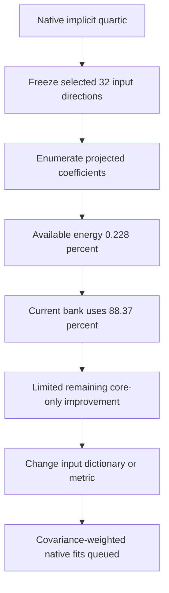

# Exact input-capacity audit and covariance geometry

**20 September2026,18:42UTC.** The learned32-direction input span contains only **0.2280% of native quartic coefficient energy**, and its fitted shared bank already uses **88.37% of that available energy**. This limits how much changing the root core alone can accomplish while those input directions remain frozen. The covariance capture also shows that the actual input distribution has a large mean component, so centered and uncentered weighting are substantially different experiments.

## What the exact calculation establishes

For an orthonormal input basis $P\in\mathbb R^{1152\times32}$, let $H_P$ be the teacher coefficient tensor restricted to that basis in all four input slots. We enumerated its52,360distinct symmetric input tuples per output, including permutation multiplicities. This computes $\|H_P\|_F^2$ exhaustively in floating-point arithmetic. The total teacher norm used to express percentages remains estimated.

| Frozen span | Available coefficient energy | Fitted program gain | Fraction of available energy used |
|---|---:|---:|---:|
| Leading32input-Gram modes | 0.03925% | — | — |
| CP8 reader span | 0.16937% | 0.08630% | 50.95% |
| Best shared-bank reader span | 0.22800% | 0.20148% | **88.37%** |

The utilization ratios cancel the common teacher-norm estimate. FP32/FP64 spot discrepancies were below6.1×10⁻⁷; all three earlier sampled energy estimates agree within one reported standard error. All registered predictions passed. Runtime was3.11seconds.

This is a ceiling for **any quartic using each particular frozen span**, not a global optimum over all32-dimensional spans, not a CP-rank impossibility theorem, and not a restriction on full-rank quadratic features. A larger or different input dictionary can evade it. Finite coefficient-query diagnostics can differ from this exact projected-energy calculation; their errors should not be interpreted as certified bounds.

## Actual MLP16 input statistics

We captured2048normalized MLP16 input rows from each of two fixed32-document FineWeb panels, using16full-model forwards. This is the correct input to the pure quartic under study. Earlier MLP17 statistics use a different input and coordinate system.

| Quantity | Calibration panel | Diagnostic panel |
|---|---:|---:|
| Mean squared norm fraction $\|\mu\|^2/\mathbb E\|x\|^2$ | 68.15% | 67.21% |
| Centered covariance condition number | 4370 | 3755 |
| Mean-energy fraction inside learned32-span | 13.27% | 13.89% |
| Total input second-moment fraction inside learned32-span | 11.83% | 11.96% |
| Total input second-moment fraction inside CP8 span | 25.39% | 25.62% |

The mean vectors have cosine0.9933, while the relative centered-covariance difference between panels is0.932. These estimates use correlated token rows from only32documents each; they are not population statistics or OOD guarantees. Input-energy coverage also does not directly measure quartic function accuracy.

A useful configuration audit: after normalizing centered covariance to average eigenvalue1, its smallest calibration eigenvalue is0.01222. Therefore the configured0.01floor changes **zero** centered eigenvalues; that arm is effectively unfloored centered covariance. The0.1floor changes305eigenvalues. The0.01floor on the normalized uncentered second moment changes85. We retain these counts rather than claiming every configured floor is an active regularizer.

## Three objectives that must remain separate

For symmetric coefficient error $\Delta$, factor $M=LL^\top$ and transform all four input slots to obtain $\Delta_L$.

1. **Covariance-weighted coefficient error:** $\|\Delta_L\|_F^2$. This corresponds to four independent input slots.
2. **Repeated-input Gaussian function error:**

$$
\mathbb E_{x\sim\mathcal N(0,M)}\|\Delta[x,x,x,x]\|^2
=24\|\Delta_L\|_F^2+72\|\operatorname{Tr}_2\Delta_L\|_F^2+9\|\operatorname{Tr}_4\Delta_L\|_2^2.
$$

Here $\operatorname{Tr}_2$ contracts two input indices; $\operatorname{Tr}_4$ contracts both pairs.

3. **Empirical function error:** the average on actual input rows, depending on their eighth moments and mean.

The distinction is consequential: $x_1^4-x_2^4$ has Gaussian squared error192under identity covariance but zero on independent Rademacher coordinates with exactly the same covariance. Also, an eigenvalue weight0.01 induces a10⁻⁸squared coefficient weight for a quartic entirely in that direction. Covariance weighting can deliberately ignore large isotropic errors.

Dense values, gradients, and Gaussian quadrature independently validate these formulas to below5×10⁻¹⁶. See the [metric note](../../direct_tensor_match/QUARTIC_METRIC_GEOMETRY.md) for definitions and derivation.

## Next registered comparison

Sixteen native fits are queued: isotropic, centered covariance at floors0.01/0.1, and second moment at floor0.01; Adam/Muon, two seeds,400steps. All optimize the **same original-coordinate reader parameters**, with covariance transforms inside the loss. This controls the whitening-parameterization confound. Matched isotropic reruns check the executor; every fit receives coefficient, Gaussian, and two-panel empirical diagnostics. Training uses calibration covariance only, not empirical activation targets.

Native validation of the refined eight-interaction mixed-basis programs is also queued. The study remains a decomposition investigation; neither these small coefficient gains nor covariance alignment establishes extraction, selective manipulation, OOD behavior, or circuit identity.

Receipts: `NATIVE_PROJECTED_ENERGY_V1`, `NATIVE_QUARTIC_COVARIANCE_V1`, `QUARTIC_INPUT_STATISTICS_AUDIT_V1`, and `QUARTIC_COVARIANCE_METRIC_CHECK_V1`, indexed in [direct_tensor_match](../../direct_tensor_match/README.md).
