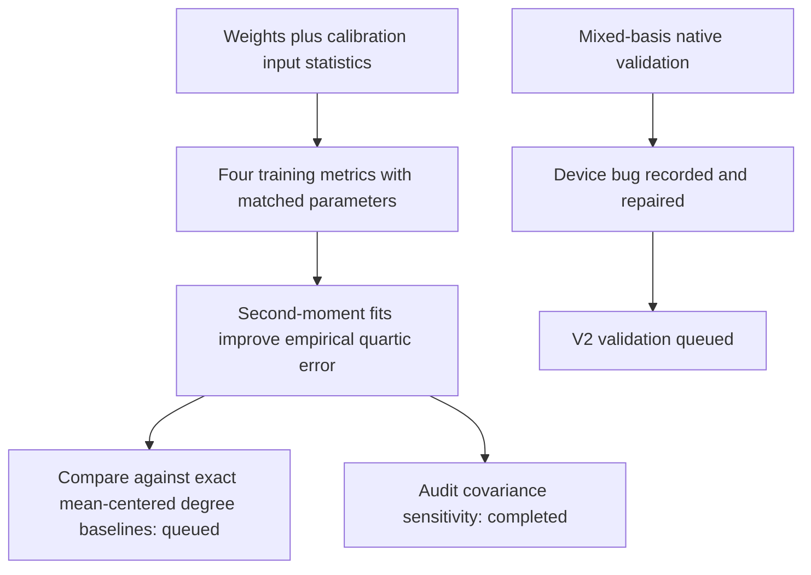

# Native covariance weighting improves the empirical quartic fit

**20September2026,18:52UTC.** With the same architecture and original-coordinate optimization parameters, second-moment weighting lowers empirical quartic-output error from roughly58–63% to25–31% on the second FineWeb panel. Centered covariance helps less. This is a useful result for the requested weights-first/data-informed comparison, but it is not yet circuit identification or a demonstrated improvement over the pending mean-centered baseline.

## Controlled comparison

All16runs use four shared quadratic features, four bilinear products per feature, ten root interactions,48,384reduced floating parameters,400steps, and learning rate0.005. Each metric gets Adam/Muon and seeds0/1. Checkpoints maximize their training objective; diagnostic errors do not select them. The four isotropic reruns reproduce their earlier training gains within the preregistered tolerance.

For $M=LL^\top$, training matches the coefficient tensors after applying$L$ in all four input slots. The native teacher and student readers are transformed inside the loss, while optimizer parameters remain in the same original coordinates. This avoids changing optimization parameterization along with the metric. The exported student uses those original-coordinate readers: it does not require a dense covariance multiplication at inference.

| Training metric | Second-panel error range over four fits | Training-selected run's second-panel error | That run's isotropic coefficient error |
|---|---:|---:|---:|
| Identity | 58.48–62.58% | 58.48% | 99.857% |
| Centered covariance, floor0.01 | 52.08–57.32% | 55.57% | 99.924% |
| Centered covariance, floor0.1 | 51.36–56.62% | 54.53% | 99.919% |
| Uncentered second moment, floor0.01 | **24.75–31.04%** | **25.28%** | 99.973% |

The table distinguishes diagnostic minima from training-selected results. For example, the best diagnostic second-moment fit is Muon seed0, but seed1 has slightly higher training gain and is the selected run. All four matched optimizer/seed pairs improve substantially under second-moment weighting. Under that metric, Muon reaches24.75/25.28% diagnostic error, versus Adam31.04/30.89%; this reverses the optimizer advantage seen in the isotropic coefficient objective under this budget.

All three registered predictions pass: finite/reproducible controls, empirical improvement, and an isotropic coefficient tradeoff. The full sweep takes59.36seconds. Synthetic isotropic Gaussian errors remain near100%; this is a distribution-specific approximation, not recovery of the global quartic.

## What M is emphasizing

Calibration inputs have68.15% of their total squared norm in the mean vector. Centered covariance discards that component; uncentered second moment preserves it. After trace normalization, the leading second-moment eigenvalue is789.46, versus53.39for centered covariance. It is therefore plausible that much of the gain involves the mean direction and its interactions. The queued exact centered-degree census will test this explanation; input means alone do not prove it.

The centered0.01floor is inactive because the minimum normalized eigenvalue is0.01222. The0.1floor modifies305directions. The second-moment0.01floor modifies85directions. These counts are retained as configuration checks.

Weighted teacher norms were estimated independently, not used to select checkpoints. Their standard errors are substantial: centered norm estimates34.34/34.47have SE2.14, and second-moment norm4833has SE403. Thus the raw estimated82–95% weighted-energy capture figures should not be treated as precise coverage certificates. The actual-row error ratios above do not depend on those norm estimates.

## Document-level redteam

Each panel contains32documents of64tokens. Treating2048token rows as independent observations would overstate statistical support. Across eight seeded disjoint16-document splits per panel, the median relative centered-covariance difference is0.914. The repeated splits overlap; this is a sensitivity measurement, not a confidence interval.

Directions were chosen only from the calibration covariance. Across full panels, normalized centered variance ratios are:

| Fixed direction group | Minimum / median / maximum variance ratio | Median quartic penalty ratio |
|---|---:|---:|
| Top16calibration eigenvectors | 0.248 / 0.485 / 0.766 | 0.0552 |
| Bottom16calibration eigenvectors | 32.1 / 40.2 / 57.3 | 2.60million |
| Sixteen random directions | 0.793 / 0.987 / 1.556 | 0.951 |

A rank-one quartic's four-slot coefficient penalty scales as the fourth power of directional variance, explaining the amplification. These are raw centered-covariance comparisons before flooring, not error ratios of the fitted programs. They expose selection/sampling sensitivity in low-variance directions; they do not distinguish population shift from finite, correlated sampling. The favorable empirical fits still need further distribution and structural checks.

## Instrument failure and continuation

The first native mixed-basis validation terminated before producing scientific results: a helper created a CPU off-diagonal mask and multiplied it with CUDA values. The repair places the mask on the tensor's device. A freshV2runner preserves the original scientific predictions and adds a CPU/CUDA transform check; V1's failure remains recorded. This is a code error, not a negative decomposition result.

Next evidence is the constant/linear/quadratic baseline and repaired native mixed-basis validation. The two-day decomposition focus remains active. OOD prediction, extraction, selective manipulation and reusable identified circuits remain unproven.

Receipts and programs: `NATIVE_WEIGHTED_BANK_V1.json/.pt`, `COVARIANCE_DOCUMENT_AUDIT_V1.json`, and `NATIVE_MIXED_ROOT_V1_FAILURE.md`, indexed in [direct_tensor_match](../../direct_tensor_match/README.md).

## 18:57 UTC addendum: reader coverage and restart consistency

A CPU audit of the16exported programs finds a marked optimizer difference under second-moment weighting. Muon's32-direction reader spans capture97.56% and96.68% of calibration mean-vector energy; Adam's capture32.98% and34.02%. Isotropic fits capture11.18–13.27%. Reader ranks are measured using a relative singular-value cutoff10⁻⁶, rather than letting arbitrary QR completion count as coverage.

On the second empirical panel, centered output predictions have pairwise cosine0.966–0.998 across second-moment fits. Their own output mean components account for70.7–76.4% of prediction energy. High agreement between predictions does not establish that the common variation is correct, or that the reader features are identical.

A new queued frozen-model audit will compare all16programs against the teacher's centered variation, split total residual energy into mean error plus centered error, and compare both a calibration-output-mean constant and the weight-derived$f(\mu)$constant. It selects the representative fit by training gain and records the data-fitted constant as a baseline, not a weight-discovered circuit. Teacher outputs and per-document residual terms will be cached to avoid repeated native contractions. Receipt: `WEIGHTED_READER_AUDIT_V1.json`; preregistration: `NATIVE_VARIATION_AUDIT_PLAN_V1.md`.
