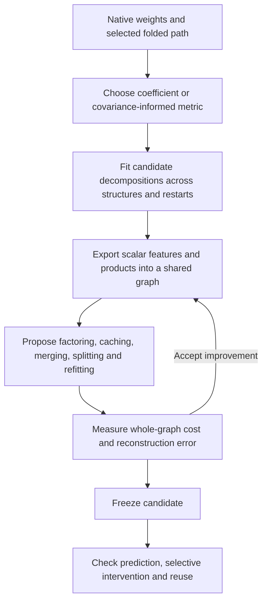

# Two-stage decomposition and shared computation graphs

**20 September 2026, 19:23 UTC.** These are decomposition experiments on a selected folded polynomial path, not an identified semantic circuit or a replacement of the full normalized model.

## What the proposed second stage adds

The proposal is useful and now partially implemented. A **tensor decomposition** chooses feature spaces and coefficients within a prescribed architecture. A **computation DAG** is a directed acyclic graph in which a computed scalar can feed any number of later nodes. Optimizing that graph lets us change the architecture and count a shared computation once.

The last box remains an outstanding scientific requirement. Prediction on reused diagnostic panels is not OOD validation or evidence of monosemanticity.

For the single-layer joint tensor,

$$
s=P^\top z,\qquad h_g=\sum_{p,q}G_{gpq}s_ps_q,\qquad y=Wh,
$$

where \(z\in\mathbb R^d\), \(P\in\mathbb R^{d\times r}\), \(G\in\mathbb R^{m\times r\times r}\), and \(W\in\mathbb R^{V\times m}\). The first core index selects the computed feature; the other two select its inputs. Output sharing can group unrelated conditions with the same downstream effect. We preserve constituent expressions instead of assigning a forced semantic name.

Ordinary HT organizes tensor slots into a tree. Our graph representation permits reuse across branches and depths. Sparse core entries, low-rank quadratic forms, stored coefficients, and distinct products are different measures of simplicity.

## What is implemented now

The scalar graph supports learned linear combinations, products, cross-depth reuse, exact structural caching, and common-factor rewrites. Five exact controls passed, including:

$$
u(ab+ac)+v(db+dc)=u\bigl(a(b+c)\bigr)+v\bigl(d(b+c)\bigr).
$$

The four input products become two, with one shared addition. A control in which other outputs still need the original products correctly rejects factoring: it would increase the **global** product count. Repeated squaring also counts each reused computation once.

A native mixed-root student exports to the graph with 24 products and 46,096 coefficients. Direct replay differs by only \(4.47\times10^{-15}\) relatively; serialization and reloading preserve it exactly at the tested precision. A bounded screen of 32 local proposals found no saving, because other outputs still consumed the original roots. This is not a proof of minimality.

**Still missing:** a broad graph search that interleaves arbitrary approximate merges/splits, intermediate insertion/removal, and continuous refitting. The infrastructure and first edit families are working; the full proposed search is not finished.

## Did direct optimization from weights help?

Yes, with a substantial qualification. Direct teacher–student tensor contractions make it possible to optimize the folded function without materializing its enormous coefficient tensor. Toy controls show that architecture, basis, initialization, and optimizer can determine whether known structure is recovered. There is no universal Adam-versus-Muon winner.

On the native two-layer pure-quartic path, the training-selected isotropic student has approximately **58.48%** relative prediction error on the second captured-input panel. Using an uncentered second-moment metric improves that to **25.28%**, at the same 48,384-coefficient architecture. A constant-output baseline has **65.51%** error; the weighted model also predicts centered variation, with **27.81%** centered error. Its benefit is not merely reproducing the mean.

But isotropic full-coefficient relative errors remain about **99.9%**. We have found a computation that is substantially better on the captured inputs, not a compact global reconstruction of the full polynomial.

The [paper's metric framework](https://arxiv.org/pdf/2605.15183) supports matching tensors under a chosen metric. Our four-slot covariance weighting is one particular metric; it is **not** the complete repeated-input Gaussian quartic prediction loss. The latter also contains trace contractions. Arbitrary shared graphs do not automatically inherit cheap exact contractions from tree-structured methods.

## First approximate graph-sharing experiment

We froze the ten root products of each fitted student and introduced shared output combinations:

$$
\phi(x)\in\mathbb R^{10},\qquad h=Z\phi(x),\qquad \widehat y=Wh.
$$

The combinations were chosen by a weighted SVD against the **student's coefficient tensor**, without fitting activation targets. The selected source is the second-moment Muon seed-1 model, selected by its original training objective. Errors below are relative Euclidean norms across the second captured-input panel.

| Representation | Stored coefficients | Distinct nonlinear products | Evaluation error |
|---|---:|---:|---:|
| Original fitted student | 48,384 | 26 | 25.28% |
| Two shared output features | 39,188 | 26 | 38.41% |
| Four shared output features | 41,512 | 26 | 26.28% |
| Eight shared output features | 46,160 | 26 | 25.28% |

The two-feature hypothesis **failed** both registered bars: it retained only 98.50% rather than at least 99% of weighted student coefficient energy, and prediction error deteriorated by more than two percentage points.

The predeclared rule, smallest tested rank retaining at least 99%, chooses four features. That version retains 99.9827% of weighted coefficient energy, saves **14.2% of coefficients**, and reduces total additions from **47,212 to 40,336**. It does not reduce nonlinear products. Its scalar DAG replay error is \(3.24\times10^{-15}\).

A residual audit explains why even this seemingly tiny coefficient change matters. Its relative coefficient error is **1.32%**, while its actual output change relative to the original student is **5.22%** on panel two. In addition, that change aligns unfavorably with the original teacher residual:

$$
\|\widehat f-f\|^2
=\|f_{\rm student}-f\|^2
+\|\widehat f-f_{\rm student}\|^2
+2\langle f_{\rm student}-f,\widehat f-f_{\rm student}\rangle.
$$

After division by teacher output energy, these terms are 0.063916, 0.003172, and +0.001995. The identity replays to \(2.7\times10^{-18}\). Thus both metric mismatch and residual alignment contribute; this is not a scalar-DAG implementation error.

## Implications and next question

Your proposal changes the final search space from a prescribed decomposition to reusable arithmetic programs. It also changes the accounting: each reachable computation is charged once. The present results support implementing that distinction, but do not yet demonstrate reusable semantic features.

The next discriminating comparison is a compact centered expansion of the native quartic path: its exact degree-two part is itself a folded third-order tensor. A registered matched-budget comparison will test how much of the observed simplicity comes from lower-degree behavior around the actual input mean, versus genuinely necessary quartic structure. Full normalizations, attention, residual terms outside the selected path, and the final softcap remain explicit boundaries.

Primary receipts: [exact graph controls](../../direct_tensor_match/ARITHMETIC_DAG_CHECK_V1.json), [native graph export](../../direct_tensor_match/NATIVE_DAG_EXPORT_V1.json), [output-sharing sweep](../../direct_tensor_match/DAG_OUTPUT_SHARING_V1.json), [graph replay](../../direct_tensor_match/SHARED_OUTPUT_DAG_REPLAY_V1.json), [residual audit](../../direct_tensor_match/OUTPUT_SHARING_RESIDUAL_AUDIT_V1.json), [centered comparison plan](../../direct_tensor_match/CENTERED_COMPACT_PLAN_V1.md).

## Addendum — 19:34 UTC: fitting and editing the graph now work on controls

The graph now has an explicit shared constant and enforces conservative degree bounds. Its differentiable compiler gives each shared node one set of coefficients. Exact unit aggregation can remain structural; if unit coefficients are learned, they count as stored parameters even at value one. Zero and unit products simplify exactly.

Five planted topologies were fitted from two random starts each using 1,024 artificial Gaussian probes and evaluated on 4,096 fresh probes. Four families recovered to below1% error in at least one start. The square of a quadratic failed both starts (best39.92%). Compiler replay, directional gradients, and exact capacity witnesses passed: this failure does not establish a representation limit.

A separate paired16-arm experiment on that square compared Adam/Muon, two rates, two seeds, and joint versus analytic output fitting. It used exact Gaussian quadrature for the degree-eight squared loss. Analytic readouts gave8/8 recoveries below1%; joint readouts gave5/8. Adam reached machine precision in several arms; Muon reached roughly0.19–0.28% at its best checkpoints with analytic readouts and often overshot afterward. This comparison does not isolate why the earlier probe-based runs failed: objective integration, initialization layout, and parameter grouping also changed. Within the paired grid, the writer comparison is controlled. Five- versus seven-point quadrature agrees to numerical precision.

The first approximate topology-edit loop is implemented: remove a product globally, simplify, refit, then evaluate the whole-graph objective. On a near-duplicate control, it reduces2products/7coefficients to1product/2coefficients, with fresh relative error6.33e-12. On two independent products, either deletion incurs50% squared Gaussian error and is rejected. This is a narrow but real edit/refit loop; arbitrary graph search remains unfinished.

The matched48,384-scalar native centered comparison is now queued through the managed runner. Its allocation selection uses the common Gaussian Taylor-target objective within each metric:

$$
\text{score}=\text{linear explained energy}+2\,\text{quadratic coefficient explained energy}.
$$

A free constant matches the Taylor target's Gaussian mean. This removes an ambiguous cross-allocation selection rule and avoids selecting using native evaluation errors. Neither the degree truncation nor the covariance metric turns this into a full-model circuit claim.

Receipts: [fixed-graph controls](../../direct_tensor_match/TRAINABLE_DAG_CHECK_V1.json), [square optimizer comparison](../../direct_tensor_match/DAG_SQUARE_OPTIMIZER_V1.json), [edit/refit controls](../../direct_tensor_match/DAG_EDIT_REFIT_V1.json).
