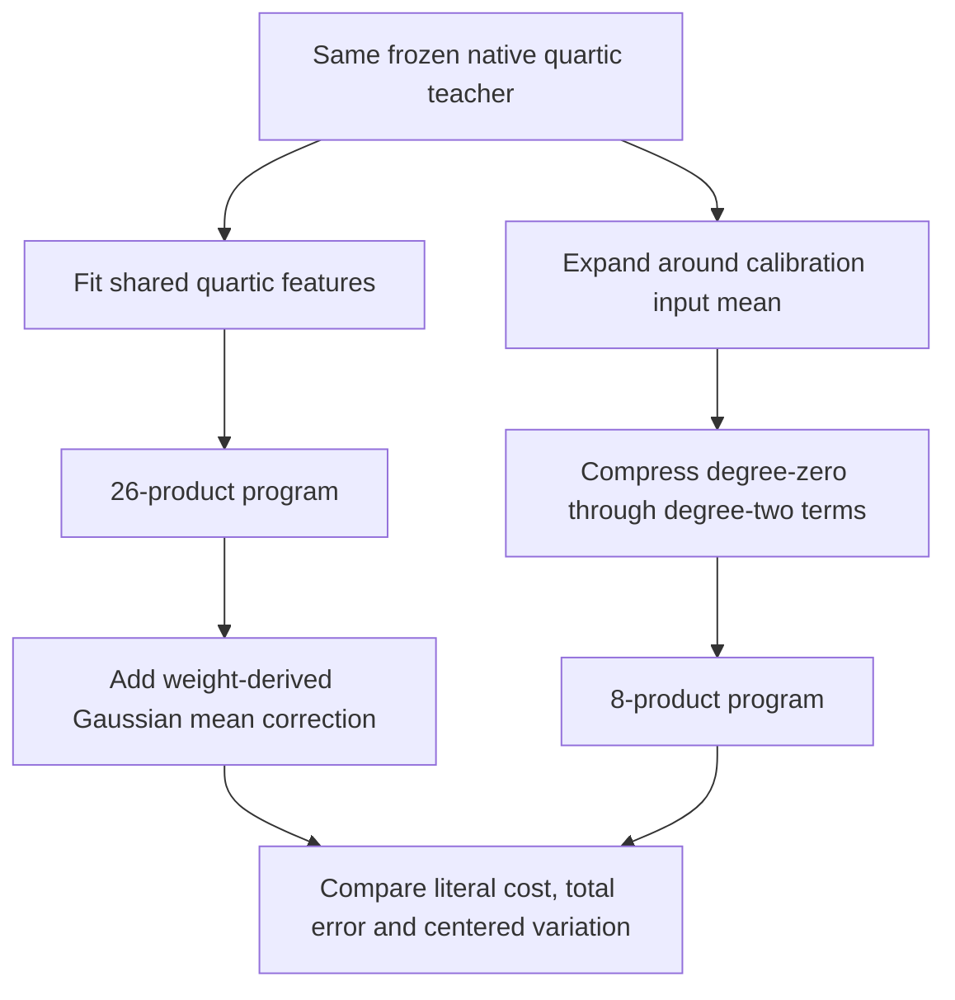

# Centered programs: fewer products, but a mean-versus-variation tradeoff

**20 September 2026, 19:44 UTC.** The active objective remains a simple, reusable, predictive and selectively manipulable circuit. These results concern a selected folded polynomial path; they do not yet identify such a circuit.

The latest native program uses eight quadratic products instead of26 products, at the same48,384-coefficient budget. Its total prediction error improves from25.28% to23.12% on the second captured-input panel. **However, its error on input-dependent variation worsens from27.81% to34.99%.** The aggregate improvement is a mean improvement, not stronger prediction of varying responses.

## Definitions and scope

The teacher is the pure quartic term obtained by composing MLP16 and MLP17 and folding the unembedding into the output. Input and reduced output widths are1152. An orthonormal vocabulary output frame is fixed and shared across candidates. Normalization, attention, other residual contributions and softcapping are outside this polynomial target.

A **product** means multiplication of two scalar features. Learned linear projections have their own coefficient and addition cost. The quartic program computes16 products inside four quadratic features, then10 products between those features:26 total.

A **centered program** uses \(\delta=x-\mu\), where \(\mu\) is the calibration input mean. It approximates the exact degree-zero, degree-one and degree-two terms of the teacher's expansion around that mean:

$$
\widehat F(x)=c+W_\ell R_\ell\delta+C_q[(A_q\delta)\odot(B_q\delta)].
$$

The selected program has linear rank8 and quadratic width8. Storage includes \(\mu\), \(c\), both linear factors and all three quadratic factors:48,384 FP32 coefficients. The common vocabulary frame is excluded from both candidates' incremental prices.

**Total relative error** is \(\|\widehat Y-Y\|_F/\|Y\|_F\), across captured inputs and outputs. **Centered variation error** first subtracts each output's panel mean from both predicted and true outputs. This is an output diagnostic; it is distinct from centering input coordinates during fitting.

## What was optimized

Twenty-six configurations compared four allocations of the same coefficient budget:

| Linear rank | Quadratic products | Total coefficients |
|---:|---:|---:|
| 2 | 12 | 48,384 |
| 8 | 8 | 48,384 |
| 14 | 4 | 48,384 |
| 20 | 0 | 48,384 |

The nonlinear arms used Adam and Muon with two starts; the linear-only arms are direct SVD controls. Two input metrics were tested: a spherical covariance with matched trace, and the calibration covariance with its registered eigenvalue floor. Both use the calibration input mean. Thus the spherical centered experiment is not fully data-free.

The quadratic coefficient loss uses implicit weight contractions. A constant correction matches the Taylor target's Gaussian mean. With this correction, Gaussian quadratic function error is twice the weighted coefficient error, plus the linear error. One winner per metric was selected by the corresponding **training objective**, before inspecting prediction errors.

| Training-selected representation | Products | Coefficients | Total error | Centered variation error |
|---|---:|---:|---:|---:|
| Prior second-moment-weighted quartic | 26 | 48,384 | 25.28% | 27.81% |
| Spherical centered quadratic | 8 | 48,384 | 25.33% | 38.02% |
| Covariance-weighted centered quadratic | 8 | 48,384 | 23.12% | 34.99% |

The covariance-selected model uses Muon, seed1. Without its weight-derived constant correction, total error is27.58%. The exact, uncompressed degree-two truncation has18.73% error but requires vastly more coefficients; it is a reference for truncation, not a priced compact competitor.

The fold independently replays at1.73e-15 relative error. The cached native teacher agrees within6.21e-7, and archived FP32 candidate programs replay within1e-7. The26-arm native run took about20seconds.

## Why the favorable result needed qualification

For residuals \(R=\widehat Y-Y\), panel size \(n\), and residual mean \(\bar r\),

$$
\|R\|_F^2=n\|\bar r\|_2^2+\|R-\mathbf1\bar r^\top\|_F^2.
$$

After division by true output energy, the quartic's mean and centered residual terms are0.03089 and0.03302. The centered program's terms are0.00118 and0.05228. The mean error decreases more than the varying-response error increases. These identities replay within1e-17.

This is a legitimate cost–error tradeoff, but not evidence that the eight-product program captures the changing computation better. It motivates a fairer comparison with a quartic program that is also allowed a constant.

## Next control

The primary next candidate freezes the existing quartic's internal features, uses its rank-eight shared output combinations, and adds

$$
b=\mathbb E_{x\sim\mathcal N(\mu,M)}[F(x)-\widehat F(x)].
$$

That mean is calculated from the weights with exact Gaussian moment formulas. No activation targets are fitted. The candidate stores47,312 coefficients including the constant and retains26products. Input mean and covariance are used offline, not stored as inference matrices.

The registered comparison also includes an empirical calibration-mean correction as a diagnostic and an evaluation-mean oracle bound. The latter is never exported or used to select a candidate. If the Gaussian correction misses where the calibration correction succeeds, that tests the Gaussian-law assumption rather than the graph implementation. The native run is queued; no outcome is claimed here.

## Progress on the proposed graph search

The graph implementation now supports constants, conservative degree limits, shared parameter ownership, differentiable fixed-topology fitting, exact rewrites, and one approximate edit: delete a product globally, refit, and accept only a lower whole-graph objective. It removes a planted redundant product with6.33e-12 fresh-probe error and rejects deletion of independent products. Broad graph search, residual feature additions, stable identification, selective intervention and OOD validation remain outstanding.

The scheduled [three-hour math and primary-literature review](../../THREE_HOURLY_MATHEMATICAL_REVIEW_2026-09-20_1937.md) connects these experiments to variable projection, Gaussian moments, equality-saturation extraction and tensor contraction complexity. It led directly to the constant-control comparison.

Receipts: [native centered comparison](../../direct_tensor_match/NATIVE_CENTERED_COMPACT_V1.json), [mean/variation audit](../../direct_tensor_match/CENTERED_COMPACT_VARIATION_AUDIT_V1.json), [next control specification](../../direct_tensor_match/QUARTIC_MEAN_CORRECTION_PLAN_V1.md), [arithmetic-program specification](../../direct_tensor_match/ARITHMETIC_PROGRAM_SEARCH_SPEC.md).
