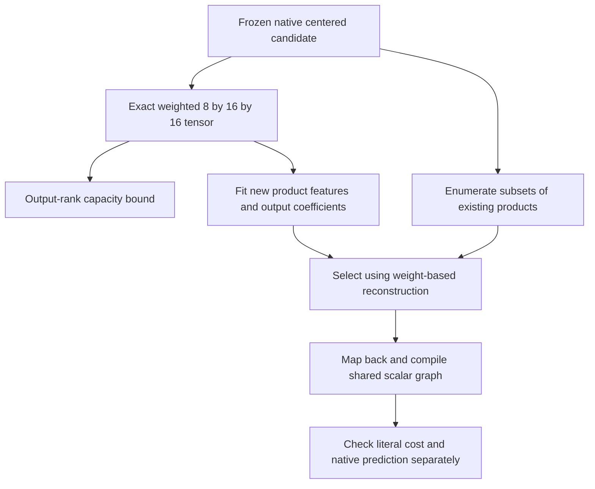
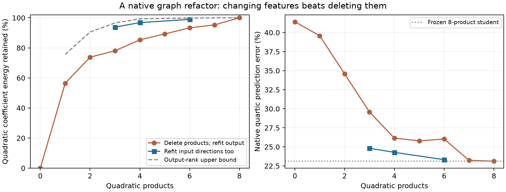

# Native graph refactoring: new products beat deleting old ones

**20 September 2026, 19:55 UTC.** The proposed second stage now has a concrete native example. Four newly fitted quadratic products preserve96.82% of a frozen candidate's quadratic coefficient energy. The best choice of four original products preserves only85.35%, even after refitting their output coefficients. Changing the computations matters more than deleting connections in this case.

This is an approximation of a previously fitted native candidate, not recovery of semantic circuits or a globally optimal arithmetic program.

## Fixed target and definitions

The source candidate approximates the pure MLP16→MLP17 quartic path around the calibration input mean. It has a linear branch of rank8 and8quadratic products:

$$
\widehat F(x)=c+W_\ell R_\ell(x-\mu)
+C_q[(A_q(x-\mu))\odot(B_q(x-\mu))].
$$

The refactor holds the center and linear branch fixed. It changes the quadratic products and their output coefficients, with a constant adjustment preserving the source candidate's Gaussian mean. The metric uses the original calibration covariance. Every topology and checkpoint is selected from weight-based losses; captured outputs are diagnostics only.

**Retained quadratic energy** is one minus relative squared error of the covariance-transformed symmetric quadratic tensor. It is not total model accuracy or total function energy. **Native prediction error** compares the resulting program against the original pure-quartic teacher on the second reused captured-input panel.

## First try: exhaustive deletion

All256subsets of the8products were evaluated. For each subset, output coefficients were solved analytically under the Gaussian metric. The best subset at each size was selected before empirical evaluation.

Four products retained85.35% rather than the registered95% bar. Native error rose23.12%→26.15%, an increase of3.023percentage points, narrowly failing the registered3point limit. Both failures are preserved.

Seven products were a gentler tradeoff:44,928coefficients and23.23% error versus48,384coefficients and23.12% for all8. These are fixed-dictionary limits, not limits on the number of products after changing their input features.

## Second try: refactor the computation

The source quadratic tensor lies in an exact16-dimensional input span and8-dimensional output span. In orthonormal coordinates for its weighted metric it is an explicit tensor of shape8×16×16. Its output-rank relaxation permits up to99.30% energy retention with4output directions. Thus the failed95% deletion goal was not ruled out by that necessary bound.

We fitted new bilinear products to this small joint tensor, comparing widths3,4,6; Adam/Muon; two rates; and two starts, for24fits. Analytic output solves and a decaying learning rate were used. The learned factors were mapped back into the original1152input and output coordinates, absorbing the temporary frames into the exported weights.

| Program | Quadratic products | Coefficients | Quadratic energy retained | Native prediction error |
|---|---:|---:|---:|---:|
| Frozen source | 8 | 48,384 | 100% | 23.12% |
| Best deletion subset | 4 | 34,560 | 85.35% | 26.15% |
| New learned products | 3 | 31,104 | 93.77% | 24.82% |
| New learned products | 4 | 34,560 | 96.82% | 24.28% |
| New learned products | 6 | 41,472 | 98.93% | 23.32% |

The four-product refactor saves28.6% of coefficients and halves the nonlinear product count, at1.16percentage points of additional native prediction error. All three registered refactor predictions pass. This does not establish global CP optimality; the optimistic output-rank bound is still above the achieved fit.

Curves use the same frozen source and reused diagnostic panel. They have no independent statistical error bars. The dashed bound is a necessary tensor-rank relaxation, not an achieved program.

## Optimizer evidence and executable graph

At width4, Adam's retained energies ranged96.41–96.79%, while Muon ranged93.07–96.82%. The larger tested rate improved the Muon fits considerably. The selected winner is Muon at.03, seed0; the near-tie with Adam does not support a broad optimizer superiority claim.

The exported four-product candidate compiles to an actual shared scalar DAG with34,560stored coefficients,33,392additions,35,720edges and degree at most2. Its graph evaluation replays the archived factor program to1.53e-15 relatively. Centering, bias and the complete reduced output readout are included in that price; the common vocabulary frame is excluded consistently.

## What this does and does not establish

This is evidence for the two-stage procedure: factorization supplies useful subspaces; a later refactor changes the products inside them and improves the error–cost tradeoff over pruning. It has not yet discovered a broadly reusable shared computation across native branches or established a feature's meaning.

The earlier mean/variation warning still applies. The four-product refactor has36.81% centered-variation error, versus34.99% for its eight-product source and27.81% for the previous quartic candidate. Lower total error alone does not show better prediction of variable computation.

The weight-derived quartic mean-correction experiment remains queued behind another live managed GPU job. It will compare constant flexibility at a fair price. No result is inferred from the queue state.

Receipts: [all deletion subsets](../../direct_tensor_match/CENTERED_PRODUCT_PRUNE_V1.json), [capacity bound](../../direct_tensor_match/CENTERED_QUADRATIC_CAPACITY_V1.json), [continuous fits](../../direct_tensor_match/CENTERED_CONTINUOUS_REFACTOR_V1.json), [scalar graph replay and costs](../../direct_tensor_match/CENTERED_DAG_EXPORT_V1.json).
