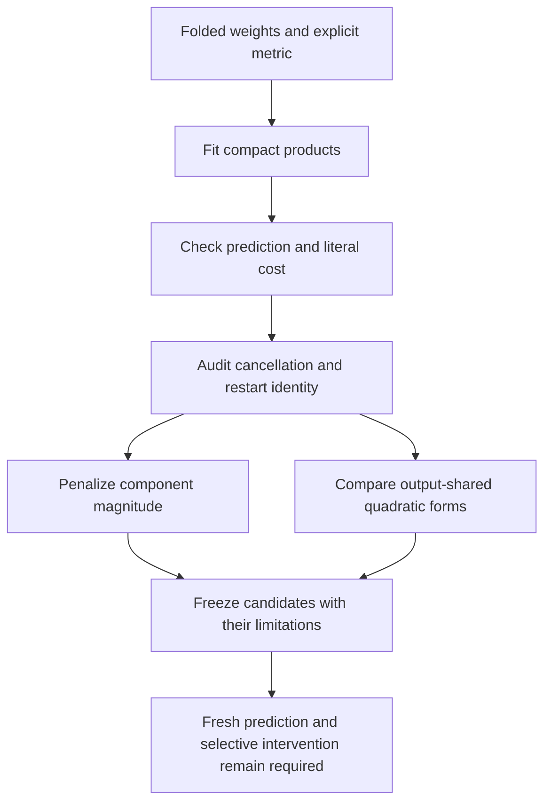

# Better prediction, but feature identity still needs work

**20 September 2026, 20:15 UTC.** The mean-control experiment improved the frozen quartic candidate to **18.38% relative prediction error**, with 47,312 coefficients and 26 products. Separately, the four-product quadratic refactor exposed strong cancellation and unstable individual features. These are useful computational approximations, not yet identified semantic circuits.

All native prediction errors below are relative root-mean-square errors on the held-out second activation panel for the selected folded two-MLP polynomial contribution, not whole-model logit or language-model errors. Coefficient counts exclude the common fixed vocabulary output frame. Centered variation error measures prediction after removing each output mean.

## The mean correction changed the comparison

The primary candidate uses eight shared output combinations of the same ten quartic root products, plus

$$b=\mathbb E_{x\sim\mathcal N(\mu,M)}[F(x)-\widehat F(x)].$$

The expectation is calculated from native weights and the calibration input mean/covariance. No activation targets are fitted. The constant does not change centered input-dependent variation.

| Candidate | Products | Coefficients | Evaluation error | Centered variation error |
|---|---:|---:|---:|---:|
| Quartic with eight output combinations, no constant | 26 | 46,160 | 25.28% | 27.84% |
| Same quartic plus Gaussian mean correction | 26 | 47,312 | 18.38% | 27.84% |
| Quartic with four output combinations plus correction | 26 | 42,664 | 19.71% | 29.90% |
| Earlier centered quadratic | 8 | 48,384 | 23.12% | 34.99% |

The primary correction performs similarly to an empirical calibration-mean correction, 18.40%, without fitting that output mean. An evaluation-panel oracle constant gives 18.20%; it is only a diagnostic lower bound and is never exported. The Gaussian assumption is not exact: its teacher mean differs from the empirical mean by about 5.4% of output RMS on panel two. Its *teacher-minus-student* correction nonetheless transfers well here.

All three registered mean-control predictions passed. The archived FP32 program's scalar DAG replays in FP64 to 4.49e-15; archive rounding changes reported error by less than 1e-9. This reverses the earlier aggregate comparison favoring degree truncation. The quadratic candidate remains cheaper in nonlinear products, but does not predict better once the quartic is allowed a priced constant.

## Four products did not imply four stable features

Eight width-four refits used Adam/Muon and four starts, keeping all fitted factors. Their total tensor cosines range .9895–.9999, but the worst matched quadratic feature cosine is only .455, after removing permutation, sign and scaling ambiguities. The registered function and feature-stability bars both fail.

For component tensors \(T_k\), define

$$R=\frac{\sum_k\|T_k\|_F^2}{\|\sum_kT_k\|_F^2}.$$

Large \(R\) means large component terms cancel. Here \(R\) ranges 63–1367; the quadratic feature Gram matrices have condition numbers about 992–21,703. These are substantial compensating terms, not merely negligible unstable features.

General low-rank tensor approximation can be ill-posed, as shown by [de Silva and Lim](https://arxiv.org/abs/math/0607647). Our finite runs do not prove that this particular fit approaches a nonattained rank limit. They do show why product count and reconstruction error alone are insufficient evidence for simple individual computations.

## Adding a bound on component size

After normalizing each quadratic feature to unit coefficient norm, we tested

$$\|T-\widehat T\|_F^2+\lambda\|C\|_F^2.$$

The writer matrix \(C\) still has an analytic ridge solution. Twenty-four refinements compared three penalties across all eight initial fits.

| Penalty | Median quadratic energy retained | Median cancellation ratio | Median matched output-component cosine |
|---:|---:|---:|---:|
| 0.0001 | 96.67% | 10.24 | 0.781 |
| 0.001 | 96.49% | 3.02 | 0.931 |
| 0.01 | 95.97% | 1.25 | 0.823 |

The registered rule selects 0.001 from weight-space criteria. Its training-selected exported program retains 96.56%, uses 4 products and 34,560 coefficients, and gives 24.06% native prediction error. Cancellation is about 3 rather than hundreds. However, the worst feature match remains .499, so the stability prediction still fails. Stronger regularization does not monotonically improve identification.

## Output sharing is a different kind of simplicity

A closed-form SVD baseline defines four computed quadratic output features, each assembled from the original eight shared products:

$$h_g=\sum_{i=1}^{8}Z_{gi}q_i,\qquad y=Wh.$$

It retains 99.30% of the quadratic tensor's energy, costs 43,808 coefficients and 8 products, and gives 23.15% native prediction error. Orthogonal columns of \(W\) eliminate cancellation *between these four output components*. Cancellation among the primitive products remains, with ratio 5.52. Thus four output features and four products are distinct assumptions; neither guarantees one human-readable concept per feature.

The graph actually reuses the eight products across all four features. It does not expand each quadratic form separately. Independent archive replay verifies the same price and reconstruction.

## Next mathematical target

Taylor truncation is not the optimal low-degree Gaussian approximation to a quartic. Higher-degree terms contribute to its lower-degree Gaussian projection. In centered coordinates the optimal degree-two coefficient is

$$Q=\tfrac12\mathbb E[\nabla^2F(x)],$$

not merely half the Hessian at the input mean. A small independent control gives 49.06% projection error versus 86.58% Taylor error; this is a toy result, not a native improvement claim.

The new implicit cross-contraction implementation matches dense coefficient values and gradients within 4e-16. It can fit a few quadratic student products against that projected part of the **full native quartic**, without expanding the order-five tensor. The next native comparison will separate mean-only correction from this change in quadratic target, with its linear branch held fixed as an explicit control.

Primary receipts: [mean correction](../../direct_tensor_match/NATIVE_QUARTIC_MEAN_V1.json), [feature stability](../../direct_tensor_match/CENTERED_FEATURE_STABILITY_V1.json), [regularization](../../direct_tensor_match/CENTERED_REGULARIZED_REFACTOR_V1.json), [output-sharing baseline](../../direct_tensor_match/CENTERED_OUTPUT_BLOCK_V1.json), [next native specification](../../direct_tensor_match/NATIVE_GAUSSIAN_QUADRATIC_PLAN_V1.md). The [20:01 strategic review](../../HOURLY_STRATEGIC_REVIEW_2026-09-20_2001.md) records the change in direction.
