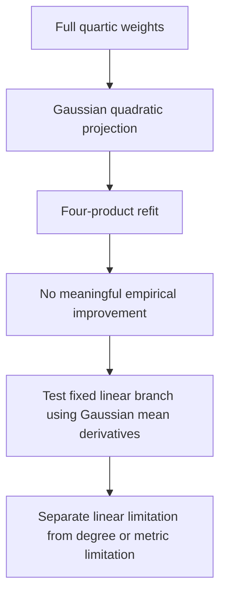

# Gaussian quadratic refitting did not improve native prediction

2026-09-20 20:27 UTC

Eight registered fits compared Adam/Muon, two paired initializations and two input covariance metrics, with 100 steps each. The linear branch stayed fixed. Fits used exact implicit weight contractions; empirical outputs were used only for evaluation on the previously reused diagnostic panels.

| Metric, selected by weight objective | Mean-only paired control | Refitted quadratic | Centered variation error |
|---|---:|---:|---:|
| Calibration covariance | 24.18% | 24.16% | 36.46% |
| Trace-matched spherical | 24.15% | 28.05% | 42.55% |

Errors are relative root-mean-square errors for the selected folded polynomial contribution, not whole-model errors. The centered winner improved its penalized objective only 0.24%; the spherical winner improved about 27.3% but transferred poorly. Both registered science predictions failed. This does not prove a global optimization limit. It argues against spending another generic sweep on this particular quadratic correction.

The earlier selected four-product program with its old constant had 24.06% error. The mean-corrected quartic remains better at 18.38%, with more products. These controls prevent attributing a mean change to newly discovered interactions.

Independent CPU scalar-DAG replay passed at less than 2e-16 relative error. Both exports use four products, 34,560 stored coefficients and 33,392 additions, excluding the common fixed vocabulary frame. Thus the negative result survives export checks.

The next control tests the fixed linear branch using the derivative of the exact Gaussian teacher mean. A dense toy oracle already checks the formula; native directional derivatives and writer replacement are pending. This changes one remaining assumption instead of increasing quadratic rank or trying more rates.

Receipts: [native comparison](../../direct_tensor_match/NATIVE_GAUSSIAN_QUADRATIC_FIT_V1.json), [independent export audit](../../direct_tensor_match/GAUSSIAN_QUADRATIC_ARCHIVE_AUDIT_V1.json), [next control](../../direct_tensor_match/GAUSSIAN_LINEAR_CONTROL_PLAN_V1.md).
