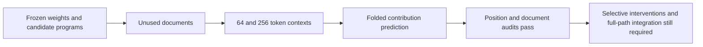

# Frozen decompositions transfer to fresh documents and longer contexts

2026-09-20 20:39 UTC

The strongest compact candidates were frozen before collecting 32 new documents
from the same source domain. Neither inputs nor outputs from these documents
were used to fit their coefficients. The test used 64-token and 256-token
contexts and 16 native-model forwards to collect normalized MLP16 inputs.

| Candidate | Coefficients | Products | Fresh64 error | Fresh256 error |
|---|---:|---:|---:|---:|
| Gaussian-corrected quadratic | 34,560 | 4 | 20.89% | 20.94% |
| Mean-corrected quartic | 47,312 | 26 | 17.44% | 17.90% |

These are relative root-mean-square errors for the isolated folded MLP16-to-MLP17
polynomial contribution. They are not whole-model errors or an installed
replacement. Prices exclude the common fixed vocabulary frame.

All three registered predictions passed. Independent CPU re-evaluation and
position stratification corroborated the result. Quartic error across four
64-position blocks was 17.44%,17.92%,17.70%,18.42%; quadratic error remained
20.51–21.19%. Matched input prefixes agree within 7.8e-7 relative error.
A 2,000-resample document bootstrap gives a paired quartic advantage of
3.00–3.89 percentage points at context64 and 2.74–3.32 at context256.
These descriptive intervals cover only these 32 documents; they are not broad
OOD evidence. Feature identity, semantic selectivity and full-model causal
replacement remain unresolved.

The preceding input-mixture diagnostic was mixed: held-out quadratic-feature
covariance discrepancy improved26.2%, but fourth-moment discrepancy only1.2%,
failing its10% bar. Random splitting barely helped. This is insufficient
justification for a larger mixture-fitting campaign. Fresh predictive evidence
was the more valuable next check, and it now supports retaining both programs
on the error–cost comparison rather than choosing solely by one metric.

Receipts: [fresh validation](../../direct_tensor_match/FROZEN_FRESH_VALIDATION_V1.json),
[document and position audit](../../direct_tensor_match/FRESH_TRANSFER_AUDIT_V1.json),
[mixture diagnostic](../../direct_tensor_match/MIXTURE_MOMENT_DIAGNOSTIC_V1.json).
