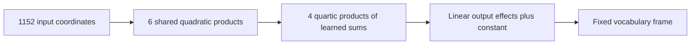

# A ten-product program after hierarchical refactoring and graph folding

2026-09-20 21:08 UTC

The selected root fit passed all three registered bars. Composing adjacent
linear maps then removed redundant stored coefficients without meaningful
prediction change. The resulting program is

$$p=(Ax)\odot(Bx),\qquad h=(Lp)\odot(Rp),\qquad y=Vh+c.$$

Here p contains six shared quadratic products; h contains four quartic features.
A and B have shape 6×1152; L and R have shape 4×6; V is 1152×4; c has 1152 entries.
Total: 19,632 coefficients, 10 products, 18,460 additions. A common fixed vocabulary
frame maps these 1152 outputs to logits and is excluded from every listed price.

| Program | Coefficients | Products | 64-token error | 256-token error |
|---|---:|---:|---:|---:|
| Earlier quartic | 47,312 | 26 | 17.44% | 17.90% |
| Fused six-root program | 21,960 | 12 | 18.18% | 18.58% |
| Fused four-root program | 19,632 | 10 | 19.06% | 19.43% |

Errors concern the isolated folded polynomial contribution. These panels are
now reused diagnostics, not a new untouched test. Compared with the earlier
quartic candidate, the ten-product program uses 58.5% fewer stored coefficients
and 61.5% fewer products, with a prediction tradeoff.

Graph folds were judged by actual reachable costs. Output-map composition
helped every root width. Folding bank writers into root readers helped the
four-root graph; it was rejected for six roots because additions increased,
and for eight roots because coefficients and additions increased. FP64
algebraic replay is below 4e-16; FP32 rounding changes outputs by 3.4e-8 relative.

The ten-product program also passes the registered local response screen:
learned-direction errors 19.31–20.87%, cosines .978–.981. Random-direction errors
remain 48–52%, so arbitrary-direction response fidelity remains limited.

At the root, two high-rate Muon fits agree better than the lower-level
primitives: centered function cosine .99994, worst matched feature cosine .904,
worst matched output direction cosine .891. This is encouraging but only a
two-fit observation. Six additional starts are registered as an identity
replication; the selected model remains frozen. Semantics, selective native
interventions and full-model replacement remain unproven.

[Root fits](../../direct_tensor_match/ROOT_PRODUCT_REFACTOR_V1.json),
[graph folds](../../direct_tensor_match/FUSED_ROOT_PROGRAM_V1.json),
[response validation](../../direct_tensor_match/DIRECTIONAL_RESPONSE_FUSED_V1.json),
[root identity](../../direct_tensor_match/ROOT_IDENTITY_AUDIT_V1.json),
[replication specification](../../direct_tensor_match/ROOT_IDENTITY_REPLICATION_PLAN_V1.md).
