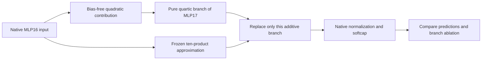

# Moving from isolated approximation to native branch intervention

2026-09-20 21:29 UTC

The latest vocabulary-contrast diagnostic qualifies the compression result:
the ten-product quartic has 18.6–18.8% relative error after removing uniform
vocabulary shifts, essentially tied with the quadratic comparator (18.5–18.6%).
The 26-product quartic remains better at 16.6–16.9%. These are pre-softcap,
isolated-function diagnostics, not language-model loss measurements.

The next test installs the approximation in the native model. We isolate only
the pure quartic contribution from MLP16 through MLP17. Residual cross terms,
biases, attention, and the actual normalization denominator remain explicit.
The CPU algebra oracle passes at 2e-16; incorrect handling of bias, residual
scaling, or normalization produces 15–35% error in the same toy instance.
This validates the algebraic instrument, not the learned candidate.

[Native screen registration](../../direct_tensor_match/NATIVE_QUARTIC_BRANCH_PLAN_V1.md).
The native screen is not yet run. Stable semantics, OOD behavior and selective
manipulation remain unproven.
