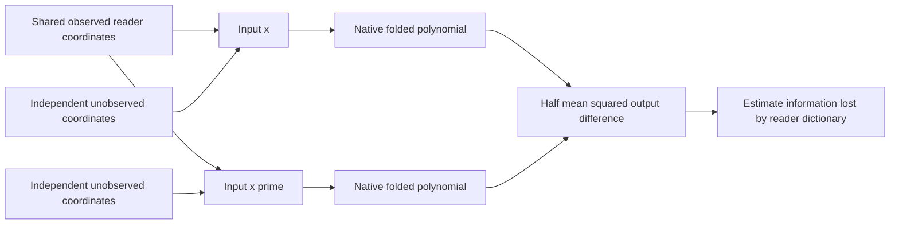

# The transfer failure predates final compression

2026-09-20 21:46 UTC

The archived-stage test used the same native background, code inputs, fixed
canonical feature directions and calibration mean. Native intervention targets
replayed identically. Neither larger program recovered the failed feature1 edit:

| Program | Products | Stored coefficients | Feature1 effect error | Effect cosine |
|---|---:|---:|---:|---:|
| Original quartic | 26 | 47,312 | 51.3% | .878 |
| Intermediate | 12 | 21,960 | 48.8% | .892 |
| Smallest | 10 | 19,632 | 48.1% | .892 |

Both registered recovery predictions fail. The result argues against final
root compression as the principal cause of this specific transfer error.
It does not prove that no richer model can help, or that optimization is correct.

The next diagnostic tests a more fundamental restriction: what can any program
predict if it sees only the learned linear input directions? For Gaussian
inputs, pair two inputs with identical observed directions and independently
vary the remaining directions. Half their expected squared output difference
is the irreducible MSE for that information set. Thus it tests the input dictionary
without choosing a Tucker core, HT tree or nonlinear decoder.

$$
\inf_g\mathbb E\|F(x)-g(Q^Tz)\|^2
=\tfrac12\mathbb E\|F(x)-F(x')\|^2,
\qquad x=\mu+Lz.
$$

Here Q spans the whitened reader directions and x,x' share Q^Tz. The identity
assumes the two complements are conditionally independent under the specified
Gaussian law. A CPU polynomial with known conditional mean passes exact
quadrature: irreducible MSE3, target energy9. The native Monte Carlo study is
registered but not yet run. Its estimates will not be called certified bounds,
and Gaussian conclusions will not be transferred automatically to real text.

[Stage result](../../direct_tensor_match/CODE_STAGE_ATTRIBUTION_V1.json),
[next experiment](../../direct_tensor_match/CONDITIONAL_READER_PLAN_V1.md).
