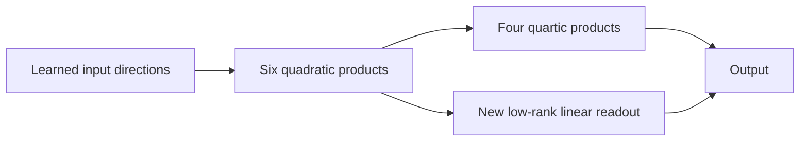

# Existing inputs leave room for a better computation

2026-09-20 21:52 UTC

The paired-input study estimates the error no deterministic decoder of the
chosen linear input directions can beat under each specified Gaussian law.
These are Monte Carlo estimates, not certified bounds or real-text guarantees.

| Input dictionary | Calibration-Gaussian estimated floor | Actual program error | Isotropic estimated floor |
|---|---:|---:|---:|
| Original32 directions | 7.46% [7.23,7.69] | 12.32% | 88.87% |
| Compressed12 directions | 8.59% [8.36,8.81] | 12.99% | 89.21% |

Intervals are block-bootstrap95% intervals. Under the isotropic law, the floor
for centered output variation is98.8–99.2%. Thus these dictionaries are strongly
adapted to the calibration distribution. Adding a more expressive decoder
cannot generally recover information missing from the reader dictionary.

Under the calibration law, however, a meaningful gap remains between input
information and current predictions. This motivates an actual graph edit:
reuse the six quadratic nodes as direct output contributors, alongside their
existing use inside quartic products.

$$
p_k=(a_k^Tx)(b_k^Tx),\qquad
\widehat F_{\rm new}(x)=\widehat F(x)+W(p-\mathbb E p).
$$

This adds no product nodes, but adds readout coefficients and linear operations,
which will be charged. It preserves the Gaussian mean. Exact weight-derived
Gaussian cross moments give the optimal readout for fixed existing nodes;
there is no text-output fitting. The independent toy quadrature check passes
at9e-16. Native fitting and validation are registered, not yet completed.

[Reader results](../../direct_tensor_match/CONDITIONAL_READER_V1.json),
[sampler audit](../../direct_tensor_match/CONDITIONAL_SAMPLER_AUDIT_V1.json),
[graph-edit registration](../../direct_tensor_match/QUADRATIC_SKIP_PLAN_V1.md).
