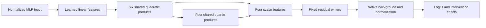

# Research update — 2026-09-20 22:33 UTC

The decomposition now supplies an executable shared arithmetic program and four scalar features with a native intervention interface. This is progress toward extraction and reuse; it is not yet a semantic or selectively manipulable circuit.

## What is reconstructed

The target is the pure quartic branch obtained by composing the penultimate and final bilinear MLPs, then applying the unembedding. Other residual terms, biases, attention, normalization denominators, final normalization and softcapping remain explicit in the native model. These results do not replace the whole model or even the entire two-block computation.

The current program computes six primitive quadratic features and four shared quartic products:

$$
p_i(x)=(a_i^\top x)(b_i^\top x),\qquad
q_j(x)=(\ell_j^\top p)(r_j^\top p).
$$

The output also reads directly from the primitive features. This skip connection reuses existing products. The full reduced-output program uses **10 distinct products and 21,948 coefficients**. Its four extracted scalar projections jointly use **10 products and 13,916 coefficients**; adding their residual-space intervention writers gives 18,524 coefficients. Dense linear projections remain a substantial cost. These counts exclude the retained native background and normalization operations, and are not an end-to-end speedup claim.

## What improved, and what failed

The fixed primary readout blends exact Gaussian weight-derived moments with empirical moments from the original calibration panel, with equal weight. It is explicitly **data-informed**, beyond using only an input covariance matrix. No confirmation outputs were used to fit it.

On fresh confirmation documents at context length 256:

| Domain | Added cross-entropy | KL divergence |
|---|---:|---:|
| FineWeb | 0.00486 | 0.00720 |
| Local Python code | 0.01901 | 0.03143 |

Both metrics measure damage relative to the native model; lower is better. Code KL fails the registered 0.02 threshold. The stronger feature-removal criterion also fails: code feature 1 has relative logit-effect error 0.400025 against a strict threshold below 0.4. This near-threshold miss remains a failure.

The metric investigation explains why covariance alone was insufficient: even Gaussians matched to actual panel means and covariances predicted improvement for a feature whose reconstruction worsened on the text. The discrepancy was primarily in residual–feature alignment, involving moments beyond covariance. Fitting those empirical moments helped, but did not resolve every transfer failure.

## New result: swapping features between documents

Donors were chosen from token information alone. The stronger control swaps between occurrences of the **same token ID in different documents**, preserving token identity while changing contextual feature amplitudes. This reuses the confirmation panels; it is a new intervention test, not another independent data holdout.

Relative error is the norm of the predicted-minus-native logit change divided by the norm of the native logit change. A zero-change predictor has error 1.

| Same-token swap | FineWeb relative error | Code relative error |
|---|---:|---:|
| Feature 0 | 0.263 | 0.252 |
| Feature 1 | 0.320 | 0.437 |
| Feature 2 | 0.500 | 0.357 |
| Feature 3 | 0.500 | 0.454 |
| Joint edit | 0.332 | 0.354 |

Joint effect cosines are 0.943 and 0.941. The broad all-feature criterion passes; the stricter major-feature criterion fails because code feature 1 exceeds 0.4 error. This supports context-dependent, extractable effects beyond a static token-only description. It does not identify what each feature means, demonstrate task selectivity, or establish whole-state interchangeability.

## Redteam and next algebraic question

The attempted scalar-root inertia audit did **not** complete: its assertion that each six-dimensional quadratic form was full rank failed. Inspection shows near-zero eigenvalues. That is a checker assumption failure, not evidence that decomposition failed or that a smaller exact circuit has already been obtained.

The next question is whether rank deficiency permits fewer products for individual scalar outputs, while preserving the savings from shared roots across all four outputs. Numerical eigenvalues alone do not certify an exact rank or an arbitrary-circuit lower bound. No product-count reduction from this audit is included in the validated counts above.

Primary receipts: `direct_tensor_match/FEATURE_SWAP_V1.json`, `BLEND_CONFIRMATION_V1.json`, `EXTRACTED_SCALAR_MODES_V1.pt`, and `EXTRACTED_SCALAR_INTERVENTIONS_V1.pt`, relative to `basis_aligned/polynomial_causal/`.

Follow-up at 22:37: the rank-assumption issue is resolved in the [three-hour mathematical review](../../THREE_HOURLY_MATHEMATICAL_REVIEW_2026-09-20_2237.md). Exact stored ranks differ from numerical ranks; standalone reductions are approximate, while the shared four-root lower bound is exact within the stated restricted class.
