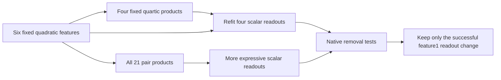

# Research update — 2026-09-20 22:44 UTC

**A same-cost readout refit repairs the previously failing code feature1 removal criterion, but worsens other features.** A more expressive decoder improves cached polynomial prediction yet fails to improve code feature1's native intervention. The useful next candidate changes only feature1's readout, preserving the other scalar computations.

## Controlled comparison

Keep the six learned quadratic input features $p_i(x)=(a_i^\top x)(b_i^\top x)$ and four original quartic products $q_j=(\ell_j^\top p)(r_j^\top p)$ fixed. Compare:

$$
\text{fixed-root refit:}\qquad s_g=b_g+c_g^\top p+\sum_{j=1}^4 w_{gj}q_j,
$$

$$
\text{dense decoder:}\qquad s_g=b_g+c_g^\top p+\sum_{i\le j}d_{gij}p_ip_j.
$$

A scalar feature is one predicted amplitude along a frozen canonical output direction. A native removal subtracts that amplitude through its fixed residual writer, retaining the native recipient background and normalization. We compare the resulting logit change against removal using the true native amplitude. Relative effect error is the norm of their difference divided by the norm of the native logit change; zero is perfect.

All fits use the original2048 calibration states and weight-evaluated native targets. This is data-informed regression. The primary ridge strength1e-4 was registered before outcomes; ridge0 and1e-2 were also reported. Diagnostic panels and native confirmation panels are reused here; no fresh holdout claim.

## Costs and cached-state prediction

| Candidate | Scalar coefficients | Distinct products | Context256 feature1 prediction error |
|---|---:|---:|---:|
| Frozen primary | 13,916 | 10 | 0.230 |
| Fixed-root refit | 13,916 | 10 | 0.174 |
| Dense decoder | 13,936 | 27 | 0.155 |

Each native intervention interface additionally stores4,608 residual-writer coefficients. Coefficient counts alone hide the dense decoder's extra17products. Normalization and the native background are outside these prices. All CPU instrument and registered prediction criteria pass; FP32 exports replay below6e-8 relative error. The ridge sweep leaves feature1's improvement largely intact over tested settings, but this is not a general robustness guarantee.

## Native tests reveal the tradeoff

| Domain / feature | Frozen | Fixed-root refit | Dense decoder |
|---|---:|---:|---:|
| FineWeb feature0 | 0.103 | 0.101 | 0.103 |
| FineWeb feature1 | 0.290 | 0.266 | 0.244 |
| FineWeb feature2 | 0.354 | 0.340 | 0.341 |
| FineWeb feature3 | 0.395 | 0.471 | 0.348 |
| FineWeb joint | 0.154 | 0.153 | 0.145 |
| Code feature0 | 0.187 | 0.166 | 0.180 |
| Code feature1 | 0.400 | **0.302** | 0.324 |
| Code feature2 | 0.310 | 0.374 | 0.378 |
| Code feature3 | 0.420 | 0.506 | 0.426 |
| Code joint | 0.213 | 0.225 | 0.231 |

Entries are relative native logit-effect errors. The fixed refit's code feature1 cosine is0.954. Its registered error<.4, cosine>.9 and10%MSE improvement criteria pass. The dense decoder's registered additional10%MSE improvement over fixed fails: it is worse on code feature1. Native target/hash checks pass, with numerical replay around1.8e-15.

These outcomes localize one failure to the learned readout rather than requiring new input features immediately. They do not prove the existing readers are sufficient for every feature. The full four-feature refit is not promoted: code features2/3 and the joint edit regress. Lower cached reconstruction error again fails to guarantee better native intervention transfer.

## Concrete successor already built

`SELECTIVE_SCALAR_READOUT_V1.pt` uses the fixed refit's feature1 coefficients and preserves the original other three scalar functions, primitive readers, shared roots and residual writers. Its graph remains13,916coefficients/10products. CPU replay verifies exactly zero change to scalar0/2/3 on both reused cached panels.

This candidate was selected after diagnostics and is labeled accordingly. Joint nonlinear behavior, swaps and independent confirmation remain untested. Algebraic preservation of untouched scalar functions is not evidence of semantic selectivity or noninterference of combined downstream effects.

Primary receipts and reproducible scripts live under `direct_tensor_match`: `PRIMITIVE_DECODER_V1.json`, `PRIMITIVE_DECODER_NATIVE_V1.json`, `fit_primitive_decoder.py`, `SELECTIVE_SCALAR_READOUT_V1.json`, and `build_selective_readout.py`. All ridge arms and all native feature results are retained, including failures.
