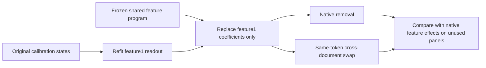

# Research update — 2026-09-20 22:50 UTC

**The selective readout improvement transfers to new documents, but code same-token swaps still fail the registered accuracy criteria.** The failure persists when any single recipient file is excluded. It is not explained by one unusually difficult file.

## What changed

The model is still the same shared scalar program:

$$
p_i(x)=(a_i^\top x)(b_i^\top x),\qquad
q_j(x)=(\ell_j^\top p)(r_j^\top p),\qquad
s_g(x)=b_g+c_g^\top p+w_g^\top q.
$$

There are six quadratic products $p_i$ and four quartic products $q_j$. Only feature1's coefficients $(b_1,c_1,w_1)$ were replaced by the original-calibration refit. The other three scalar functions, input readers, shared products and residual writers are unchanged. Cost remains13,916scalar coefficients and10products, plus4,608residual-writer coefficients. Native residual background and normalization are additional explicit operations.

This candidate was selected after earlier diagnostic results. Confirmation below used unused FineWeb document indices128:160 and16new Python files from `archive/`, selected lexicographically before native outputs. Earlier `jacclust/` files did not provide16unused eligible documents, so the directory switch was documented before evaluation. These remain related local code files, not a representative external code corpus; pretrained overlap is unknown.

## Removal and interchange

A **removal** subtracts one feature's amplitude through its residual writer. A **same-token swap** replaces that amplitude with one from the same token ID in another document, keeping the recipient background and normalization. We compare the predicted final-logit change with the change produced by the true native amplitude. Relative error is their difference norm divided by the native-effect norm; lower is better.

| New panel / intervention | Original feature1 error | Selective feature1 error | Selective cosine |
|---|---:|---:|---:|
| FineWeb removal | 0.336 | 0.300 | 0.954 |
| FineWeb same-token swap | 0.294 | 0.261 | 0.965 |
| Code removal | 0.385 | 0.298 | 0.955 |
| Code same-token swap | 0.510 | **0.448** | **0.895** |

The strict feature criterion required error<0.4 and cosine>0.9 in every setting. **It fails on code swaps.** The separate prediction of at least10%code feature1 MSE improvement passes for both removal and swap. Both statements are retained.

Joint edits also improve in every setting:

| New panel / intervention | Original joint error | Selective joint error |
|---|---:|---:|
| FineWeb removal | 0.1584 | 0.1534 |
| FineWeb same-token swap | 0.3088 | 0.3068 |
| Code removal | 0.2038 | 0.1945 |
| Code same-token swap | 0.3908 | 0.3814 |

Instrument checks pass: native targets and the untouched individual features reproduce within6e-8 relative tolerance. Before independent confirmation, the same candidate passed all registered criteria on reused panels; the fresh miss is preserved rather than replacing its thresholds.

## Redteam: improvement is broad, residual failure is broad

A descriptive leave-one-recipient-document analysis of the code swaps finds:

- Improvement on all16files.
- No file contributes more than9.92%of the new squared error.
- Removing any one recipient file leaves error between0.442and0.451, always above0.4.
- The corresponding cosine ranges0.893–0.898, always below0.9.

Donor links remain fixed across this analysis. These are influence diagnostics, not independent-sample confidence intervals.

An additional CPU decomposition of the readout change shows substantial cancellation among its constant, quadratic and quartic terms. Their symmetric contributions to the cached context256 MSE gain are +21.6,-77.4,+81.4, totaling+25.7. This algebraic allocation does not identify independent causal effects. It warns against interpreting the repair as one isolated positive term or assuming components can be removed independently.

## What this changes about the research direction

The same input computations supported a materially better feature1 readout, so changing the input dictionary was not necessary for the first improvement. Yet contextual differences remain harder to predict than feature removals, even after independent confirmation. The candidate is an improved operational feature predictor, not a completed semantic circuit.

Further work should distinguish residual information missing from the fixed readers from a decoder objective that underweights contextual differences. Another exact root-count reduction is not the priority: the previous restricted lower-bound audit already established the shared four-root requirement. Task selectivity, interpretable constituent conditions, wider OOD robustness and stable circuit identification remain open.

Primary receipts under `direct_tensor_match`: `SELECTIVE_READOUT_NATIVE_V1.json` (reused tests), `SELECTIVE_CONFIRMATION_V1.json` (independent confirmation), `SELECTIVE_CONFIRMATION_INFLUENCE_V1.json` (file influence), `SELECTIVE_READOUT_CHANGE_V1.json` (readout algebra). Exact panel/program hashes, all aligned swaps and every individual feature result are retained in the linked experiment family.
