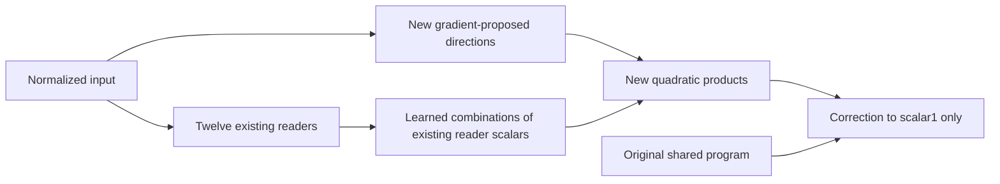

# Research update — 2026-09-20 22:58 UTC

**The existing readers miss native feature1 dependence even at fixed input norm.** Adding four new quadratic products improves cached prediction by18–20%MSE, but their weight-gradient initialization does not consistently beat an equally sized random-direction control by the registered margin. Native intervention transfer of these additions remains untested.

## A fixed-reader counterexample

The current program reads twelve linear forms of the normalized input, then computes six quadratic and four quartic products. Let $Q$ have orthonormal columns spanning those reader directions. Decompose

$$
x_\parallel=QQ^\top x,\qquad x_\perp=x-x_\parallel.
$$

Choose a unit vector $d$ perpendicular to both the reader span and $x_\perp$. The paired inputs

$$
x_\pm=x_\parallel+\cos(\theta)x_\perp
\pm\sin(\theta)\|x_\perp\|d
$$

have exactly the same reader values and norm as each other and the original state. Therefore **every function of the fixed readers**, not just our current Tucker-style decoder, must return the same value for both inputs.

We evaluated the native folded scalar on such inputs, using its analytic weight-derived gradient to select a sensitive invisible direction, with seeded random directions as controls. These are artificial states near actual normalized inputs, not counterfactual texts. A nonzero response establishes local algebraic insufficiency of the reader dictionary; it does not establish a natural-data reconstruction floor or explain the code swap error by itself.

| Quantity | Calibration states | Disjoint reused diagnostic states |
|---|---:|---:|
| Invisible fraction of spherical tangent gradient energy | 27.7% | 27.3% |
| Relative input displacement at angle0.05 | 3.60% | 3.67% |
| Gradient-directed paired scalar difference / native scalar std | 0.539 | 0.587 |
| Random paired scalar difference / native scalar std | 0.0140 | 0.0158 |

The difference compares the two opposite endpoints; each endpoint has the stated displacement from the original state. Reader/student/norm invariance error is below4.8e-15. Analytic gradients match a toy autograd oracle, native FP32/FP64 gradient discrepancy is3.4e-7, and the small-angle linear-response check is2.9e-5. All registered sphere-probe criteria pass.

The leading four ambient missing-gradient directions learned from calibration capture45.6%of its missing-gradient energy and35.9%on the diagnostic panel. These figures use ambient reader-nullspace gradients, distinct from the norm-constrained tangent fractions above.

## New products that reuse the old readers

The derivative result proposes new directions; it does not identify a semantic feature. We tested a small correction to scalar1:

$$
\Delta s_1(x)=\sum_{a=1}^k
(v_a^\top x)(w_a^\top Hx)-c,
$$

where $H$ contains the twelve existing readers. The directions $v_a$ come from calibration missing-gradient SVD, while $w_a$ is fitted to the original calibration residual. The constant $c$ centers the added products on calibration data. This is data-informed fitting with weight-gradient proposals, not a weights-only tensor identity.

Partner forms $w_a^\top Hx$ reuse the existing reader activations. The executable DAG counts this reuse; it does not store another dense1152-dimensional vector for every partner. Widths1,4,8 add respectively1,4,8products. Random orthonormal reader-nullspace directions at matching widths control for extra capacity. Ridge1e-3 and primarywidth4 were fixed before fitting.

| Candidate | Scalar coefficients | Products | Feature1 error, context64 | Feature1 error, context256 |
|---|---:|---:|---:|---:|
| Selective baseline | 13,916 | 10 | 0.1721 | 0.1737 |
| Gradient width1 | 15,080 | 11 | 0.1671 | 0.1673 |
| Gradient width4, primary | 18,572 | 14 | 0.1558 | 0.1549 |
| Gradient width8 | 23,228 | 18 | 0.1514 | 0.1534 |
| Random width4 | 18,572 | 14 | 0.1599 | 0.1638 |

Residual writers add4,608coefficients to each candidate; native background operations are additional. Errors above compare scalar amplitudes with cached native targets, not final-logit intervention effects. All widths and controls are retained in the receipt.

The primary achieves18.0%and20.5%MSE reductions against the selective baseline, passing the registered10%gain criterion. Against randomwidth4, its MSE improvement is only5.0%at context64 and10.6%at context256: **the registered requirement of at least10%on both panels fails**. The larger width8 is not promoted after seeing outcomes. Graph/expanded-polynomial replay is below3.1e-15; scalar0/2/3 are unchanged.

## Implication

A downstream refit cannot make the existing readers globally sufficient: the equal-reader probes give explicit counterexamples. Small added products can recover some missing scalar variation, but this does not yet establish superiority of gradient-guided discovery or better code swaps. Next validation must compare the fixed primary and random control in the native intervention interface, preserving the failed control margin and the higher literal cost.

Receipts under `direct_tensor_match`: `READER_SPHERE_V1.json`, `READER_SPHERE_ORACLE_V1.json`, `READER_SPHERE_DIRECTIONS_V1.pt`, and `GRADIENT_READER_ADDITIONS_V1.json/.pt`. Reproducible implementations: `reader_sphere_probe.py` and `gradient_reader_additions.py`. Both experiments retain explicit scope and metric definitions; neither establishes semantic selectivity or completes the circuit goal.
