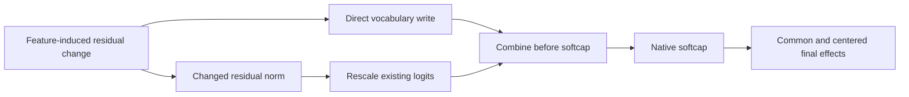

# Research update — 2026-09-20 23:07 UTC

**The larger reader candidate is not promoted. A separate metric audit confirms that probability-relevant code swap fidelity still fails.** The current preferred candidate remains the selective10product program.

## Added readers did not earn their cost

Four gradient-proposed quadratic products improved cached scalar reconstruction, but native code feature1 same-token error was0.4511, versus0.4476 for the smaller selective program and0.4587 for the matched random-direction addition. Its registered10%MSE advantage over random failed, as did the strict error<.4/cosine>.9 criterion. Joint errors beat random, but that does not establish an improvement over the smaller candidate. The gradient candidate costs18,572scalar coefficients/14products versus13,916/10, before the common4,608coefficient residual writer.

The negative native result does not contradict the equal-reader sphere counterexamples. Those establish missing native dependence, not that these particular added products recover it under the relevant metric.

## Separate common and centered final-logit effects

For a final-logit change $e\in\mathbb R^V$, define

$$
\bar e=V^{-1}\sum_v e_v,\qquad e_\perp=e-\bar e\mathbf1.
$$

A common shift in final logits leaves softmax probabilities unchanged. The squared norm splits exactly:

$$
\|e\|_2^2=V\bar e^2+\|e_\perp\|_2^2.
$$

We now score both components in the shared native removal/swap evaluators. The partition is applied **after** final RMSNorm and softcapping. A common direction before those nonlinear operations cannot simply be discarded.

| Selective feature1 intervention | Native common-energy fraction | Raw error | Centered error | Centered cosine |
|---|---:|---:|---:|---:|
| FineWeb removal | 41.2% | 0.300 | 0.286 | 0.958 |
| FineWeb same-token swap | 62.0% | 0.261 | 0.308 | 0.952 |
| Code removal | 54.2% | 0.298 | 0.299 | 0.954 |
| Code same-token swap | 46.7% | 0.448 | **0.431** | 0.903 |

The registered hypothesis that common energy stays below50%in every setting fails. The centered accuracy criterion also fails: code swap error remains above0.4, although centered cosine exceeds0.9. Centering can increase or decrease relative error because it changes both numerator and denominator; it is not a repair to the program.

Raw effects reproduce archived results within3.1e-8; common-plus-centered energy identities reproduce within4.4e-16. All four individual features and joint edits, plus CE-effect errors, are retained. These are reused diagnostic panels. Neither scoring choice establishes semantic selectivity.

## Next mechanism to isolate: direct writing versus normalization

For residual state $x$, additive intervention $\delta$, linear unembedding $U$, and

$$
s=\sqrt{\operatorname{mean}(x^2)+\epsilon},\quad
s'=\sqrt{s^2+2\operatorname{mean}(x\delta)+\operatorname{mean}(\delta^2)},
$$

the exact pre-softcap response is

$$
\ell'=\frac{s}{s'}\ell+\frac{U\delta}{s'},\qquad \ell=\frac{Ux}{s}.
$$

Thus a feature intervention changes both a vocabulary direction and the scale of the existing logits. Final softcap remains $30\tanh(\ell'/30)$.

The formula is implemented in `final_norm_response.py`. CPU checks reproduce the full finite response to2.2e-16 relative error, verify a norm-preserving edit has no normalizer-only effect, and demonstrate that a pre-softcap common shift can become noncommon after softcapping. This is a verified algebraic tool; native attribution between direct writing and normalization remains unmeasured. Those components can interact and will not be treated as independent causal contributions.

The hourly review is [recorded here](../../HOURLY_STRATEGIC_REVIEW_2026-09-20_2303.md). The next native audit should use this formula to clarify what the operational scalar effects actually do before another fit is attempted.

Primary receipts under `direct_tensor_match`: `GRADIENT_READER_NATIVE_V1.json`, `CENTERED_EFFECT_V1.json`, `LOGIT_EFFECT_PARTITION_ORACLE_V1.json`, and `FINAL_NORM_RESPONSE_ORACLE_V1.json`. Candidate specifications and output prefixes now share the existing two-candidate orchestrator; native evaluators also share the new effect-partition scorer.
