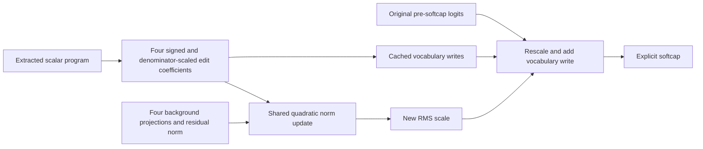

# Research update — 2026-09-20 23:14 UTC

**The extracted features act through both vocabulary writing and normalization, with substantial interaction. Neither path alone meets the registered approximation criterion.** Keeping these operations explicit is necessary to describe their native effects.

## Native mechanism test

We used true native amplitudes in the fixed four-feature frame, on the reused32FineWeb/16code panels. All four individual features and the joint edit were tested under removal and same-token swaps. There was no fitting or new student candidate.

Let $x$ be the final residual state, $\delta$ the feature-induced edit, $U$ the linear unembedding and $s,s'$ the old/new RMS scales. The exact pre-softcap response is

$$
\ell'=\frac{s}{s'}\ell+\frac{U\delta}{s'},\qquad \ell=\frac{Ux}{s}.
$$

We compared the full native effect with two diagnostic controls: direct writing with the normalizer held at $s$, and changed normalization with no vocabulary write. The remainder is an explicit interaction term. Centered final-logit effects subtract the per-token vocabulary mean after softcapping; these are the probability-relevant directions.

| Native feature1 effect | Direct-only error | Normalizer-only error |
|---|---:|---:|
| FineWeb removal | 0.810 | 0.799 |
| FineWeb same-token swap | 0.774 | 0.825 |
| Code removal | 0.604 | 0.945 |
| Code same-token swap | 0.560 | 0.930 |

Errors compare each control with the full centered native effect. The registered criterion was below0.5 for modes0/1 in every setting. Both hypotheses fail. Full-formula replay against native execution passes at4.03e-5relative error; archived native effect energies reproduce exactly.

For code feature1 removal, full added cross-entropy is+0.00389, direct-only is+0.02513, and normalizer-only is-0.01956. These controls are diagnostic paths, not independent natural counterfactuals; their CE changes need not add. This example shows why the scalar cannot simply be named a vocabulary-writing or confidence-scaling feature from its projected output direction.

The effect decomposition also exposes cancellation. For FineWeb feature0 removal, direct-only centered energy is3.22times the full effect energy. A component can be larger than the final effect because other components cancel it. Signed projections onto the full effect, energies, cosines and CE effects for all features are preserved in the receipt.

## A shared four-feature response circuit

The next CPU implementation represents arbitrary joint edits without constructing a full residual edit for every evaluation. Let $W\in\mathbb R^{1152\times4}$ contain the fixed residual writers and $t\in\mathbb R^4$ their edit coefficients, so $\delta=Wt$. Coefficients include the sign and native branch denominator; they are not raw feature amplitudes.

Cache

$$
G=\frac{W^\top W}{1152},\qquad V=UW,
$$

and obtain background statistics

$$
b=\frac{W^\top x}{1152},\qquad s^2=\operatorname{mean}(x^2)+\epsilon.
$$

Then

$$
{s'}^2=s^2+2b^\top t+t^\top Gt,\qquad
\ell'=\frac{s}{s'}\ell+\frac{Vt}{s'}.
$$

Final softcapping remains explicit. The same four coefficients feed both the vocabulary write and the shared normalization computation. Off-diagonal entries of $G$ represent joint normalization interactions: the residual-writer cosine between features1and3 is0.640, and between2and3 is0.494. Orthogonality in the earlier output frame does not imply orthogonality of these residual writers.

`shared_response_circuit.py` builds this interface using the actual model writers and unembedding. On synthetic residual states, exact arithmetic replay is1.6e-15; FP32 cached vocabulary vectors produce2.5e-8relative effect error. Zero-edit and joint-coefficient composition controls pass. Adding separate logit effects is not the interface: the synthetic joint response differs from that additive approximation by4.3%in this test. Native-state replay of the cached implementation remains pending; the earlier full-residual formula was the native-tested object.

## Honest price and remaining scope

This is an optional response cache, not a new compression result. Stored arrays contain201,216derived vocabulary-write scalars,16Gram scalars and4,608residual-writer scalars. Including the13,916coefficient scalar library gives219,756stored scalars. The large vocabulary cache trades storage for reuse across interventions; omitting it requires applying the retained native unembedding. Original pre-softcap logits and background statistics are still required. No whole-model speedup, standalone sufficiency or semantic identity is claimed.

The program now has a more precise computational specification: learned scalar conditions control both fixed vocabulary writes and a shared norm-dependent response. Which conditions those scalars represent, whether they are semantically selective, and why code swaps remain inaccurate are still unresolved.

Primary receipts under `direct_tensor_match`: `FINAL_NORM_NATIVE_V1.json` and `SHARED_RESPONSE_CIRCUIT_V1.json/.pt`. The native experiment and CPU export are separate evidence levels; every failed dominance criterion is retained.
