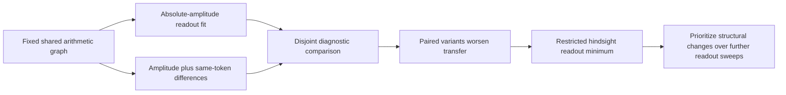

# Research update — 2026-09-20 23:20 UTC

**The shared response interface now passes native mixed-edit replay. The next fixed-graph fitting idea—explicitly matching same-token differences—failed held-out diagnostics and is not promoted.**

## Joint response replay

The cached response uses the four edit coefficients in both the vocabulary write and the exact quadratic update to the final RMS denominator. On8FineWeb and8code documents, we tested zero edits, all-feature removals, mixed signed strengths and token-varying random strengths. These tests use the predicted scalar amplitudes and compare two implementations of the same intervention; they do not establish greater accuracy against true native features.

| Check | Result |
|---|---:|
| Maximum native final-logit effect replay error | $4.73\times10^{-6}$ |
| Sequential residual additions versus joint edit | $1.04\times10^{-6}$ |
| Zero edit | Exact |
| Combining coefficients before response evaluation | Exact |

All registered replay criteria pass. The vocabulary cache's additional storage and required native background remain as documented in the23:14report. Joint coefficient composition is valid; simply adding separately computed logit effects is not.

## Pair-aware fitting, with fixed graph and cost

We next held the10-product graph and scalar0/2/3fixed, fitting only scalar1's existing readout. The objective adds differences between same-token occurrences in different calibration documents:

$$
\mathcal L=\mathbb E\big[(\hat s(x)-s(x))^2\big]
+\tau\kappa\,\mathbb E_{(a,b)}\big[(\hat s(x_b)-\hat s(x_a))-(s(x_b)-s(x_a))\big]^2
+\text{ridge},
$$

where $\kappa$ balances the target second moments. An aligned-position donor control uses the same recipient set and pair count. Only original calibration states/targets were fitted; token/state provenance hashes agree. This is an explicitly data-informed metric, not coefficient-Frobenius matching.

Weights $\tau=0,0.25,1,4$ were tested, with primary$\tau=1$specified before outcomes. The intercept anchors the calibration target mean, since differences alone cannot identify a constant. Coefficients, product count and untouched scalar functions remain unchanged in structure and cost.

| Same-token scalar prediction | Baseline error | Primary paired-fit error |
|---|---:|---:|
| Calibration | 0.2047 | 0.2000 |
| Disjoint diagnostic, context64 | 0.2641 | **0.2686** |
| Disjoint diagnostic, context256 | 0.2242 | **0.2290** |

Every nonzero paired weight worsened the same-token error on both diagnostic panels. The aligned control also failed to improve transfer. Both registered10%MSE-gain criteria fail. Zero-weight replay, literal DAG replay and unchanged-feature checks pass. These variants do not proceed to native evaluation.

## How much room remains in this readout class?

A subsequent hindsight least-squares calculation finds the best possible pair fit on each panel using the same ten nonconstant features. It uses diagnostic targets only to measure a restricted finite-sample minimum; no hindsight candidate was exported.

| Panel | Baseline pair error | Hindsight minimum | Maximum possible MSE reduction |
|---|---:|---:|---:|
| Calibration | 0.2047 | 0.1991 | 5.5% |
| Diagnostic64 | 0.2641 | 0.2450 | 14.0% |
| Diagnostic256 | 0.2242 | 0.2117 | 10.8% |

Normal-equation residuals are below3.1e-15. These limits apply only to linear readouts of the fixed ten features on these panels. They are not bounds for new features, nonlinear decoders, native logit effects or unseen data. They show that repeated readout-weight sweeps have limited remaining headroom and that calibration-optimal changes need not transfer.

The next structural investigation should revisit which native terms and feature interactions the dictionary represents, rather than continue small readout-penalty changes. Existing gains in operational extraction and reuse are retained; semantic constituent conditions, selective task effects and robust code swaps remain open. The original full-tensor and cross-path goal is unchanged.

Receipts under `direct_tensor_match`: `SHARED_RESPONSE_NATIVE_V1.json`, `PAIRED_READOUT_V1.json`, `PAIRED_READOUT_PROGRAMS_V1.pt`, and `PAIR_READOUT_ORACLE_V1.json`. The CPU oracle is a diagnostic bound, not a newly selected model.
