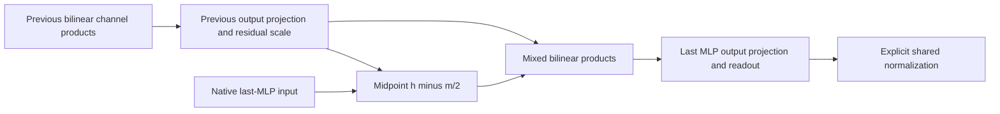

# Research update — 2026-09-20 23:30 UTC

**The isolated quartic branch omits larger cross-source effects.** An exact six-block expansion of the last MLP shows that the interaction between the remaining residual and the previous MLP polynomial output has 1.9–2.3 times the quartic self term's centered-logit removal effect. The terms also cancel substantially. This motivates decomposing a broader source-dependent computation rather than continuing small readout changes to the isolated self term.

## Exact source definitions

At the last MLP's native pre-normalization input $h$, define

$$
m=\lambda_{17,0}\big(\mathrm{MLP}_{16}\text{ output}-b_{16}\big),\qquad
a=\mathrm{attention}_{17}\text{ output},\qquad r=h-m-a.
$$

The previous MLP bias remains in $r$. Every actual residual contribution enters once. With $B(x)=D[(Lx)\odot(Rx)]$ denoting the last MLP polynomial part, expand

$$
B(r+m+a)=B(r)+B(m)+B(a)+K(r,m)+K(r,a)+K(m,a),
$$

$$
K(u,v)=D[(Lu)\odot(Rv)+(Lv)\odot(Ru)].
$$

All six terms share the original normalization denominator $s(h)^2$. The final MLP bias, residual background, final RMSNorm and softcap remain explicit. The old pure quartic target is only $B(m)$.

This is an expansion in intermediate source coordinates. The sources are dependent computations in the real model; their polynomial degree in earlier inputs is not uniformly two.

## Native results

On reused 32 FineWeb / 16 code documents at context 256, removing each term while keeping the original background and normalization denominator gives:

| Removed polynomial block | FineWeb centered effect / $B(m)$ effect | Code centered effect / $B(m)$ effect | FineWeb added CE | Code added CE |
|---|---:|---:|---:|---:|
| $B(r)$ | 3.341 | 2.629 | 1.4005 | 3.4959 |
| $K(r,m)$ | **2.253** | **1.854** | 2.4964 | 4.6215 |
| $K(r,a)$ | 0.418 | 0.335 | 0.0246 | 0.1303 |
| $B(m)$ | 1.000 | 1.000 | 0.1128 | 0.4616 |
| $K(m,a)$ | 0.227 | 0.203 | 0.0065 | 0.0007 |
| $B(a)$ | 0.026 | 0.019 | 0.0001 | 0.0013 |
| All terms touching $m$ | 1.845 | 1.480 | 1.5543 | 3.1964 |
| All polynomial terms | 2.243 | 2.101 | 0.6531 | 2.1262 |

Added CE is damage relative to the native model; lower is better. These component removals are **not full upstream-source ablations**: removing MLP16 in the model would also change attention, residual paths and normalization. The table measures precisely the declared final-MLP polynomial terms.

All registered checks pass. Six-term reconstruction, native final-state reconstruction and replay of the old pure-quartic term have maximum relative error 2.94e-7. The native cross-term importance criterion passes in both domains.

For the three terms touching $m$, the norm of their sum divided by the root-sum-square of individual norms is 0.733 on FineWeb and 0.717 on code, in the reduced unembedding metric. Both pass the registered cancellation threshold 0.75. Component energies are not additive. This cancellation is observed on source evaluations; it does not by itself prove a low coefficient-tensor rank.

## A broader third-order tensor, with an exact midpoint identity

Let $n=h-m/2$ and write $m=D_{\mathrm{prev}}p$, where $p$ contains the previous MLP channel products and $D_{\mathrm{prev}}$ includes the residual multiplier. The complete polynomial contribution touching $m$ is

$$
B(h)-B(h-m)=D[(Ln)\odot(RD_{\mathrm{prev}}p)
+(Rn)\odot(LD_{\mathrm{prev}}p)].
$$

After a linear readout $U$, this defines a mixed third-order tensor

$$
T_{vij}=\sum_k(UD)_{vk}
\left[L_{ki}(RD_{\mathrm{prev}})_{kj}
+R_{ki}(LD_{\mathrm{prev}})_{kj}\right],
$$

with one output index, one midpoint-input index and one previous-channel-product index. Here $n\in\mathbb R^{1152}$ and $p\in\mathbb R^{4608}$. The vocabulary axis can use the exact fixed QR output frame, reducing it from 50304 to 1152 while preserving linear Euclidean output error. Normalization remains outside this polynomial numerator.

`midpoint_folded_tensor.py` implements this target and an exact implicit teacher/student contraction. It avoids materializing the tensor or the large contracted matrices $LD_{\mathrm{prev}}$ and $RD_{\mathrm{prev}}$: student cross products associate through $D_{\mathrm{prev}}$ first. Toy midpoint replay, dense-tensor replay, coefficient-objective replay and gradients all agree within 3.5e-16.

This is a new structurally broader target and a verified matching kernel, not a successful native compression. The next baseline should measure its output-mode spectrum and rank-dependent error lower bounds before choosing student widths. Isotropic coefficient metrics and data-informed function metrics must remain separate. The purpose is to expose useful joint computations, not to declare another low-rank approximation a semantic circuit.

Receipts under `direct_tensor_match`: `LAST_MLP_SOURCE_BLOCKS_V1.json`, `LAST_MLP_SOURCE_ORACLE_V1.json`, and `MIDPOINT_FOLDED_TENSOR_ORACLE_V1.json`. The prior 10-product program and its code-swap failure remain retained; no new candidate replaces it yet.
