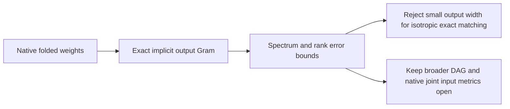

# Research update — 2026-09-20 23:40 UTC

The broader midpoint tensor has a broad output spectrum. Small shared-output Tucker or CP models cannot accurately match its isotropic coefficient tensor, even with perfect optimization. This is a capacity limitation of this target and metric, not evidence that arbitrary arithmetic DAGs cannot be simple.

The target includes all last-MLP polynomial terms involving the preceding MLP polynomial source. Let n=h−m/2 and m=Dprev p. With C equal to the last down projection followed by the exact reduced unembedding frame,

$$
T_{vij}=\sum_k C_{vk}[L_{ki}(RD_{\mathrm{prev}})_{kj}+R_{ki}(LD_{\mathrm{prev}})_{kj}].
$$

Output rank means the dimension of the shared output space. The output unfolding treats the two input indices as one column index. Its Gram eigenvalues are squared singular values. For any approximation whose output rank is at most r,

$$
\frac{\|T-\widehat T\|_F}{\|T\|_F}\geq\sqrt{\frac{\sum_{j>r}\lambda_j}{\sum_j\lambda_j}}.
$$

| Output rank | Necessary relative coefficient error |
|---:|---:|
| 4 | 94.6% |
| 16 | 92.4% |
| 32 | 90.4% |
| 64 | 87.0% |
| 128 | 80.9% |
| 256 | 70.1% |
| 512 | 51.0% |
| 1024 | 15.6% |
| 1152 | 0.0% |

The registered rank64 error<50% and rank256 error<20% hypotheses both fail. Instrument checks pass: dense toy Gram and spectrum agree within4e-16; a planted rank-two target has negligible tail; the native Gram trace matches a separate explicit-factor contraction within1.5e-16. No optimizer ran in this experiment.

The successor CPU analysis prices necessary CP widths in `MIDPOINT_CAPACITY_V1.json`. It is a lower bound on CP capacity, not a sufficient construction and not a lower bound on general circuit size. An arithmetic graph may use many output directions while reusing cheap internal computations.

A data-informed comparison must preserve dependence between midpoint n and channel products p. A loss using independent marginal covariance matrices changes the metric but generally does not reproduce the empirical joint fourth moment. The appropriate comparison is paired native evaluations or their joint lifted moment, with separate fitting and held-out documents. This is the next structural distinction to test; repeatedly optimizing width64 under the same coefficient metric cannot overturn this bound.

Receipts: `MIDPOINT_SPECTRUM_V1.json`, `MIDPOINT_SPECTRUM_ORACLE_V1.json`, `MIDPOINT_CAPACITY_V1.json`. Normalization, softcap, residual background, and previous bias retain the scope described in the23:30report. No semantic circuit or native compression is claimed.
