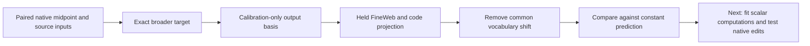

# Research update — 2026-09-20 23:46 UTC

The broader midpoint target has a transferable small output space on native inputs, despite its broad coefficient spectrum. This justifies trying a data-informed scalar computation model; it does not yet supply those scalar computations.

The target remains the complete previous-MLP-polynomial-dependent last-MLP contribution, with the original last-MLP normalization denominator included. The native midpoint and previous-source inputs are evaluated together. Output bases are fitted only on 32 original calibration FineWeb documents at context64, then frozen for 32 separate FineWeb documents and16 code documents at context256. These held panels have been used for earlier diagnostics; they are not new confirmation data.

| Metric / rank64 output approximation | FineWeb error | Code error |
|---|---:|---:|
| Raw reduced linear-logit output | 8.17% | 6.30% |
| Vocabulary-centered output, refitted calibration basis | 11.66% | 9.72% |
| Vocabulary-centered variation, relative to fixed mean predictor | 31.86% | 20.68% |

The last row uses an affine basis and a calibration mean, and measures residual error relative to the error of predicting that mean everywhere. It exposes a harder denominator than total output magnitude. Rank4 still leaves47.6% /37.4% of this variation norm; small rank is promising but not nearly exact.

All preregistered native basis and common-output audit bars pass. Exact midpoint replay agrees within5.2e-15. The coefficient-metric rank64 error lower bound remains87%; these results use a different input measure and do not contradict it.

## Exact meaning of the metric

For the unembedding QR factorization U=Q R with orthonormal columns of Q, let y denote reduced output coordinates, and let a be the normalized vocabulary sum of Q's rows. Removing a shared shift across vocabulary logits gives

$$
\|\operatorname{center}(Qy)\|_2^2
=y^\top M y,\qquad
M=I-aa^\top,\qquad
a=Q^\top\mathbf 1/\sqrt V.
$$

Common shifts account for50.9% of FineWeb output energy and58.0% of code output energy. The original raw basis also retains good accuracy under this centered metric; the success is not solely a common-logit artifact. This centering occurs before final RMSNorm and softcap. It is not a substitute for testing centered final-logit intervention effects.

A fixed-mean baseline and affine basis use

$$
\widehat y=\mu+P_r(y-\mu).
$$

This projection still requires the exact target y. The missing discovery step is a small arithmetic graph predicting its coordinates directly from the declared intermediate inputs. Output rank is a capacity baseline, not an executable compression claim.

## Covariance and dependence

An exact CPU toy shows that equal marginal means and covariances need not imply equal bilinear functional error: paired inputs with the same value have product energy3, while independent copies with the same marginal distribution have energy1. For a bilinear error tensor, the exact empirical metric uses the joint second moment of the lifted feature n⊗m. Its loss contraction matches direct evaluations within4e-16. A Kronecker product of marginal covariance matrices is a separate approximation.

The artificial shifted-source control has a recorded implementation deviation: it shifts already-normalized source vectors, carrying donor normalization, rather than shifting raw source vectors under the recipient denominator. It is only a normalized-input mismatch diagnostic. The primary native pairs, fitting split, registered predictions and table above are unaffected.

Next, fit scalar functions in the transferable output space, counting shared products and linear coefficients. Both coefficient and native-input metrics remain useful, but their error values must remain distinct. Native removal/swap validation is still required; no semantic or selective-manipulation claim follows from this output-space result.

Receipts: `MIDPOINT_NATIVE_V1.json/.pt`, `MIDPOINT_CENTERED_V1.json/.pt`, `MIDPOINT_VARIATION_V1.json`, `JOINT_MIDPOINT_METRIC_ORACLE_V1.json` under `direct_tensor_match`.
