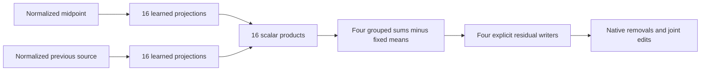

# Research update — 2026-09-20 23:50 UTC

A concrete16-product scalar program now predicts four varying output features of the broader midpoint target. Covariance-weighted factorization substantially outperforms coefficient-only factorization at the same size. These features are operational output coordinates, not established semantic concepts.

## What is computed

Normalize the midpoint n=h−m/2 and previous MLP polynomial source m using the original last-MLP RMS denominator. For a fixed scalar output reader q, the target is

$$
t(n,m)=n^\top K m-\mu_q,
\qquad K=L^\top\operatorname{diag}(q^\top C)R+R^\top\operatorname{diag}(q^\top C)L.
$$

Here C is the last down projection followed by the reduced unembedding; the scalar mean is fixed from calibration. Four q directions are chosen from the calibration vocabulary-centered output covariance. K is therefore obtained exactly from weights once the output reader is fixed.

The compact program approximates each scalar by

$$
\widehat t_g(n,m)=\sum_{j=1}^{r}(a_{gj}^\top n)(b_{gj}^\top m)-\mu_g.
$$

This is an output-sharing block-term baseline. Each of four scalars has r products; cross-scalar reuse has not yet been optimized. Normalized n and m are required inputs, so upstream computation and previous down projection remain explicit.

## Two weight-based matrix objectives

The isotropic baseline truncates K's singular values. The data-informed baseline forms second-moment square roots S_n and S_m from calibration inputs and factorizes

$$
S_n K S_m\approx U_r\Sigma_r V_r^\top,
\qquad A=S_n^{-1}U_r\Sigma_r^{1/2},\qquad B=S_m^{-1}V_r\Sigma_r^{1/2}.
$$

The moments are noncentral and regularized by1e-6 times their mean eigenvalue. This minimizes a separable weighted coefficient error. It is an exact functional metric for independent marginal draws, but only an approximation for dependent native pairs. All reported prediction errors below are evaluated directly on the paired native inputs.

This operates in (n,m), while the earlier third-order coefficient spectrum used (n,p), with m=Dprev p. These coefficient metrics are different. The native target function is the same.

| Products per scalar | Total products | Isotropic FineWeb error | Weighted FineWeb error | Isotropic code error | Weighted code error |
|---:|---:|---:|---:|---:|---:|
| 1 | 4 | 82.4% | 74.9% | 70.5% | 73.3% |
| 4 | 16 | 34.3% | **7.4%** | 27.1% | **5.2%** |
| 16 | 64 | 25.1% | 4.5% | 19.1% | 2.0% |
| 64 | 256 | 15.6% | 3.0% | 10.4% | 1.2% |

Errors are aggregate relative norms over the four calibration-centered scalar targets, relative to a fixed-mean predictor. These are separate FineWeb and code panels, reused for diagnostics. Four scalar coordinates do not reconstruct the entire broader output; the previously measured output-space truncation error remains additional.

All registered predictions pass. Exact scalar-matrix replay is2.55e-15; full-rank weighted inversion replay is2.65e-12. On the16-product program, worst individual scalar error is15.4% FineWeb and6.7% code. The rank-one weighted arm worsens code aggregate error relative to isotropic, and some individual scalar errors exceed100%; covariance weighting is not uniformly successful at every width.

## Executable extraction and price

The16-product program exports two1152×16 input matrices, a fixed product-to-scalar readout, four means and four reduced output writers. Price:36,864 learned reader coefficients,16 products, four means and4,608 reduced writer coefficients. Fixed summation topology and upstream state/normalization work are additional; this is not an end-to-end speedup claim. Export replay is exact in the tested contraction order, and scalar reader/writer duality error is2.1e-15.

The next managed experiment tests individual and simultaneous feature removals against the true native amplitudes, with final RMSNorm and softcap executed normally. Passing scalar prediction is not assumed to guarantee accurate effects. Same-token swaps, fresh confirmation, semantic selectivity and stability remain open.

Receipts: `MIDPOINT_FACTOR_V1.json`, `MIDPOINT_FACTOR_PROGRAMS_V1.pt`, `MIDPOINT_EXTRACTED_PROGRAM_V1.pt`, `MIDPOINT_EXPORT_ORACLE_V1.json`, `WEIGHTED_BILINEAR_SVD_ORACLE_V1.json` under `direct_tensor_match`.
