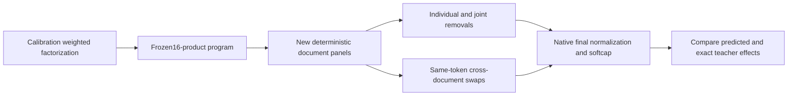

# Research update — 2026-09-20 23:56 UTC

The frozen16-product midpoint program passes native removals and same-token cross-document swaps on new documents. All previously registered thresholds pass without refitting or changing the readers, writers, means, ranks, or thresholds.

The program predicts four scalar variations of the complete previous-MLP-polynomial-dependent last-MLP contribution. A scalar is an operational coordinate, not yet a named human concept. Its input is the normalized midpoint/source pair; the existing upstream model still computes that interface.

## What the confirmation tests

For scalar amplitudes t and explicit residual writers V, removal subtracts tV from the final residual state. A swap adds the donor–recipient amplitude difference through the same writer:

$$
\Delta x=V(t_{\mathrm{donor}}-t_{\mathrm{recipient}}).
$$

Amplitudes already include the original last-MLP normalization. We do not divide by the recipient denominator again. Final RMSNorm and softcap execute normally. Predicted effects are compared with effects using exact teacher amplitudes in the same recipient background. The comparison uses vocabulary-centered final-logit changes.

Same-token donors come from another document, chosen by nearest position with deterministic ties. Recipient positions start at16. Donors and panel rows were frozen and hashed before evaluation; donor choice does not use activations or model outputs.

The confirmation panel contains32 FineWeb documents160:192 from the reserved corpus and16 additional lexicographically selected archive code files. Earlier code sources and exact token prefixes are excluded. These are new documents for this program, but the code comes from the same repository; this is not broad external OOD evidence. Pretraining overlap is unknown.

| Domain | Feature | Removal relative error | Same-token swap relative error | Swap cosine |
|---|---|---:|---:|---:|
| fineweb | 0 | 4.0% | 3.9% | 0.9992 |
| fineweb | 1 | 6.4% | 8.1% | 0.9967 |
| fineweb | 2 | 11.5% | 9.7% | 0.9953 |
| fineweb | 3 | 5.6% | 6.6% | 0.9978 |
| fineweb | joint | 5.9% | 5.7% | 0.9984 |
| code | 0 | 5.1% | 3.8% | 0.9994 |
| code | 1 | 4.4% | 9.3% | 0.9956 |
| code | 2 | 6.1% | 7.9% | 0.9974 |
| code | 3 | 3.0% | 4.4% | 0.9991 |
| code | joint | 4.6% | 5.4% | 0.9987 |

Registered individual thresholds were error<30% and cosine>0.95; the joint error threshold was20%. Instrument checks include frozen program hash, token hashes, donor identities, zero self-edit, scalar export replay and reader/writer consistency. All pass. Same-token coverage is70.5% of eligible FineWeb sites and81.6% of code sites.

## Interpretation and remaining work

This supports executable extraction, prediction on new documents, individual manipulation fidelity, and simultaneous use of four specified features. It does not establish semantic selectivity: no test yet shows that changing a feature changes one intended task while preserving unrelated tasks. Stable feature identification across fitting data, broader OOD transfer, and reuse across different target computations remain open.

The older isolated-quartic program failed a code-swap test, but this is a broader target with different readers and input interface. Their error percentages are not an apples-to-apples comparison of alternative implementations of one circuit.

A successor CPU graph study tests sharing the16 input projections across the four features. An8-direction dictionary per input would reduce reader coefficients from36,864 to18,688, while retaining16 products and adding intermediate linear combinations. However, its scalar coefficient errors are37–42% relative to the confirmed program. It has not been tested on native inputs and is not promoted. Full16-direction reconstruction replays within4e-15. Covariance-aware sharing or continuous refitting may be needed; the confirmed program remains the baseline.

Receipts: `MIDPOINT_CONFIRMATION_V1.json`, its removal/swap receipts and panel/donor manifests, plus `MIDPOINT_SHARED_READERS_V1.json/.pt` under `direct_tensor_match`.
