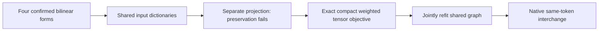

# Research update — 2026-09-21 00:03 UTC

The two-stage procedure now has a concrete graph-edit result: sharing the input dictionaries and jointly refitting their bilinear tensors roughly halves input coefficient storage while retaining acceptable native swap fidelity. The larger independently confirmed program remains the stronger accuracy baseline.

## What changed in the graph

The original program computes16 left and16 right projections, then16 products grouped into four scalar features. The shared graph computes eight basis projections of each input and reuses those to construct the same16 left/right product operands:

$$
u=P_n^\top n,\quad v=P_m^\top m,\qquad
\ell=T_n^\top u,\quad r=T_m^\top v,\qquad
\widehat t=W^\top(\ell\odot r)-\mu.
$$

The16 products and four scalar output definitions stay fixed. Here W is a fixed grouping map; output residual writers are unchanged. Intermediate linear features can feed multiple product operands. This is a concrete example of linear reuse in a computation DAG, not discovery of arbitrary deep reuse.

| Scalar input graph cost | Confirmed baseline | Shared refit |
|---|---:|---:|
| Learned input coefficients | 36,864 | 18,688 |
| Linear coefficient multiplications | 36,864 | 18,688 |
| Input linear additions | 36,832 | 18,640 |
| Input linear nodes | 32 | 48 |
| Variable–variable products | 16 | 16 |

Four means,12 scalar-sum additions, four mean subtractions and4,608 writer coefficients remain additional. The shared graph uses more linear nodes but fewer coefficients and arithmetic operations. The upstream model, previous source projection, midpoint construction and normalization are still required; this is not a whole-model speedup claim.

## Why the first edit failed

Projecting each reader matrix into a shared span is not the same as optimizing the composed products. With eight shared directions per input, coefficient-only sharing gave59.1% FineWeb /23.6% code scalar variation error. Native-moment-weighted sharing improved that to9.6% /9.3%, but failed the preservation threshold relative to the confirmed7.4% /5.2% baseline.

The failure is retained. More favorable input statistics alone did not preserve the computation sufficiently.

## Joint optimization directly from the tensors

The successor fits the whole graph against the confirmed program's bilinear tensors under the calibration second-moment metric. No held examples or target activations are fitted. With moment square roots S_n,S_m, form compact orthonormal bases

$$
S_n A=Q_n R_n,\qquad S_m B=Q_m R_m.
$$

All target forms lie in these16-dimensional input spaces. Frobenius error is preserved in the compact cores, so optimization needs only four16×16 tensors and shared8-dimensional dictionaries. Compact-versus-expanded metric replay error is3.7e-16.

Nine Adam runs used three starts and learning rates0.003,0.01,0.03, each for1200steps. The weighted coefficient error to the confirmed program fell from1.83% to0.89%. All runs reached nearly the same loss. This does not establish that their internal feature bases are identical or semantically stable. The metric is separable and noncentral; its percentage is not directly comparable to centered native scalar or logit-effect errors.

## Native result and limits

The explicit shared graph, with its intermediate projections, was evaluated on the reused diagnostic swap panels:

| Joint same-token effect error | Confirmed baseline | Shared refit |
|---|---:|---:|
| FineWeb | 6.45% | 7.77% |
| Code | 6.22% | 7.72% |

All individual feature errors remain below12.9%, with cosines above0.95. The registered joint criterion allowed at most1.25 times the baseline error; both pass, with code close to that boundary. This is a priced tradeoff, not an accuracy gain. The refit has not received new-document confirmation or a separate removal test. Keep both programs and do not transfer the larger program's fresh-confirmation claim to the smaller one.

A successor CPU price audit counts actual stored nonzeros and replayed the explicit graph against its dense equivalent within1.5e-16. It confirms the49.3% reader-coefficient reduction and the extra16linear nodes. Semantic selectivity, stable identification, broader OOD, and sharing across different target computations remain open.

Receipts: `MIDPOINT_SHARED_FIT_V1.json`, `MIDPOINT_JOINT_CORE_REFIT_V1.json/.pt`, `MIDPOINT_REFIT_SWAP_V1.json`, `MIDPOINT_GRAPH_PRICE_V1.json` under `direct_tensor_match`.
