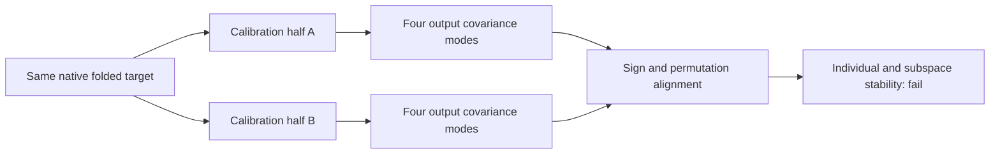

# Research update — 2026-09-21 00:09 UTC

The four operational midpoint features are not yet stably identified units. Native prediction, extraction and edits remain verified for the fixed features, but rediscovering output directions from calibration-document splits fails both registered stability criteria.

## What was tested

We recaptured exact midpoint target outputs on the original32calibration documents. Four fixed complementary16-document splits were specified before the run: contiguous halves, even/odd documents, and two seeded random partitions. Each half independently defines a vocabulary-centered output covariance and its four leading eigenvectors. The native weights, vocabulary metric and input convention are fixed; each half uses its own output mean.

For orthonormal feature bases A and B, individual-feature matching maximizes absolute cosine over permutations, thereby allowing signs and feature order to change. Subspace agreement is measured by the singular values of A transpose B:

$$
C=A^\top B,\qquad
c_{\mathrm{individual}}=\min_i |C_{i,\pi(i)}|,
\qquad c_{\mathrm{subspace}}=\sigma_{\min}(C).
$$

The permutation maximizes the sum of absolute matched cosines. A toy control verifies the distinction: sign/permutation changes score1, while a rotated basis of the exact same subspace has individual cosine0.5 but subspace cosine1. Thus this test cannot silently treat arbitrary rotations as stable individual features.

Registered thresholds were individual cosine>0.9 and minimum principal cosine>0.95 for every complementary pair.

| Calibration split | Weakest matched feature cosine | Weakest principal cosine |
|---|---:|---:|
| contiguous | 0.9256 | 0.9513 |
| parity | 0.8979 | 0.9239 |
| random0 | 0.9364 | 0.9473 |
| random1 | 0.9045 | 0.9237 |

Both stability predictions fail. Exact full-calibration moment replay passes at1.3e-15, and the recaptured full basis reproduces the existing feature directions. The failure is not a capture mismatch. The first three matched feature directions are more consistent; the fourth is weakest. Dropping that feature after this result would change the claim and would not make the registered four-feature test pass.

## Corpus dependence

As a separate diagnostic, the full calibration basis was compared with modes computed from the reused FineWeb and code output covariances. FineWeb matched feature cosines are0.960–0.981, with weakest principal cosine0.973. Code matched cosines are0.658–0.857 after reordering, with weakest principal cosine0.916.

This demonstrates a distinction between a fixed feature transferring accurately to code and the same feature being rediscovered as a leading covariance direction on code. The former has behavioral evidence; the latter does not. Covariance-selected features depend on the input distribution, and output variance is not a semantic definition.

## Executed follow-up diagnosis

A CPU analysis of neighboring modes finds that each half's first four directions project into the other's first eight with cosine norms at least0.973. Some fourth-mode variability therefore lies in nearby modes. However, the entire rank-eight subspace has minimum principal cosines only0.700–0.859 across splits. Increasing rank does not produce eight stable individual features and is not a repair of the failure.

The original calibration midpoint/source inputs and outputs are now cached once, with token hash and scope, for subsequent CPU studies. No held or confirmation rows were added to this fitting cache.

The next discovery question is whether the bilinear interaction structure can identify reusable components more consistently than variance-selected output coordinates. That calls for jointly factoring the interaction tensors and comparing functionally aligned components across splits; it does not justify assigning semantic labels to the current PCA directions. The confirmed16-product program and smaller shared graph remain operational baselines with their existing, explicitly limited claims.

Receipts: `MIDPOINT_STABILITY_V1.json`, `MIDPOINT_STABILITY_BASES_V1.pt`, `MIDPOINT_STABILITY_DIAGNOSIS_V1.json`, `MIDPOINT_CALIBRATION_ROWS_V1.pt` under `direct_tensor_match`.
